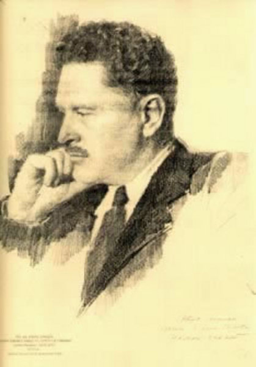

Ne içli bir **dua**, ne içten bir **ah** 

Uyuyor serviler altında **dergâh!**..

Kaç kere **gönlümü** dinledi bu yer

Tek tük kandillerde **yorgun** alevler

Titriyor gecenin **ser**t rüzgarıyla

**Gece** sanki sönen yıldızlarıyla  

Gölgeli **dergâhın** dolmuş içine... 

Bir inilti, bir ses**... Bu yalvarış ne**?

Ya **Rabbi**, ne içten anıldı **adın!**.. 

**Ölmeden öl**! diyen bir itikadın

Gönülden duyarak ulu sesini

**Ruha** şifa sunan felsefesini

Biri zikrediyor **dergâhta** işte

**Göklere** yükselen bu inleyişte 

Elemi **gizlidir** bir ah u vahın

Çoktan **dervişleri** yattı dergâhın..

  Bu yalvaran **kimdir,** kim bu zikreden? 

Yoksa **ağlıyor** mu gönlüm bilmeden! 

**Gönül!** Bu inilti senden mi geldi?. 

Hayır, işte **o ses** yine yükseldi

Yine **yalvarıyor**, yine ağlıyor

**Gözümü** dumandan eli bağlıyor 

İçimde yakılan bir **buhurdanın...** 

**Vuruşu** duruyor kalbimde kanın

Bir **hayalet** oldu yanan benliğim 

Bu kuvvetli **ruh** kim? Bu **zikreden** kim? 

Kim bu **varlığımı** kendine çeken?..  Şimdi bir **zulmette** gölge gibi ben.

O **yalvaran** sese ilerliyorum

Benliğim **ölmeden** öldü! diyorum... 

Böyle yürüyerek **geçtikçe** her an 

**Gitgide** geliyor sesi yakında Gitgide sinerken ben **gölgeler** **Yorgun** ayaklarım çarptı bir yere Titredim bir **taşa** ani temasla  Ömrümde bu kadar **korkmadım** asla

Sanki ta kalbimi bir **bıçak** yardı... 

Önümde bir **küme karanlık** vardı

Bütün varlığımı bir **an** unuttum

Yavaşça **eğilip** o yeri tuttum

**Dergâh** kuyusunun duvarıydı bu... 

Yeniden **benzimi** sararttı korku

Burdan geliyordu o **iniltiler**! 

**Gönülde** titrerken **şüpheli** bir yer

**Allaha** yalvaran, **Allahın** adı 

**Beynimin** içinde uğuldadı

Sanki bir dakika **çarpmadı** kalbim 

Ey ulu **Allahım**, ey ulu **Rabbim!.**

**Kuyuda** zikreden, **ağlayan** kimdi? 

İçine eğildim... **Anladım** şimdi

**İsm-i Celalini** candan andıkça  Yer yer yükselerek **çalkalandıkça**

**Kuyunun** zulmette **parlayan** suyu...

Kuyu **zikrediyor**, ağlıyor **kuyu**!...”

                                 **Nazım Hikmet**                                  (1902-1963)
