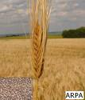

Bir **nebze** yaşadım da **gördüm** ki, Pek kısaymış **ömür.** Bir **lahza** döndüm de **baktım** ki, Bir **arp**a boyu **yol** gitmişim. 

Hani **yirmi** yaş ? nerede **otuz** ? Ya **kırklı** yıllar, **elliyi** de anlamadık, Bir soru sordular **yirmisinde**, **Cevabını** verdim otuzunda,

**Kırkları**n sorusu **aklımda** kalmadı, Ellinin **hesabı** da tutmadı.

Bir başka **sual** ettiler sonunda Daha **cevap yok** ! bilmiyorum. Var mı **bilen** söylesin ? Bilmeyen **sussun**… **Susmaktır**,  bu sorunun **hak** ettiği cevap.  Susmaktır **cevapların** en koyusu… **Sus** ve **dinle**. Sustukça **konuş.**
