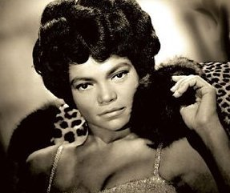

"**Üsküdar’ a giderken aldı da bir yağmur**” şarkısını Türkçe söyleyerek bir zamanlar **ülkemizde** şöhret kazanan **Amerikalı** zenci şarkıcı **Ertha Kith** 81 yaşında öldü. Dinince dinlensin. **Müteveffa**’nın ülkesine, çevresine ve insanlara **hizmeti** varsa son **yolculuğunda** rehber olsun.

**San’atçılar** halkın gözünün **kulağının,** duygusunun **emanetçisidirler**. Halk duygularını onlara emanet eder.  San’atçılar bu emaneti **yolunda,** yordamında kullanarak zamanı geldiğinde **sahibine** iade ederler. O sırada s**an’atçı** halkın gözü, kulağı ve **dilidir.** Halk dünyaya onların **gözü** ile bakar, sesleri onların **kulağı** ile dinler ve söylemek istediği **şarkıyı** onların **diliyle** seslendirir. Halk **resim** yapmak ister, boyayı bulamaz, **fırçayı** tutamaz, **ressam** onun  adına **o işi** yapar. Halk **şarkı** söylemek veya  **çalgı** çalmak ister, üstesinden gelemez, **müzisyen** unun adına o işi yapar. **Amerikalı** şarkıcı **Bing Crosby** “Ben şöhretimi benim gibi **şarkı** söylemek isteyen fakat **beceremeyenlere** borçluyum” demiştir.

Kendi ülkesinde **Ertha Kith** meşhur muydu ?  değil miydi ? bilemem ama **şarkıcı** o yıllarda bizim **ülkede** çok tanınmıştı. Bu tanınma “**Üsküdar’a giderken**” şarkısı ile ilgili değil, bu şarkıyı bu hanım’ın “**neden söylediği** ? ” ile ilgiliydi. Yani ortada **müzik** değil müziğin ötesinde **bir şeyler** vardı. Biz o zamanlar hep **İngilizce, İspanyol’ca, İtalyanca** şarkılar söylüyorduk. Bir yabancının bizim **şarkıları** söyleyeceği ise hiçbirimizin **aklına** gelmiyordu.

Günün birinde **çarpık** bir ağızdan “**Üsküdar’a giderken**" i duymaya başladığımızda **şaşkına** dönmüştük. Ayrıca şarkıcı **eserin** bir yerinde **Türkçe** güfteyi bir kenara bırakıyor, düz **ingilizce**’yle **Türkler** hakkında bir şeyler söylüyor ve o bölümü “**O… Turcs”** diye bitiriyordu. Bu konu da **tam**  anlaşılmayarak **şarkıya**, aşırı bir **gizem** katıyordu… **Gündemsiz** bir sırada olacak, **ülkede**, koskoca bir olay olmuştu, bayan **Ertha Kith’**in “Üsküdar"ı söyleyişi... 

**TV’**nin olmadığı ve her evde **radyo’**ların şimdi olduğundan çok daha **itibarlı** sayıldığı bir çağda, uzun süre **gündemden** düşmedi şarkı. **Türkiye**’de henüz “**long play:** uzun çalar ” veya “**micro sillon**” denen **33,5** devirlik plaklar ortada yoktu. Memleket eski “**taş plak**” çağını yaşıyordu. Sanırım bu alanda ünlü **Odeon** firması şarkıyı **taş plak** olarak üretti ve **piyasaya** sürdü. **Telif**’ini satın aldı mı ? bilmem  O yıllarda **müzik hukuku** da henüz doğmamıştı.

Pek hoşumuza gitti bir **Amerikalı**’nın **Türkçe** şarkı söylemesi… **San’atçının** ağzı **Türkçe**’ye yakışmıyordu, ama olsun ‘ söylüyordu ya **Türkçe**, dinlerken kendimizden geçiyorduk… **Ertha Kith** özellikle, her dilde ayrı bir **ses** karakteri gösteren “**e**” harflerini, **İngilizce** entonasyonla çıkarıyor, **ezdikçe** eziyordu. Kadının dilinde “**e”** ler, iyiden iyiye “**i”** ye dönmüştü. O da **olsun** ! yeter ki bir **yabancı** bizim şarkıyı söylesin.

  Aradan **kırk yıl** geçti ? Hala düşüyorum. Acaba biz, ben ve **Türkler** bu işe  neden bu kadar **sevinmiştik** ? Daha sonraki yıllarda **İtalyan** asıllı **Adamo** da gelmiş “**her yerde kar var**… “diye **Türkçe** bir şarkı söylemiş ama o şarkı **Ertha Kith**’in “**Üsküdar’**ı” kadar meşhur olamamıştı. **Anlaşıldığına** göre biz  o sırada topluca “**ezik**” bir dönemden geçiyorduk. Bir yabancı **kültürün** saldırısına uğramış ve **gerilemiştik**. Amerikalı her yanımızı sarmış **ruhumuzu** ele geçirmişti… O **Amerikalı** bizim şarkımızı söyleyince de biz sevinçten **ağlamaklı** olmuştuk.

Olayın bir **boyutu** daha var: hem **Ertha Kith**, hem de **Adamo** “**e**” harflerinin canına okuyunca o kişilerden sonra icat olunan “**Türkçe sözlü hafif batı müziği**” parçalarındaki tüm “**e**”ler de “**i”** ye dönüşmüştü… Şarkı **dilimizi** ele geçiren bu “**virüs**” halen **devam** etmektedir. 

Bayan Ertha Kith **müteveffa** oldu. Bundan sonra **Türkçe** şarkı söyleyecek **Amerikalı** şarkıcı çıkar mı acaba ? **İngilizce** şarkı söyleyen **Türklerin** devam eden bolluğunda **Türkçe** şarkı söyleyecek tek bir **yabancı** daha çıkarsa yine de **sevinecek** miyiz dersiniz ?
