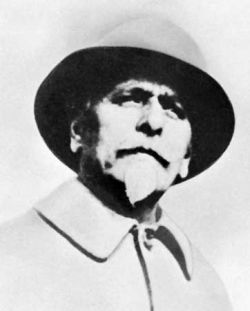

  

**Zaharof**, **Onasis,** **Soros,** **Buş** Bunların hepsi **zehirli** kuş **Rahmandan** geç şeytanla buluş yeryüzünün **mahvını** konuş

Biri baştan **satmış** canını sonra **döker** insan kanını terketmiştir **namus** lafını Bir de **döner** ister affını

Paradır **Soros**'un mabudu Yoktur o **belanın** hududu Vicdan ve **insanlık** bu muydu **Dürüstler** buna gönül koydu

Baltayı **gömmüştü** pederi Bu geldi **beterin** beteri Döktü **uluslar** alın teri Yaz günleri oldu **zemheri**

Yok **Buş**'tan öte **katı** azgın Dünya bu **adama** pek kızgın Kimse diyemez buna **düzgün Tarih** ve insanlık pek üzgün
