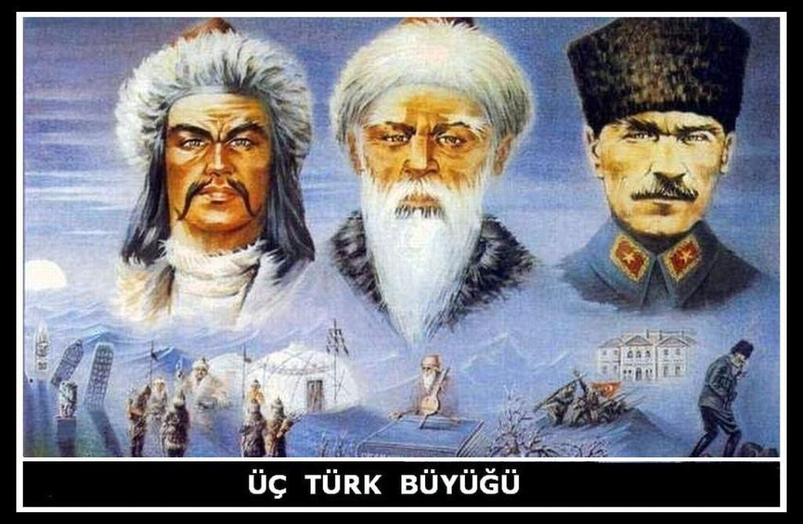

****

**Anayasa**’yı seçilmiş **Meclis** ve **Hükümetler** yerine seçilmemiş **Anayasa Mahkemesi** ve  **Danıştay**, Ulusal güvenliğimizi  seçilmiş **Meclis** ve **Hükümet** yerine seçilmemiş **Milli Güvenlik kurulu** ve **askeri yargı** üstlenmeye devam ettikçe; bu işin **sonu** gelmeyecektir. **Tarihimizde** yer alan son **Türk Devleti** zor durumdadır.

Seçilmiş **iktidarlar** görev yapamadıkça; **siyaset** sağırlar ve körler **diyaloğu** şeklinde sürüp gittikçe; **Devletin** kurumları arasında görülen tüyler ürpertici **muhalefet,** **münaferet** ve **münazaa** devam ettikçe; **Tarihimizde** yer alan son **Türk** **devleti** zor durumdadır.

Her siyasi **kriz** ve **güç** dalgalanmasından sonra siyasetin **yetkisiz** fakat hırslı **aktörleri** tarafından kurulan **Ana****yasa dönemi** ve ona bağlı hukuksal **düzenlemeler** kamu vicdanında yankılanmadıkça; **yankılanmak** şöyle dursun, bunlar, **isimleri** dahi anılamayacak derecede **yersiz** ve köksüz oldukça; Yapılan **anayasalar** toplumda **anayasa** hukukunun derin **köklerine** dayanmayıp **halkın başına** çöreklenmiş bir sınıfın **çıkarlarına** yarayan **köksüz** metinler olarak kaldıkça; bir **içtimai mukavele,** yani **halkın devletle** sözleşmesi olan anayasalar, **tek taraflı** yazıldıkça;   **Tarihimizde**  kurulan son **Türk Devleti** zorlanacaktır.

**Çağdaş** insanlık döneminin **bilim** ve **teknolojide** her gün yeni **ufuklar** açtığı bir çağda, **Türk Ulusu** henüz son kurduğu Devletin **sistem** ve **rejim** konularına takılmaya devam ettikçe; **Tarihimizde** yer alan son **Türk Devleti** zarar edecektir.

Bu devlete **sahip çıkmaya** çaba harcayan ancak, **kurumsal** ve **konumsal** yapıları gereği, **toplumda** gelişme ve **atılım** yapma görevi üstlenmiş olan **hükümetleri** bilerek veya bilmeden **engellemeye** devam eden **askerler** ve **bürokratlar** bu çarpık işe **yatkınlık** gösterdiği sürece; **Tarihte** son görülen **Türk Devleti** sarsılacaktır.

**Milli vicdanda** yerini bulmamış **yapay** kurumlarla bu **Ulusun** ve bu **Halkın** hukukunun korunması **sağlanmaya** çalışıldıkça; bu konuda sürdürülen, **Hamas** lideri **İsmail Haniye'**nin değimi ile “**siyasi maskaralığın**” sonu gelmedikçe; **Tarihte** kurulan son **Türk Devleti** zarar görecektir.

**Milli vicdan** isterdi ki **Anayasa Mahkemesi**, seçilmiş **meclislerden** çıkan bir yasayı “**iptal”**  etmek yerine **yasama** organına dönerek "**düzenlenme"** tavsiyesinde bulunsun.  Yine **Milli vicdan** isterdi ki **Milli Güvenlik Kurulu Hamas’ın** boğazına çöken **İsrail’e** gülünç biçimde “ **yapma etme** ” diyeceğine **Hükümetimize** dönerek “**İsrail ile diplomatik** ilişkiklerini kes, **savunma sanayi** ile ilgili anlaşmalarını **iptal et**…” diyebilsin. Hayır ! diyemedi...Demedi.

Neye yarar ki **27 mayıs** adını taşıyan bir “**genç subay**” ayaklanmasından sonra kurulan **Anayasa döneminin** getirdiği bu iki kurum, aradan geçen **kırk yıla rağmen** halen rüştünü ispat etmiş değildir. **Anayasa Mahkemesi** arkasında gizli kapaklı **finans** çemberleri saklayan **bürokrat** kesimin **hükümetlere** sallanan **tehdid** parmağı, **Milli Güvenlik Kurulu** ise “Biz buradayız, bir yere **gitmedik**, haberiniz olsun” diyen yaşlı **paşaların**  kahve ocağıdır.

**Devletimiz** zor durumdadır. Kuruluşunun **sekseninci** yılında **Cumhuriyet, Osmanlıyı** yıkan, dağıtan ve **tarih** sahnesinden **silen** meş'um kurumsal **parçalanmanın** eşiğindedir. Tarihte **Türklerin** kurduğu ve sayıları yanlışlıkla **on altı** olarak bilinen **Türk Devletlerinin** hiç biri, **yabancı** orduların saldırısı ile yıkılmamış cümlesi  kendi **içinden** çökmüştür. **1912** **Balkan Savaşı** sürerken **700 bin** askerimizi “**tehlike yoktur**” diye terhis eden bir **Türk hükümetiydi**. İnsanlardan **akıl** kalktığında eskiler  “**basireti bağlandı**…” demişler. Ya **Devletin** basireti bağlanırsa…

**Rabbim** muhafaza buyursun.
