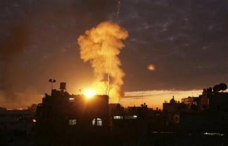

İsrail **Gazze’**yi  bombalamasın, **Türkler Kürt'**leri bombalasın… Türk **siyaset** ve **Devlet** kuruluşlarının **Ortadoğu** konusundaki genel politik tutumlarının **ruhu**, özeti, delili, **medlûlü** bu olsa gerek… **İsrail** haksız… **Türkiye** haklı… Kim ? neden **haklı** ? nasıl haklı ? **belli** değil.

Bu hale son zamanların **siyaset** pratiğinde “**çifte standart**” diyorlar… Siyasetin genellikle **inanç**, doktrin ve **felsefe** tabanından mahrum kaldığı **dönemlerde** görülüyor… **İçi** ve **kafası** boşalmış kişi ve **kurumlarca**, sonu belirsiz bir **zaman** içinde sürdürülüyor. 

Yönetim ve **icraat**, insanî boyut ve yüksek **insanî** değerler yerine **günlük** politikalara alışınca işte böylesine **ruh yoksunu** gariplikler ortaya çıkıyor… Bunun sonucunda **kangren** olmuş sorunlara hiçbir **köklü çare** bulunmuyor ve **kanlı olaylar** uzayıp gidiyor…gittiği yere kadar.

   Resim: Leon Gerome

Bir gün **insanların** neden birbirini öldürdükleri anlaşılmaz oluyor… **Sağırla**r ve **körler** diyaloğu, zamanla **vahşî** hayvanların birbirini kıyasıya **parçaladığı**  balta girmemiş **orman** görüntüsü kazanıyor, ortalık **Roma** İmparatoru Ermeni **Vespasyan’**ın, esirleri **insan e**tiyle beslenen **arslanlara** yedirdiği **Roma** şehrinin arenalarına dönüyor…

İnanır mısınız ? ben **on sekizinci** yüzyıl savaşlarını **özler** oldum. O zaman **ordular** karşı karşıya gelir, **strateji** belirler, tabya oluşturur,  **siper** kazar, adam gibi **erkekçe,** mertçe döğüşürlerdi. Davasında **haklı** olan kazanır “ölen ölür kalan s**ağlar** bizim” olurdu… **Ço**cuk öldürmek, **hastane** yıkmak, **ambülans** yakmak,  **yaralı** bombalamak o zaman yoktu. Sadece **İspanyol** iç savaşında görülmüş o da **sınırlı** kalmıştı. Eski savaşların **silah ambargoları**, esir andlaşmaları, **savaş hukuğu**, düzenli orduları ve sağlam **disiplini** vardı. Ne güzel **savaşlarmış** onlar… Şu yaşanan **zamanda** böylesine namussuz **savaşların** tanığı olmak biz 2ı. Yüzyıl **insanlarının** kaderi olsa gerek…

  Gerçek şudur ki **devrimizin** savaşları cadılar bayramına dönmüştür. **Gerilla** savaşı ile **çete** savaşı, **eşkiya** savaşı ile **köy** koruyuculuğu, **terör** mücadelesi ile **bağımsızlık** mücadeleleri, **kişisel**, grupsal ve **ticarî** şirketlerin aralarındaki **çekişmeler**, hatta politikacıların **kişisel** hırsları ve **aile** meseleleri dahi   birbirine karışmış, **şeref** ve gurur kalmamış **zafer** kavramı yerini **kirli** bir üstünlük **rekabetine** bırakmıştır. Yüz yıl önce **makinalı tüfeği** icat eden **Batı,** bu konuda **başı** çekerek **insanoğlunu** kütleler halinde öldürmenin, **inanılmaz**, akıl almaz **yöntemlerini** arayıp bulmuştur.

Bir **savaş** endüstrisi doğmuş, savaş **endüstri** olmuş,  arzın üzerinde akan **insan kanı** her gün bir az daha **değer** kaybetmiş, uğrunda dökülen kanın fiyatı **Petrol**’le ters orantılı düşmüş. **Petrol** pahallılaştıkça **insan kanı** ucuzlamıştır.

**Olayın** içinde bir de muhtemelen **organ mafyası** var. Ben eminim ki, usta **organ mafyacıları** şimdi tezgahlarını **Gazze’**ye taşıdılar. Dikkat ederseniz dünyanın bir yerinde **savaş** biterken başka yerinde başlıyor. Yaklaşık **Vietnam** savaşının sonunda başlayan **organ** mafyasının tezgahları hiç **boş** kalmıyor… Önce **Lübnan**, sonra **Bosna** sonra **Rwanda** ,şimdi **Filistin**… Acaba bundan sonra **nereye** el atacak ve **pazarı** nerede kuracaklar ?  

Ne oluyor… ? **Neden** oluyor ? Bu **çatışma** nedendir…? Bu **boğuşmanın**  sebebi ne ? Uzayın derinliklerinde, bizden daha **medenî** canlılar varsa, acaba oradan bakıp **hakkımızda** neler düşünmektedirler ?

  Goltz paşa

Yakın dönemde **Türk askeri** okullarının değerli **Alman** hocası **von der Goltz paşa** harbiyedeki dersleri sırasında **“savaş nimettir…”** dermiş**.** **Savaşın** insanoğlu’nun **yeteneklerini** harekete geçirdiğinden ve **dünyaya** ivme kazandırdığından **söz** edermiş. Gelsin de **şimdi** görsün savaşın ne biçim “**nimet**” olduğunu **von der Golt paşa** hazretleri. Evet ! savaş bir **nimet,** ama **organ** mafyası için…
