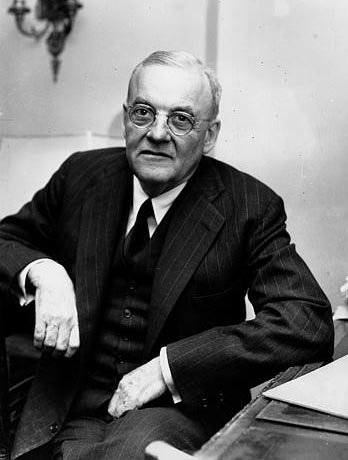
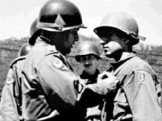

 John Foster Dalles

**Muhalifleri** bir köşeye sıkıştırıp **yok** etme **doktrini** dünya politik sahnesinde bir zamanların Amerikan Dış İşleri Bakanı **John Foster Dalles** tarafından icat edilmiştir. Bu zekice **politika** ilk defa 1950-1053 **Kore savaşında** denenmiş, kısmen **başarılı** olmuş, daha sonra **Vietnam** savaşında tekrarlanmış, **başarı** kazanamamıştır.

Bir ülkede sana **yaramaz** adamlar ortaya **çıktığında** önce bekleyeceksin, bunların  sayıları **çoğalacak**, niyetleri ve **amaçları** açıkça belli olacak, o **amaç** karar ve **eyleme** dönüşecek, o zaman onları yavaş **yavaş** bir yerlere **toplayacaksın**, bu işlemlerin zamanı ve **dereceleri** var… En sonunda **senden yana** olanlarla, olmayanların tam **ayırımına** sıra gelecek ve o zaman **karşı tarafın** yok edilmesi gerektiğini **bu tarafa** bildireceksin. Bütün bunları **gizlice** yapacaksın, gizliliği korumak için de durmaksızın **demokrasi, insan hakları** ve **hukuktan** bahsedeceksin, herkes seni **dürüst** sanacak. **Kıyasıya** alkışlanacaksın.

Gerekçelerini de **aralıksız** hazırlayarak senden yana olan **tarafa** iyice belleteceksin. Karşı tarafın **insanlığa** tehlike olduğunu anlatacak ve neden **yok** edilmeleri gerektiğini her gün **herkese** duyuracaksın… bütün bunları yaparken **zamanı** iyi kollayacak ve **kazanı** devamlı kaynatmanın **çaresini** bulacaksın. Sonunda iş **kıvama** gelecek, **kazan** taşacak, o zaman da **ipin ucunu** kaçırmadan bir **hamlede** son **raundu** oynayacaksın. Artık **dünya** senindir. Önünde hiçbir **engel** kalmamıştır. **Soygun** ve **mel’anet** için tüm kapılar **sana** ardına kadar açıktır.

Amerika 1950-1953 **Kore** savaşında dünya **kamu oyunu** kendi tarafına toplayarak bu programı **başarı** ile yürütmüştü. Amacı; **sistem** ve **yaşam biçimi** olarak seçtiği **vahşî kapitalizme** karşı çıkarak yeryüzüne doğmuş olan en büyük düşmanı **komünizmi,** kendi ülkesine **sıçramadan** önce denizin öbür **tarafında** durdurmaktı. Bunun için gerdiği kalkanın bir ucu **Kuzeydoğu Asya’**da, **Kore**’de, diğer ucu **Güney Asya’**da, **Vietnam**’daydı.  **Kore**’yi önce ikiye ayırdı: **Kuzey Kore, Güney Kore**… Sonra **Kuzey Kore**’nin **Güney Kore**’ye saldırdığını **ileri** sürdü ve tüm **dünyayı** arkasına alarak **Kore**’nin kuzey'ine yüklendi.

Bu savaştan sonra sıra **Vietnam**’a geldi. Orada da aynı şeyi yaptı. **Vietnam**'ı **Kuzey Vietnam** ve **Güney Vietnam** olarak ikiye ayırdı. kendi yandaşlarından oluşan **Güney**’e asker ve **malzeme** yolladı ama oraya **dünya** kamu oyunu toplayamadı, zira i**ş** anlaşılmış, **Dulles** doktrininin **foyası** ortaya çıkmıştı.

**Kore**’ de başarı kazanan “**parçala yönet**” siyaseti **Vietnam**’da yürümemişti. **Vietnam** savaşı uzayıp **Amerikan** kamu oyu yönetime **baş** kaldırınca, **Amerika  Vietnam’**ı elinden kaçırdı. Neden ? **Kore**’de kimse yoktu, **Vietnam’**da ise  **Ho Şi Minh** isimli, **namuslu** bir adam vardı. Onun **komunist** olduğunu ve dolayısıyle **namussuz** olduğunu,  kimseye anlatamamıştı **Amerika,** zira artık **ikna** gücü yoktu.

Dünyada **Amerika** merkezli siyasetin ana hatları hudur. Ancak bu siyaset **Dulles** tarafından da bulunmuş değildir. Bunu **Romalı'**lar icat etti, adına “**divida impera**” dediler. Yani “**parçala hükmet**…” **Romalı'**lar vaktiyle dünyaya yayılan en büyük **imparatorlukların** ilki olan **siyasi** düzenlerini tek bu **ilke** üzerinde inşa etmişlerdi. İnsanları **bölerek** ülke yönettiler. Ancak her **canlı** gibi onun da sonu geldi. Şimdi **mafya İtalya** toplumunun içini kurt gibi kemirerek, vaktiyle **Roma’**nın yaktığı **canların** intikamını alıyor…

**Dulles**’in çırakları şimdi **İsrail**’de faaliyet gösteriyorlar. **İsrail** topraklarına el koyduğu **Filistinli'**leri önce ikiye ayırdı. **El Fetih** ve **Hamas** adını alan bu iki **fraksiyon** birbirine **kanlı bıçaklı** oldu. **El Fetih,** **Batı Şeria'**da tüm namussuzluğu ve **yılışıklığı** ile işgalcı **İsrail’**den yana çıktı. **Hamas** **Gazze**'de direndi, başına da **belayı** aldı. **İsrail** gününü bekledi **bombayı** bastı. Şimdi işin **sonunu** getirecek, **Hamas**’ı ortadan kaldıracak, **Gazze** çemberini yok edecektir. Bu **İsrail**’in **ölüm kalım** savaşıdır. **Ben** **Gurion**’un ülkesi son **raundu** oynuyor.

Yine de doğrusunu **Rabbim** biliyor. Bizden bu kadar.

 Not: Kore Savaşında canlarını feda eden  aziz şehitlerimizin hatıraları önünde saygı ile eğilirim. Onlar bir ideal uğruna öldüler.                                        Nezih Uzel 

