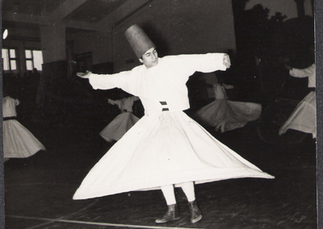

   
_Hüseyin Tüzün, Konya 1961_

Geçtiğimiz **cumartesi** günü onarımı tamamlanan “**Yenikapı Mevlevihanesi**” salonlarında **Vakıflar Genel müdürlüğü** ile **Mevlevi camiası** arasında gerçekleşen tarihi istişare toplantısında **Devlet** yetkililerinin karşısına iki sıra dizilen **Mevleviler** onsekiz yaşındaydılar.

Genç, terütaze, **dipdiri,** canlı ve heyecanlıydılar. Yedi yüz yılın **birikimi** ile içleri **enerji** doluydu. Bu enerjiye **Hazreti Mevlana** vaktiyle “**aşk”** adını takmıştı. **Mevlana** eski zamanda aşkın **tarifini** de vermişti: “**ben ol da bil**…” diyordu. O ise bir **aşıktı**. **Yaradan'**ın izni ile **Yaradan**’ın yolunda ve **sonsuzluğa** doğru…

**Devletin** sağında, masada **Mevlevi** ailelerin bu gün yaşayan **torunları** vardı. Başta hz. **Mevlana’**nın 22. göbekten iki **devamı** yer almıştı: **Esin** ve **Faruk Hemdem Çelebi’**ler. Daha ilerde **Yenikapı Mevlevihanesi’**nde 190 yıl **post tutmuş** **Kütahyalı Ebubekir Çelebi** ailesinin son torunu **Marmara Üniversitesi** matematik doçenti **Baki Baykara** yer alıyordu. Onun hemen yanında **Eskişehir** **Mevlevihanesi** şeyh torunları vardı. **Masanın**  bu tarafında yer alanların çoğu, yüzlerce yıllık **Mevlevi şeyhlerinin** ve **Mevlevi** ailelerin bu gün yaşayan **torunları** veya akrabalarıydılar. Devlet **“hadi**…” dese bunlar vaktiyle **atalarının** zorunlu olarak **terk ettikleri** dergahlarının başına geçerler ve **yedi asırlık** hizmet, **modern** şekliyle kaldığı yerden **devam** edebilirdi. Muhteşem bir **manzara** seyrediyorduk.

**Devleti**n solunda ise **yaşamlarını** ve cümle gayretlerini bir ömür boyu **Mevlevilik** hizmetinde harcamış, **harcamaya devam** eden ve harcamaya **gönüllü** ailelerin devamı yer almıştı. Bunların arasında **Mevleviliği** birkaç nesle öğreten, büyük bilim adamı, **Mevlevi dervişi**, rahmetli **Abdülbaki Gölpınarlı’**nın oğlu göze çarpıyordu. Onun yanında **Türkiye'**ye ney sazını tanıtan **Niyazi Sayın** vardı. Oradaki **tüm** diğer kişilerin de **nesepleri** kurcalandığında geride daima, **Mevleviliğin** onuru olmuş ve bu gün **fani hayata** veda etmiş büyük **tarihi isimlerin** çıkacağı şüphesizdi. **Masanın** karşı sırasında yer alan **Mevlevi aileler** o gün, orada, **insan geninden** yürüyen ve yürümeye devam eden bir **kültürün** muhteşem **manzarasını** seyrettiler. 

Günümüzde **uluslar arası** şöhrete kavuşan **Konya Mevlana İhtifali** elli yıl önce **1950**’lerin başlangıcında adı geçen **Mevlevi aileler** tarafından kurulmuştu. Bunların arasında **Yenikapılı’**lar başı çekiyordu. O sırada **Konya il halk kütüphanesinde** yapılan anma törenlerinde, **Yenikapı Mevlevihanesi** son şeyhi **Abdülbaki Baykara’**nın iki oğlu **Gavsi** ve **Resuhi Baykara’**lar görev almıştı. **1958 şebi arusunda**, rahmetli **Gavsi Baykara’**nın postnişin olduğu bir **sema**  sırasında kardeşi **Resuhi Baykara**, onun oğlu, o yıl 8 yaşında sema çıkarmış olan **Baki Baykara,** **İstanbul**’un beş **Mevlevihanesinden** biri olan **Eyyübsultan Bahariye Mevlevihanesinin** son şeyhi **Selman Tüzün** ve oğlu **Hüseyin Tüzün** salonda **semazenlerin** arasındaydılar. **Mutrıb**’ta **Yenikapı** ve **Galata Mevlevihaneleri** kudümzenbaşıları **Sadedin Heper** ve **Şakir Çetiner**, Galata **Mevlevihanesinde** ney üflemiş eczacı  **Halil Can** bey, neyzenbaşı olarak kalabalık **mutrıb**’ta yerlerini almışlardı. **Semazenlerin** çoğu **Sivas, Afyon, Kütahya** ve **Manisa Mevlevihanelerinin** son dervişleriydiler. O gece, o salonda, **Mevlevi Ayini** icrasında, vazife gören herkes eski **Mevlevi ailelerin** çocukları veya yakınlarıydı.

Bu muhterem **kişilerin** çoğu bu gün **hayatta** değiller. Hayatta olanlar ise **asla** yaşlanmadılar. **Ruhları** hep genç kaldı. Onların yaşları **on sekizi** aşmadı. Görevi ise giderek **bedenleri genç olan** yeni nesillere devrettiler.

Onsekiz **Mevlevilerde** uğurlu bir rakamdır. **Mevlevilerin** kendileri de uğurludur. **Günümüzün** toplumunda kendilerini yanlışlıkla **Mevlevi** sayanların da bir gün **uğur** ve **feyz** sahibi olacakları umulur.
