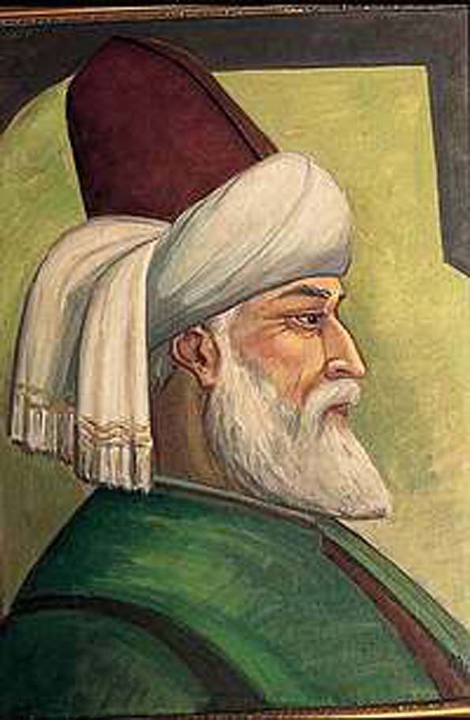

  
  
Yüce **Pir** dedi ki:  
“Bir bölük halk **kılıç** gibi savaşıyor  
Bir bölük halk dalga dalga **secdede**Bir bölük **halk** kanımızı içmede”

Asil **Pirim,** Bunlar kan içmeye **doymadı** !  
Yarın **Orada** kusacaklar,  
Hep **beraber** seyrederiz.
