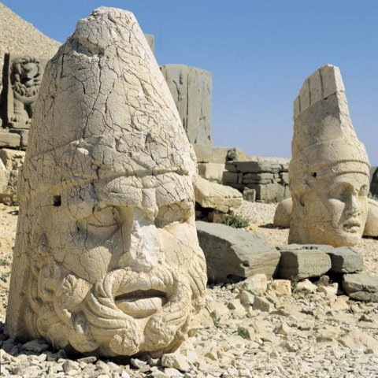

  

Ey **iman** incisini,  
Bir ekmek karşılığı **veren.**Ey gönül madenini,  
Bir **arpaya** feda eden.  
**Nemrud**,gönlünü  
Hakk’ın dostu **İbrahim’**e  
**Teslim** etmedi de,  
Sonunda **canını** bir  
**Sivrisineğe** verdi.  
                  **Mevlana**
