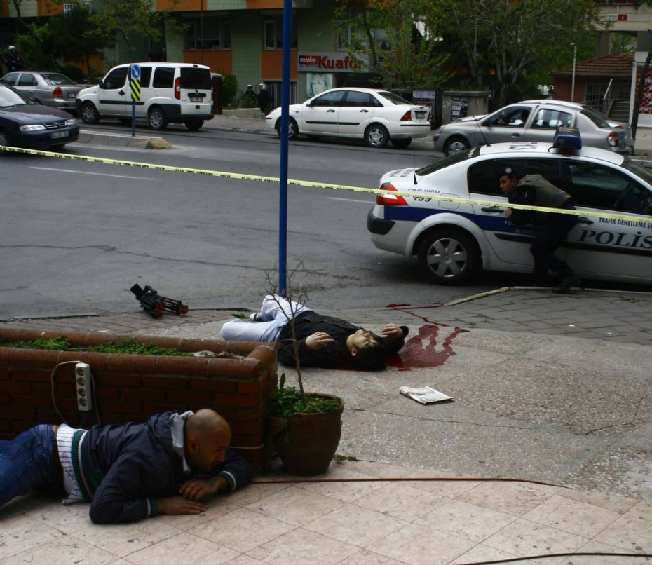

Kurulu düzen **alçaklaşınca,  
**Ona karşı çıkmak **namus** borcudur.  
Kurulu **düzen** alçaklaşmadan  
Ona karşı **çıkmak** ise,  
**Alçaklığın** ta kendisidir…  
O zaman **yargılanması** gereken  
Kanlı **terörist** değil,  
**Kurulu** düzendir…
