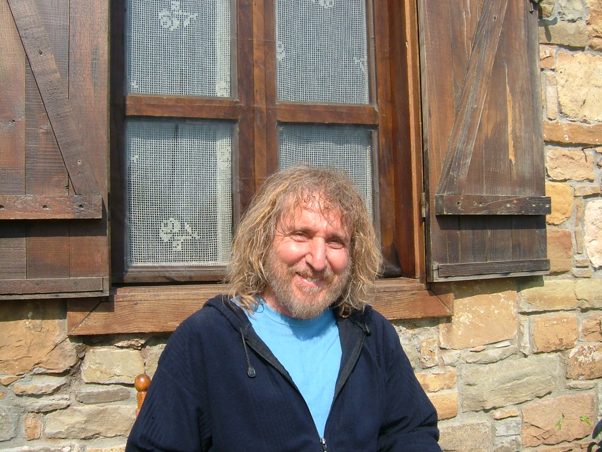

****

**Nezih Uzel**'den not: Ben **TV'y**e çıkmamak için **yıllarca** direndim. Sonunda **başaramadım** ve   pek değerli iki **arkadaşım** beni bir **kanalda** dört saat konuşturdular. Sonunda olan oldu **"şöhret**" tuzağına düşmeye **ramak** kaldı. Ancak o **konuşmanın** önemli bir faydası belirdi. **Sevgili** vatandaşlarımızın **bu güne** kadar bu konularla **uğraşmamış** değerli bir **kesiti** birden "**tasavvuf**" merakına kapıldı. Bence bu **iş iyi bir başlangıç** . Dünyamızda **yaralı gönüllere** yeni ilaçlar bulunabilir. Şimdilik benim **pek sevdiğim** bir yazımı tekrar yayınlıyorum. **Okuyun** iyi gelecektir. **Saygılar** .    

(Arşivden)                 
"İbadete ayrılan Cami, din öğretimine ayrılan Medrese ve her ikisini bir araya getirerek ona uygulamalı İslamî yaşam biçimi ekleyen Tekke ile İslam ülkelerindeki toplumsal örgütlenme tamamlanmaktadır. Tekkeler bağlı oldukları  tarikatların toplanma yerleridir.

Kuruluş amacına uygun olarak Tekkeler,  yüksek dini ve ahlâkî değerlerle varlığını koruyan  “örnek” bir insan türünü önermektedir. Yeryüzünde gelmiş geçmiş her uygarlığın amacı, hedef tuttuğu “ideal insan şekline” giden yolları açmak ve korumak olmuştur.

Tekke bir insan modeli çizer. Bu insan bağlı olduğu din’in kurallarını öğrenir ve yerine getirir. Sonra bu kuralların iç yapısına yönelerek inançları üzerinde düşünce sahibi olur. Bu iki aşamadan geçen insan üçüncü bir durakta gerçeklere ulaşır. Bu gerçek yaşanan dünyada olduğu gibi herkesin kendi yorumuna bağlı olmayıp, dinin önerdiği yolda yürüyenlerce ulaşılmış tanrısal gerçeklerdir. Dördüncü aşamada ise insan öğrendikleri ile yaşayacak ve bunları başkalarına öğretecektir.

Tarikat terminolojisinde bu dört aşama şu şekilde formüle bağlanmıştır.

                      Şeriat  
                      Tarikat  
                      Hakikat   
                      Ma’rifet

Bu eğitim bir Şeyhin gözetiminde başlar ve bir ömür boyu sürer. Tekke eğitimi belirli bir zaman birimine bağlı değildir. Bu eğitimin sıraları, sınıfları ve zamanı yoktur. Yaşı da yoktur. Kişi istediği yaşta eğitimine başlayabilir ve bulunduğu mertebeden ileriye doğru kutsal yolculuğuna devam eder.

Tarikat yollarında unutulmaması gereken gerçek şudur ki: Şeriatten sonra ulaşılan Tarikat ince Müslümanlıktır. Dinde yasak olan, Tarikat’te cinayettir. Dinde günah, olan tarikatte küfürdür. Tarikata girenlerin eğitimin her aşamasında bu hükümleri unutmamaları gerekir. Aksi halde tarikat eğitimi tamamlanmaz. Türkün evliyası Ahmet Yesevî “şeriatsız tarikat şeytan icadıdır” demiştir. Dini emirlerin kontrolünden çıkan bir tarikat eğitimi küfürdür. Böyle bir eğitim, hangi nedenle olursa olsun, psikolojik bir rahatsızlıktan öteye sonuç vermez. 

Tarikat eğitiminin en yaygın ve en fazla kabul görmüş, şekli, yedi mertebeli ruhi tekamül dereceleridir... Tasavvuf dünyasında ve tekkeler çevresinde yoğun biçimde uygulanan ve sonuçları konusunda kuşku bulunmayan en düzenli eğitim budur. Yedi mertebe şu şekilde sıralanıyor:  
                      Nefsi Emmare  
                      Nefsi Levvame  
                      Nefsi Mülhime  
                      Nefsi Mutmaine  
                      Raziyye   
                      Merziye  
                      Safiye

Mertebeler Kur’an ayetleri ile sabittir. Dolayısıyle zaman içinde aşılan bu mertebeler, Tanrı buyruğudur. Dinini bilen, yaşayan ve daha ileri ölçülerde yaşamak isteyenlerim başvurdukları veya “niyet” edenin niyetinin derecesine göre, izni ilâhî ile ulaştığı mertebelerdir.                                                               

Yedi mertebenin ilki “Emare”dir. Bu mertebede insan ilkeldir. Yeryüzüne geldiği gibidir. Hiçbir eğitim ve öğretimden geçmemiştir. Aile ve toplum baskısını tanımaz. Arap dilinde “İnsiyak” denilen refleksleri ile yaşar. Üşür, ısınır, karnı acıkır, doymak ister, doyar, cinsinin devamını arzular, üremek ister, üremenin doğal yolunu tutar. Hayvan gibidir. Doğa’nın ona bahşettiği fiziksel ve çevresel olanakları kendiliğinden kullanır. Bunların üzerinde eski yüzyıllarda insanların edindikleri maddesel ve ruhî birikimlerden habersizdir. Doğal yapısından gelen doyumsuzluk ve ihtiraslarla doludur. Dünyanın, yaşadığı ortamın, evrenin, öncesi ve sonrasına ait hiçbir düşüncesi yoktur. Böyle bir gereksinimi de yoktur. O bir urdur.

Yedi mertebenin ikincisi “ Nefsi levvame”dir. “Lev” kelimesinden gelir. İki kısma ayrılır: Birinci kısım insanın kendi nefsine  dair bazı ipuçları elde etmesidir. Kendisine ait fikirler edinmesidir. Henüz pek çelimsiz ve ambrion halindeki bu fikirler, giderek gelişir ve sorgulamalara dönüşür. Bu noktada “nefsi levvamenin ikinci aşaması başlar ki bu noktada insan “ilk önce “Dünyaya neden geldiği ?” sorusunu sorar. Bu sorunun ardından “Dünya nedir…? ölüm nedir…? bunların göğüslemenin çareleri nelerdir” ? şeklinde bir dizi soru ile karşılaşır. Bu sorulara yeterince karşılık bulamamanın ızdırabını yaşamak ve kendini kusurlu  ve zayıf görmek “nefsi emmare” mertebesini sonudur. Bu aşama çok uzun sürebilir. Bu sırada tâlip kendini herkesten daha aşağı görür. Bu mertebe, bir ölçüde kişinin kendi kendisi ile uğraşmasıdır. Bir nefis savaşıdır.  Buna zamanımızda “özeleştiri” diyorlar.

Üçüncü mertebe “Nefsi mülhime” dir. Önceki aşamada kusurlarının azametine ve korkunç görüntüsüne kendisini kaptırmış ve pek çok psikolojik travmalar yaşamış olan insan, bu noktada bunları alt edebilmek için bazı “ilhamlara” ihtiyacı olduğunu anlar. Mertebe”nin “mülhime” adı buradan geliyor. Mülhime sırasında müridin  ulaştığı mertebeyi, mürşidin fark etmesi ve müridini daldığı  beşerî bataklığından kurtamak için, ona kendi canavarlarını apaçık ve acımasız biçimde göstermesi ve kendi kendisini bu korkunç canavarlarından kurtarması için ona “”ilham” sağlaması gerekmektedir. Alışılmış “eğitim” ve öğretim” metotlarının tesirsiz ve gülünç kaldığı bu noktada Şeyhin rolü son derecede değerlidir. Şeyhi olmayanın şeyhi şeytandır denmiştir. Şeyh bu ilhamı nereden alıp müridine verecektir ? Onun kendi canavarları ile boğuşmasında Ona nasıl yardımcı olacaktır ? Bir tek çare görünüyor: Mürşidin de vaktiyle aynı aşamalardan geçmiş olması. O da vaktiyle aynı yollardan geçmiş ve o da kendi nefsi ile amansız bir mücadele vermiştir. Deneyimlidir. Şimdi deneyimini, seçtiği özel araçlarla müridine aktaracaktır. Bu araçlar eskiden kendi kullandığı veya önceden bildiği araçlar olmayabilir. Mevlânâ diyor ki: “her hastalığın kendi ilacı vardır…” Buna güre mürşid müridin ihtiyacı olan ilacı hazırlayıp ona sunacak, mürid o ilaçtan aldığı ilhamla kendini bulacaktır.  

Dördüncü mertebe “mutmaine” dir. Kişinin aldığı “ilhamların” ışığında kendi kendisini rahatlatması, kendi kendisi ile barışmasıdır. Bu mertebede öz eleştiri bitmiş, özgüven başlamıştır. Nefis savaşı sona ermiştir. Savaş kazanılmıştır. Büyük gürültülerle çağlayarak akan sular durulmuştur. Mutaine sakin bir limandır. Kişi bu limanda barışa ulaşmıştır. Ancak Şeyhin rehberliği de bu noktada son bulmaktadır. Mutmaine sonrası, kimsenin bilmediği, müridin sadece Yaradanı ile baş başa kaldığı bir alandır. Bundan sonrasını araştırmak dervişe bühtan, araştırana hüsrandır.

Bu noktadan sonra bilinmemesi, araştırılmaması gereken son mertebelere sıra geliyor. Bunların ilki “Raziye” mertebesidir. Kişi bu mertebede Dünyadaki ve muhtemelen evrendeki her işi Yaradan’dan bilip boyun büker ve tam bir teslimiyete ulaşır. 

Altıncı mertebe “Marziyye mertebesidir. Yaradan’ın kulundan razı olması demektir. Yani Yaradan’ın kuluna dönmesi ve ona kendi  Varlığından varlık sunmasıdır.

Yedinci ve son mertebeye “Sâfiyye” denmiştir. Kişinin Yaradanı ile hemhâl olduğu bu mertebenin bir başka adı da “fenâfillah” tır. Yani özünde yok olup, Tanrı’da var olmak… (Arşiv'den Nisan 2007)
