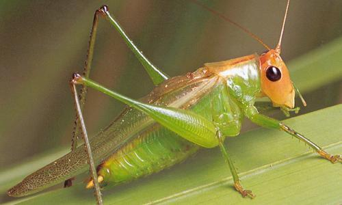

  
Üstüme **gelmeyin** benim,                 
Ben **Yusufçuğu** savunmuyorum.  
**Kalendere** hayret ediyorum.

**Sevgi** varlıkları canlandırır.  
**Bıçak** gibi biler.  
Kasıp **kavurur,** kızartır.  
Eğirir, **büker**, yumuşatır.  
Yoğurur, **kaldırır** indirir.

Kazana **atar** pişirir,  
Yerden yere **vurur,** çarpıtır.  
**Yok eder** de, yeniden **var** kılar.  
**Canını** alır da, yeniden **can** verir  
**Bozar** sonra düzeltir.

Kırar,**parçalar,  
**İnletir, **ağlatır.  
**Sonunda   
**Birbirine** ekler.  
Aşılar, **mayalar**.  
  
**Ağlayana** dost  
Gülene **düşmandır.  
**  
Bu **Çekirgede** ise hiç **hareket** yok,  
Bataklıkta **Doğduğu** gibi...  
Ham **halat** duygusuz.  
Suratsız,**ruhsuz.  
**  
**Yusufçuk** ne kadar **sırnaşsa,  
Kalenderden** hiç haber yok.  
Damarında **kan** kurumuş.  
Oldu mu **ya** !…
