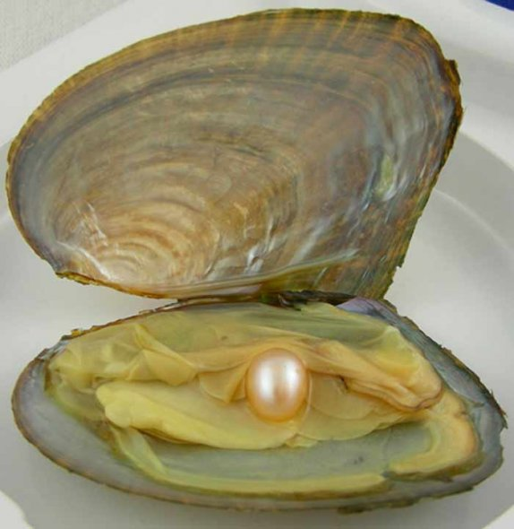

Bir haberdi **Yusufçuğun** tek derdi  
**Kalender** ise işi **gerdikçe** gerdi  
Onun **kalın hali** cümleden beterdi  
O durmadan **aşkın** yolunu keserdi

**Yusufçuk** beklemekten yorulmuyordu  
Suskundu, Ona **aşkı** sorulmuyordu  
**Kalender** ise durmadan **horluyordu** Huyunun yükü **böceği** zorluyordu

**Yusufçuk** günden güne  **soldu** sarardı  
**Ruhu** daraldı da gözleri karardı  
Sonunda verdiği hızlı bir **karardı  
Kalenderi** gönlünden söküp **kopardı**

Şimdi artık **Kalender** değildi  hedef  
**Midye** karnında bulmuştu saf  bir **sedef  
Kalender** edebilirdi kendin telef  
Bu **öykü** çok anlatıldı **halef selef  
**
