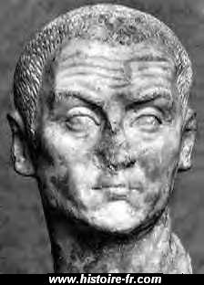

tarih sohbetleri  
İzmit 305

   Roma imparatoru Diokletien M.S. 245 yılında Dalmaçya'da Dioklea kasabasında doğdu. Bir köle ailesinin çocuğuydu. İmparator Probüs zamanı orduya girdi ve hızla yükseldi. 283’te İran seferine katıldı. İmparator Carus bu sefer sırasında ölünce yerine oğlu Numerius geçmişti. Ancak Numeriüs çadırında ölü bulundu. Üvey babası Arius Aper tarafından öldürüldü, dediler. Diokletien Aperi öldürdü. Askerler Diokletien’i imparator ilan ettiler.  
                                         
                                    _Maximien Hercules_  
Diokletien imparatorluğu büyük sıkıntılar içinde bulmuştu. Ordu’da ayaklanmalar vardı ve Roma  ekonomik kriz içindeydi. İmparator ordudan tanıdığı yakın dostu Panonia’lı bir general olan Maximien Hercules ile iktidarı paylaşmak istedi. Diokletien 286 nisanında kardeşim dediği Maximien Hercules’i “august” ilan etti. İki hükümdar İmparatorluğu paylaştılar: Diokletien Doğu’yu Maximien Batıyı aldı.  
  
291 yılında Diokletien ve Maximien Milano’da buluştular. Her iki augüst’ün karşılaştıkları zorlukların ardı arkası kesilmiyordu. Bu yüzden Diokletien kendilerine birer yardımcı (Sezar) seçmeyi kararlaştırdı. İllirya’lı iki generali bu işle görevlendirdi: Galere, Diokletien’in sezarı, Constance Chlore, Maximien’in sezarı oldu.  
293 martında Roma tahtı dörde ayrıldı. Tarihte ilk defa görülen bu dörtlü yönetim biçimine "tetrarchie” adı verildi   
                    
İmparatorluk on iki grupta toplanan ve dört tetrark tarafından yönetilen dört alan üzerinde. 101 eyalere ayrıldı. Diokletien Mısır, Libya ve Trakya’yı aldı. Maximien Hercule İtalya ve Afrika’yı aldı. Constance Chlore Gaule ve Britanya’yı, Galère ise Yunanistan, Makedonya, İllirya ve Panonia’yı aldılar. Ancak Diocletien diğerlerinden üstündü. « Primus Augustus » ünvanını  koruyordu.  
   
Roma bu devirde değerini kaybetmeye başlamıştı. Dört imparator  Başkent’te oturmuyorlardı. Diokletien Nikomedya’da, Maximien Hercule Milano’da Constance Chlore İngiltere’de, Galere Sirmium’da hüküm sürüyordu. İtalya öncülüğünü yitirmişti. Sonunda İmaratorluğun basit bir eyaleti olarak kaldı.   
  
Diokletien “Primus Augustus” olarak  İmparatorlukta derin reformlara girişti. Pek çok ekonomik reform yaptı. İmparatorluğu, hükümdarın yaşayan Tanrı gibi görülmesini sağlayan bir  Doğu monarşisisi şekline soktu. Böylece Senato son iktidar kırıntılarını da kaybetti.  
  

“Büyük İşkence” (303-304) Diokletien Hıristiyanlar uyguladığı “büyük işkence “ile de tarihe damgasını vurmuştur. İmparator Roma’nın eski geleneklerini canlandırmak ve “tetrark” dörtlü yönetime tanrısal bir özellik katmak istiyordu.  
   
Sezarı Galère tarafından koşullandırılan Diokletien, 303 şubatı ile 304 şubatı arasında dört büyük genelge yayınladı: Bunlar Hırıstiyan yazıtları ve tapınaklarının imhası ve Hırıstiyan din adamlarının malvarlıklarının dondurulması; hırıstiyan din adamlarının tutuklanması: Din adamlarının kurban kesmeye zorlanması, ve arkadan tüm hırıstiyan halkın kurban kesmeye zorlanmasını emrediyordu. Doğu ülkeleri “Büyük İşkence” den aşırı zarar gördü. Ancak asıl kanlı katliam İsa Peygamberin yaşadığı Filistin topraklarında ve Afrika’da meydana gelmişti.   
  
Sonunda işkence 305 yılının içinde bitti. Ancak  bütün bu olaylar kilisenin içini bir kere daha karıştırmıştı. Pek çok eski hırıstiyan zora dayanamayarak dinlerinden döndüklerini öne sürüyor ve tekrar hırıstiyanlığa kabul edilmelerini istiyordu. Bazı hırıstiyanlar ise ölerek şehit sayılmayı reddettikleri için onların affedilmesini istemiyordu. Bu arada belirtmek gerekir ki o çağda hıristiyan olanların çoğu, ordu, yargıçlık mesleği ve tiyatro gibi paganizm gelenekleri saydıkları işlere bulaşmak istemiyorlardı.  
    
  
    _Galere  
_Tarihçi Lactence, Diokletien, Maximien ve Galere’in sadece hırıstiyanları işkence etmekle kalmayıp yönettikleri kişilere karşı kriminel bir siyaset güttüklerini anlatıyor. Bu açıdan Diokletien’in genelgesine dayanarak tetrark’ı eleştiren Lactence, ordu’nun büyümesi, vergilerin artması ve eyaletlerin çoğalmasını kötülüklerin sebebi olarak gösteriyor.  
   
  
Galere neden böyle hareket etti: Tarihçi Lactence çok basit diyor ve ilave ediyor: “ Galere hırıstiyanlardan nefret ediyordu zira anası Romula, iğrenç bir kadındı. Tuna nehrinin ötesindeki vahşi yerlerde  yaşayan barbar kavimlerden geliyordu. Fanatik bir putperestti. Dağ tanrılarına tapan bir dinciydi. Hırıstiyanlara duyduğu kini kendi oğluna aşılayan ve onlara işkence yaptıran bu aşağılık fanatik kadındı”. 

311 mayısında imparator Galere amansız bir hastalık sonucu uzun süre can çekişerek öldü. Pek çok antik yazara göre Galere Hırıstiyanlara reva gördüğü korkunç zulmün vebalini ödemişti.  Not etmek gerekir ki Galere’in ölümünden az önce Diokletien genelgelerini reddettiği söylenir.

Saltanatının zorluklarından bıkan Diokletien tahtını terk ederek Doğduğu Dalmaçya’ya gitti ve 313’te Split’teki sarayında öldü Diokletien son yıllarında Salone’deki bahçesinde marul ve lahana yetiştiriyor ve her gün marul yiyordu. Yakınları tekrar Nikomedia’ya dönerek tahta geçmesini istiyorlardı. Diokletien onlara “Siz buraya gelin, bakın marullar ne güzel büyüyor…” dedi. Diokletien'in marulları tarihe geçti. Yazar Apicius’a göre eskiler marul’u   salamura balık, zeytinyağı, kimyon ve sakız çiçeği haşlaması ile yerlermiş.
