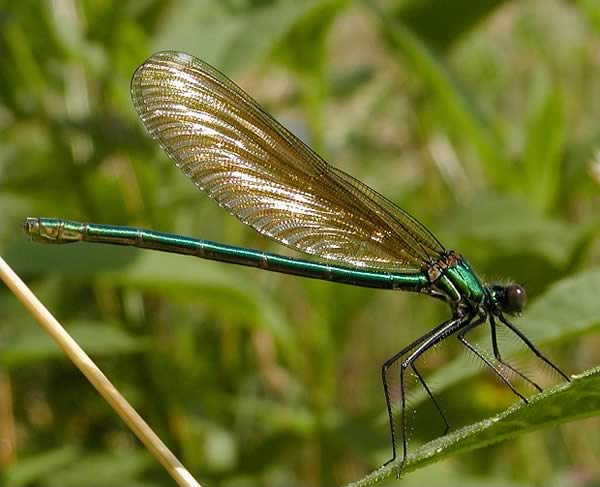

Kahretti **Yusufçuğu** Kalender  
Böylesi **zalim** ender mi ender  
**Yusufçuk** aşk içinde **semender**  
**Kalender** bu olaydan bîhaber

**Aşkın** ne izi var, ne de **yönü  
**Aşkın ne **arkası** var ne önü  
Aşık ki **aşktan** aldı özünü   
**Aşk** ona söyledi, **son** sözünü

**Kalenderde** aşk olsaydı eğer   
Kendi öz **bağrını** deler de geçer  
**Bilinmez** ki bu da bir **cins** kader  
Ola ki **aklı** aşkından **beter** 

Ne bilsin **Yusufçuk** bu halleri  
**Aklı** kesmedi hiç bu **işleri  
**O yanlız **sevdi**, kurdu **düşleri  
**Hep **açtı** kapanmış **görüşleri**
