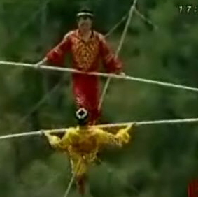

Bir **ipin** üstüne çıktın **oynamaya  
**Aşağıda **insanlar** başladı **kaynamaya  
**Pat ! dedin **düştün** yere ansızın  
**Adı** anılacak mıydı yerdeki **cansızın** ?   
  
Düştüğünü bile **bilmedin,** sen hâlâ  
**İpin** üstünde sandın kendini  
Sonra anladılar az çok **fendini  
**\-İşte dedin **bakın**, ben yerde de **yürürüm**  
Hem **arkamı,** hem de önümü **görürüm**

İnandılar **aşkla** sana, **marifet** sandılar lafını  
Sen ise çoktan hazırladın **minarenin** kılıfını

**Canım** kurban sana ey **yücelikler** şahı  
Bu **ülkenin** gelmiş geçmiş en **şen** padişahı  
Biliyor musun yerin altında ne **canlılar** var  
Sana **bel bağlayan** temiz kanlılar var

Siyasi **mevtanın** da bir canı olur  
**Binlerce** yıl yaşayan **cesedi** olur  
Son **kemik** çürümeden **toprakta  
**Son **damla** kurumadan yaprakta

**Git**, bir gün olsun **çekil** görüntüden  
Kimse ölmez **ruhundaki** çöküntüden  
Yerin **boş kalmaz** korkma,  
Bir daha **buralara** sokulma
