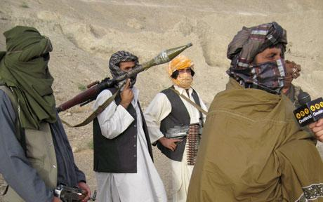

****

**Kandahar.-**Le poids des **sociétés militaires** privées est l'une des facettes cachées de la **guerre d’Afg**anistan. La **Commission parlementaire américaine** sur la passation des **marchés** en temps de guerre a révélé, début novembre, qu'avec **74 000 salariés** en **Afghanistan**, leur nombre **dépasse** celui des troupes **régulières américaines.** Un chiffre deux fois plus **important** que celui admis **officiellement** par le **Pentagone.**

Pourtant les **incidents** se multiplient. Début **octobre**, après un conflit avec les **Britanniques** et les soldats **afghans** dans la province du **Helmand**, la société **Paravant** s'est vu refuser le renouvellement de son **contrat**. Les soldats **afghans** s'étaient rebellés, fin août, contre leurs **formateurs** qui buvaient de l'**alcool** devant eux, en plein **ramadan.  
  
**Cette **société** n'est autre qu'une filiale de Xe, **ex-Blackwater**, dont le nom est **associé** à de multiples **violences** en _Irak,_ parmi lesquelles une **tuerie** en pleine rue à **Bagdad** (17 civils tués) en 2007. En mai, trois **employés** de **Paravant** ont par ailleurs été **impliqués** dans la mort d'un **automobiliste** à **Kaboul.  
**  
"La fin du contrat pour l'i**nstruction** du tir à **Kandahar** n'a pas été une **perte,** commente un membre de **Paravant.** En ce moment, avec le **départ** des troupes **américaines,** beaucoup de nos gars repartent en **Irak**."  
  
**DynCorp,** qui pilote l'instruction des **policiers afghans** avec un budget annuel de près de **1,5 milliard** de dollars (1 milliard d'euros). **Début 2009**, une société **i**ndienne basée à **Dubaï** (Emirats arabes unis), **HEB**, chargée de la formation d'**armuriers** au sein du 205e corps de **l'armée afghane** à **Kandahar**. **HEB,** qui recevrait près de **9 millions** de dollars par **mois** pour cette **prestation**. (Courtoisie **le Monde**)  
  
**Türkçe özet**: _Kasım ayı başında Amerikan parlementosu’nda kurulan özel bir komisyon, Afganistan savaşında özel şirketlerin çalıştırdığı paralı asker sayısının 74.000’e ulaştığını saptadı. Bu rakam Afganistan’da bulunan düzenli Amerikan ordusunun asker sayısından fazla. Halmant bölgesinde ramazanda içki içen Paravant isimli İngiliz şirketinin eğitmenleri ile Afgan ordusunun askerleri arasında çatışma çıkmıştı. Paravan Amerikan Black-Water şirketinin bir yan kuruluşu. Bu olay üzerine Paravan şirketi ile sözleşme iptal edildi. Şirketin bir yetkilisi  “ zararımız yok,  şimdi arkadaşlarımız Irak’a gidecekler…” dedi.  Afgan polislerini eğiten Dyn Coorp isimli bir Amerikan özel şirketi  bu iş için yılda 1,5 milyar dolar ücret alıyor. 2009 başında Dubai’de kurulan ve Afgan zırhlı birliklerini eğiten Hint kökenli HEB şirketi ayda 9 milyon dolar alıyor. (Teşekkürler le Monde)_
