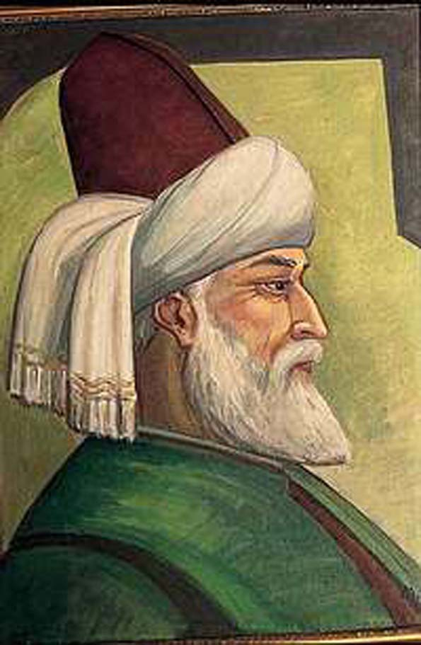

__

_Bir mektup ve cevap:  
_  
"Maalesef insanlar da Mevlana’yı Mevleviliği bu bahis mevzu kişi otoriteymiş gibi onlardan öğrenebileceklerini sanarak takip ediyorlar,işin kötüsü bunlara gazetelerde koca koca sutun veriliyor ve daha çok kişinin zihnini bulandırıyorlar eninde sonunda iş çeşmenin başındakiler neyi ne kadar kimden öğreneceğimizi belirliyorlar ve her zamanki gibi doğruyu bulmak çaba,emek istiyor"  
cevap:  
"Kimse Mevlânâ’yı anlatmaz, herkes kendi tercihlerini anlatır. Bu yüzden kim ne kadar çok konuşursa o kadar çok ve çeşitli “Mevlânâ" çıkıyor ortaya, Hz. Mevlânâ’nın büyüklüğü de burada zaten.. Herkese bir Mevlânâ düşüyor. Bütün bu anlatılanların toplamından siz de kendinize uygun bir Mevlânâ çıkarabilirsiniz.
