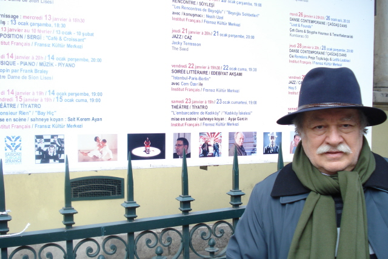

****

**Beyoğlu Belediyesi** ile Fransız **Kültür** Merkezi’nin ortaklaşa düzenledikleri “**Beyoğlu Sohbetleri**” programı geçen hafta pek kötü bir havaya denk geldi. **Beyoğlu** Caddesi’ndeki kargaşadan kurtulup konsolosluk binasına kendimizi dar attığımızda rahat bir **nefes** aldık. Doğruca **kantine** inerek birer çay söyledik. Karşıdan tanıdık bir **yüzün** bana doğru hareketlendiğini farkettim. Bu, V**olkan Köprülü**’ydü. Bizden önce gelmiş kenarda bir **masaya** oturmuştu. Her zamanki gibi **meraklı** gözlerle etrafı kolaçan ettiği sırada bizim **geldiğimizi** görmüştü…Yaklaştı:  
\-**Volkan** merhaba, ne **zaman** geldin ?  
\-Az önce, fazla beklemedim.  
 **Volkan** kibardır. Her şeye çabuk çabuk **darılmaz,** darılsa da belli etmnez, yine öyle yaptığına **emindim,** biraz sıkılmışa benziyordu, Fazla üstelemedim. **“Buyur otur”** dedim, dinlemedi. Etrafımda dolaşarak **fotograf** çekmeye koyuldu. **Digital** kameralar çıkalı Volkan’ın **fotograf** merakı arttı. Bir başladı mı dakikalarca **resim** çekiyor, eskiden olsa **film** harcamamak istemezdi.  Biraz **cimridir.** Neden sonra yerine oturdu.  
\-Nasılsın ?  
\-**İyiyim,**  
\-Bu **havada** nasıl geldin ?  
\-Ben **hava** mava dinlemem, sen neredeysen ben oradayım.

Sevgili **Volkan** ne kadar da hakikatlidir. **Masaya** daha sonra gelenlerden biri **sordu:**  
\-Ne zamandan **beri** tanışıyorsunuz ?  **Volkan**  yine belli etmeden **kızdı**. Anlamsız da olsa bu **soruya** cevap vermek için büyük **güç** harcadığı belliydi:  
\-**Elli yılı** geçti, biz **çocukluk** arkadaşıyız..  
Doğruydu… **Volkan**'la ellili yıllardan beri tanışıyoruz. **Volkan Köprülü**, Gerçekten “**Köprülüdür” Köprülüler** sülalesinin başlangıç neslinden "**Kabudan**\-ı Derya, **Sakız** Fatihi, **Yenikapı Mevlihânesi** şeyhi **Kaari Ahmed Dede'**nin dervişi “**Amucazade Hüseyin Paşa**” kolundandır. **Osmanlı Devleti'**nin bir zaman **payandası** olan **Köprülüler'**den kalma ulu bir çınar’dır **Volkan**.. Küçükken **Hisar'**da beraber **bisikletle** gezerdik. Ben **Üsküdar**’da **Bağlarbaşı’**nda **Nakkaş Tepe**’den bisikleti saldım mı, **Anadoluhisarı**’na kadar kendi kendine giderdi. **Beylerbeyi** ve **Çengelköy'**den hızla geçerek.. Dönüş biraz **zor** olurdu ya neyse.. Konumuz “**Beyoğlu Sohbeti**”

Salona biraz **geç** girdik, bekledik ki dolsun.. Vakit **gecikince** dostum neyzen **Ahmet Sosysal**’a taksim yapmasını söyledim. Eskiden **Cüzzam hastahanesi** olarak kullanılmış olan **Fransız Konsolosluk** binasının beşyüz kişilik **konferans** salonunda fazla **boş** yer kalmamıştı. **“Belediye başkanı** gelecek biraz bekleyelim..” dediler. **Başkanların** hiçbir yere saatinde gelmediğini **bildiğimden** sıkıldım. Halkı bir dakika bile **bekletmey**i hiçbir zaman kendime yediremediğim için az sonra **yerimden** fırladım “Ben çıkıyorum, **başkanınız** gelince keserim” diyerek **sahneye** huruç ettim.

Ortaya bir **koltuk** koymuşlar. Beni **meddah** gibi oraya oturttular. Toplantı **Belediye Başkanlığı** adına açıldı. Sunucu biyografimi okudu. Lafa başlarken **Beyoğlu** Belediye Başkanı **Misbah Demircan** kapıdan göründü. **Sözü** keserek karşıladık, **Lafa** yeniden başladık. Konu “ **Beyoğlu’nda Mevlevilik ve Mevlevi Kültürü**…” olarak bildirilmişti. Tabii ağırlık **“Galata Mevlevihanesi**” olacaktı.

\-**Beyoğlu**’na geleli **altmış yıl** oldu diyerek söze başladım ve devam ettim: altmış yıl önce **1949 yılının** sonbaharında beni **Galatasaray lisesine** yazdırdılar. O zamandan beri **Beyoğlu**’ndayım. Bu yörenin bir **parçası** oldum. Zaman benim için burada çok **farklı** oldu. Bazen çok **hızlı** geçti, bazen de **hiç** geçmedi.. Çocukluğumun en **değerli** yılları ile **gençlik** çağlarım ve **orta yaşlı** halim burada birbirine karıştı. Herşey öylesine **ansızın** ve içe oldu ki, şimdi **yılları** birbirinden ayıramıyorum. **Ne oldu** ? hatırlamıyorum.

Bazen **saatler** bile birbirine karışıyor. Eski **Hristaki** sonra ünlü **Çiçek Pasajı** olan yerin üzerinde **binaya** uydurulmuş büyük bir **meydan saati** vardır. Bu saat önceleri **üçü çeyrek  geçerdi**, sanırım yirmi yıldan fazla hep **üçü çeyrek**  geçti. Sonra otuz yıl kadar **sekiz buçuk** oldu. Anlaşılan bir ara **onarıp** çalıştırmışlar, ancak bir gün saat **sekiz buçuk’**ta yine durmuştu. Buraya gelirken baktım: **Dokuz’a çeyrek** var. Hemcinsleri gibi fazla **çalışkan** olmayan bu naçiz **saat,** yarım asırda üç defa **doğruyu** göstermişti.

         **         **

**Konsolosluktaki** toplantı **Galata Mevlevihanesi** üzerinde yoğunluk kazanarak devam etti: **Salon**u dolduran dinleyiciler, **485 yıl** önce kurulmuş olan bu **Mevlevîhâne** hakkında **temel** bilgiler edindiler. Burada **asırlar** içinde yetişen **şeyh** efendilerine dair sorular sordular**. Mevlevîhânenin** neden devamlı **onarımda** olduğunu ve ne zaman açılacağını **merak** ettiler. Bu konuda kendi **kişisel** yorumumu aktarırken biraz da **ileri** gittim, dedim ki : “**Galata Mevlevîhânes**i  devletin bir **müzesidir**. Burası eski **hükümetler** zamanında bir **Mevlevî Kültür Merkezi** olarak düşünüldü, ancak sonradan paralı **turistik gösteriler** salonu oldu, **devlet** bundan rahatsız, şimdi **onarımları** bahane ederek bir süre **kapalı** tutmayı ve unutturmayı deniyor.”

Toplantı Bir **Fransız** kuruluşu olan **Fransız Kültür Merkezi'**nde yapıldığı ve büyük ölçüde **“Beyoğlu Kültürüne**” ayrıldığı için sadece **İstanbul**’un değil tüm **Türkiye'**nin göz bebeği olan bu **kaza**  merkezi hakkında daha üst **perdeden** birşeyler söylemek gereği de **ihmal** edilemezdi. **Ülke** çapında bir eğlence ve **“boşalma**” yeri olan bu alan, aynı zamanda gerçekten **dünya kültürlerinin** ve çeşitli inançların **gösteri** yeri gibiydi. **Toplantıya** gelirken düşünüyordum: Sahi ! bu **Beyoğlu** ne kadar ilginç bir yerdi:

**Taksim**’den Ana caddeye girerken solda Minare gibi iki kulesiyle “**Aya Triada:Kutsal Üçleme**” Rum Ortodoks kilisesi göze çarpıyordu. Onun sağında 250 yıllık **Taksim Suyu** tesisleri vardı. Az ilerde sağda **Ağa Cami**  yer almıştı. Yola devam ettiğinizde Balıkpazar **“Üç Horon Ermeni kilisesine"** varıyordunuz. Solda **Galatasaray Lisesi** onun yanında **St. Antoine** İtalyan **Fransisken** tarikatı kilisesi tüm haşmetiyle yükseliyordu. Karşı sokakta **Meryem ana Rum kilisesi,** onun devamında, dar bir sokakta **Rum Katolik Melkit Kilisesi** ve karşısında **Kumaşçı Draperyo’**nun fetihten sonra vakfettiği **St.Pierre Manastır**’ı yer alıyordu. Solda sokak içinde **Kırım Kilisesi** namı ile ma’ruf  **İngiliz Angilikan kilisesi** ve en sonunda **Galata Mevlevîhânesi** ile sergi tamamlanıyordu. **Böylece** bu alanda bütün **dinlere** uğramak ve sonuda **Mevlevi** olmak mümkündü.

Aslında bütün bu saydığımız binaların hiç biri yokken **Mevlevîhâne** vardı. **Mevlevîhâne Fatih Sultan Mehmet** devri akıncı beylerinden **İskenderpaşa**’nın bahçesiydi. **Paşa** burayı vakfederek bir **Mevlevîhâne** olmasını istediğinde henüz **Beyoğlu** semti yoktu. Bu yüzden beş asırlık **Mevlevîhâne** şimdi yanına gelip sıralanan tüm **yapılara** tepeden bakarak onları bir **orkestra şefi** tavrıyla gözlüyor. Hepsine sonradan görme “**nevzuhur**” muamelesi yapıyor. Zaten öyle **değil** mi ?  Buralarda kimselere yokken **Mevlevile**r vardı..

**Beyoğlu'**nda yüzyıllardır **doğu-batı** karşılaşması yaşanıyor. **Dünyada** birbirine yabancı **iki zıt  kültür** burada buluşarak **ortak yaşamanın** sırlarına ermeye **çaba** harcamış. Hala da **harcıyor**. Burada **iki** ve daha fazla **yaşam** **biçimi** birbiri ile örtüşmüş, bazen biri diğerine **üstün** gelmiş, bazen diğeri **öncekini** bastırmış.. Amma ne olmuşsa **olmuş,** bir insan **manzarası** çizilmiş. **Politik** yatırımlara ve hain **odakların** gizli emellerine **malzeme** olmadığı zaman farklı insan **cinslerinin**, rahatça bir arada **yaşayabileceğini** göstermiş **Beyoğlu.**.

**Beyoğlu'**na gelip **kurtlarını dökmek** sonra da adam gibi **eve dönmek** mümkündür.  

