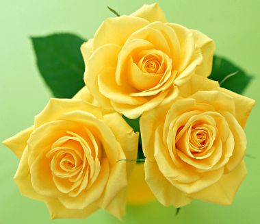

Sana **saldırmadığım** için Sevinmeliyim **Sana** bir kötülük Yapmadığım için **Mutlu** olmalıyım.

**Vahşi** hayvanlar gibi Doğal **yaşamda**  olmadığıma **Şükür** etmeliyim.

**Senin** bana kötülük Yapacağını **bilsem** de Seni yine sevdiğime. **Gurur** duymalıyım

**SUFİ** sevgiden yoksundur Ne verirlerse **onu** alır **Sevgi** ise bir çağlayandır Sevgiden yana **tüm** sözler Hep **yalandır**, yalandır.

                                 Sarı Şeyh
