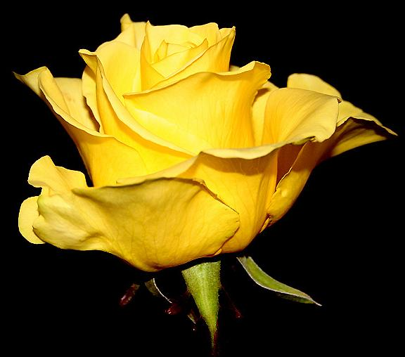

****

**Aşık** ki her **an** kendin görür Aşkında bin çeşit **hal** görür Hem **kendini** hem O’nu görür Sonra iki **canı** bir görür

Birden öte bir **yok,** bir tektir **Bir**, her an **O’na** benzemektir **Ruhu** bir sırla bezemektir Sırdan içre **sırra** ermektir

Kaldım bir an **sırrımla** sırdaş **Oldum** kendi sırrımla haldaş Vermedi bana **sır**, o yoldaş Bu ne **gizli** haldir, arkadaş

Gönlümde yer tutan bir **emel** Varlığımda oldu **tek** temel Aşk **pınarından** aldığım el **Kurban** ettiğim cana **bede**l

Erenlerin **bağında** bir gül **Dikene** aldırma sen hep **gül** Bir diken için **kırma** gönül Dikensizdir, dertsizdir **sümbül**

Sen de bu yoldan sakın **şaşma Kendini bil,** haddini aşma Kendini bilmeze **sataşma Alçaklarda** asla dolaşma

**SARI ŞEYH** derler bir kul vardı Aşıklık **sırrına** tapardı Aşka düşmeyeni **savardı** Susuzları **aşkla** suvardı

                                      **Sarı şeyh**
