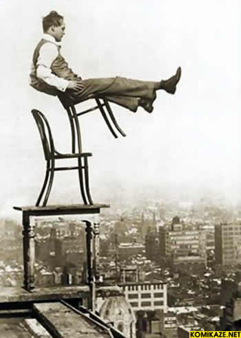

Benim adım Aydınlık Bir kardeşim vardı Uyanık Uyanık beni pek severdi. Benim gibi olmaya özenirdi.

Ben de onu severdim Ama her nedense ona pek Özenmezdim, kardeş işte Ne denir ? Sevgi bağı pek derin

Uyanık bir gün bana dedi ki: Ağabey seni pek takdir ediyorum Herkes seni seviyor… –Uyanık dedim, seni de seviyorlar, ama Senden korkuyorlar.   Uyanık sarsıldı. Benzi sarardı. Hiçbir şey söylemeden, Yanımdan uzaklaştı gitti Arkasından bakakaldım…

Üzüldüm, keşke Uyanığa Bunu söylemeseydim, galiba Şimdi Uyanık da kendisinden Korkuyor. Benden duyunca İnandı, iş  başka oldu.   O da yersiz bir korkuya kapıldı. Uyanık korkarsa artık, nasıl “Uyanıklık” yapacak ? Korku gelince  güven Nasıl yerinde kalacak ?

Kendisini kandıramayınca Uyanık, Başkalarını nasıl kandıracak ? Zavallı Uyanık, çaresiz Uyanık Dengesi bozuldu. Yazık !
