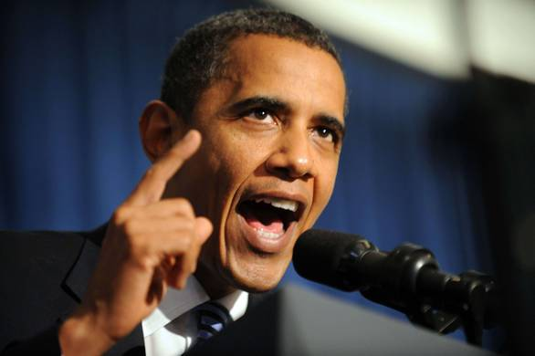

Plus d’un quart des **Américains** pensent, à tort, que **Barack Obama** n’est pas né sur le sol **américain**. Ils sont également de plus en plus **nombreux** (18 % de la population américaine aujourd’hui, contre 12 % à son arrivée à la **Maison Blanche)** à croire que ce dernier est **musulman.**

Ces chiffres **étonnants** seraient liés, d’une part, à une mauvaise communication de **Barack Obam**a, notamment au sujet de sa **personnalité** et de ses **croyances,** d’autre part, à une **campagne massive** de désinformation menée par ses **opposants politiques,** explique Le **New York Times.** Une **désinformation** rendue d’autant plus facile que le **président**, soutenant le projet de **mosquée** près de **Ground Zero**, s’est attiré les **foudres** de nombreuses

**associations** et hommes politiques. Mais cette prise de **position** n’est pas à l’origine de ces **erreurs** : les études montrent que les **Américains** ignoraient déjà un certain nombre de **choses** au sujet de leur **président** avant celle-ci.

Même parmi les **démocrates** ayant répondu à un **sondag**e repris par le **journal**, seuls 46 % croient savoir qu’**Obama** est **chrétien,** alors qu’ils étaient 55 % en **mars.**, (Courtoisie: **New York Times**)

_Türkçe özet: Amerika Birleşik Devletlerı Cumhurbaşkanı Barak Obama  Beyaz Saray’a geldiğinde %12 Amerikalı müslüman olduğuna  inanırken bu sayının şimdi % 18’e çıktığı belirtiliyor.Başkanın yıkılan Dünya Ticaret Merkezinin boş arsasına bir cami yapılması projesini destekleyişinin bu sonucu doğurduğu açıklanıyor._

_Newyork Times’in haberine göre Demokratlar arasında şimdi %46 kişi Obama’nın hırıstiyan olduğuna inanıyor, geçtiğimiz mart ayında ise bu sayı %55’idi._ (_Teşekkürler New York Times_)
