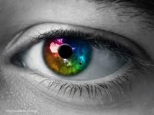

Can **gözü** bildiğini söyler Gönül gözü söylemez, **dinler** **Can** gözü konuşur Gönül gözü **susar**

Konuşan “**bir şey**” söyler Susan “**her şey**” söyler Şu **tuhaf** yeryüzünde Konuşurken **susanlar** **Susarken** konuşanlar var..

Dostum ! **konuş.**. **Susma** konuş.. Birşeyler **söyle** Söylemez susarsan Laflar içinde çürüyecek.. Rahatsız olacaksın.

Saygın ve Kıymetli **Dost !** Her doğrudan **yana** olma Bir **yerlere** takılıp kalma Dosdoğruyu ara Doğru var **doğrudan** içeri

**Gönül** gözü açılınca Can gözü kapanır İşte o zaman dosdoğru Güneş gibi.. **Sarı Şeyh**
