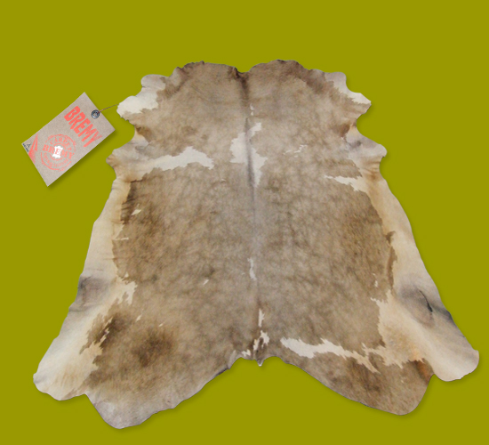

Ben **dost** derdinde Dost **post** derdinde

Her ikimiz de Bir **can** derdinde

**Cana** can verdim Kana **kan** verdim

Yine **döndüm** de Sana **el** verdim

Sel **aldı** beni **Yel** vurdu beni

Oldum da **deli** **Rast** geldi beli

Şu **yeryüzüne** **Divaneler** var

**Halkın** içinde Neler **neler** var

Kimi der”**hayır”** **Kimi** der “evet”

Her iki **yolda** **Şaşkın** kullar var

**SARI ŞEYH** yeter İş dünden **beter**

_Sarı Şeyh_

_önemli not: evet ve hayır kelimeleri üzerindeki tırnaklar referandum'dan sonra kaldırılacaktır._
