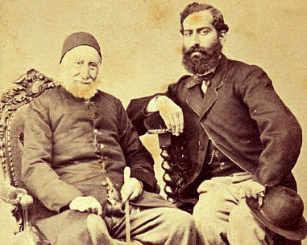

_Galata'da "eski bir ev" diye tanıtılan bir hanın fotoğrafı hakkında sorulan bir soruya cevabımdır:_

"Galata kulesinin yakınındaki Serdarı Ekrem sokağında yer alan bu han Osmanlı Devletinin yıkımına yol açanlardan biri olan ünlü Camondo ailesinin mekanıdır. Birkaç yıl önce ortadan kaldırılmasına karar verilmişken yorulmaz, Çiğdem-Selim Tugay çiftinin olağanüstü gayret ve özel çabaları ile kurtulmuştur. Şimdi sanırım iş hanı oldu.

Camondo ailesi Sultanabdülaziz döneminde meşhur olmuş "bir galata bankeri" sülalesidir. Ailenin kurucusu Salamon Camondo başlangıçta sadık bir Osmanlı teb'asıydı. Zaman ilerleyip kapitalist dünya çarklarını işletmeye başlayına Salamon'un iki oğlu ulusrarası finans dünyasında yerlerini aldılar. O sırada Avrupa'da birikmiş büyük sermaye grupları vardı. Camondo'lar oradan ucuzca aldıkları kredileri, Osmanlı Devletine defalarca katlayarak sattılar. Olağanüstü zengin olan aile 4000 sikke altınla Dolmabahçe Sarayının yapılması ve Kırım savaşı için gerekli mali imkanları sağladı.

Camondo'lar savaşlardan sonra ailece Paris'e göç ederek işlerini orada sürdürdüler. Fransada da öyle işler yaptılar ki Fransızlar bir gün Nessim Camondo'ya "yeter artık Versay sarayını da mı satın alacaksın ?" dediler Nessim "çoktan aldım ve Krala sattım" diye cevap verdi. O sırada Avrupa'da silah kaçakçılığı, savaş tellallığı, uyuşturucu ve her türlü kirli-gizli  hikayelerin altından  hep güler yüzleri ile Camondolar çıkıyordu.

Almanlar Paris işgalinde Camondo'ların saltanatına son verdiler Son Camondo 2ı yaşında bir delikanlı, Dasau 'da Alman kurşunları ile hayata veda etti. Camondo ailesinin Paris'teki şatosu bu gün Fransız hükümetine bağlı bir müzediir.

Ünü dünyaya yaygın günümüzün başarılı bankeri George Soros Camondo'ların yanında oda uşağı bile değildir. Neye yarar ki O menhus para dolaplarının kanlı çarkları arasında ne Salamon Camondo, ne oğlu Nessim değil 21 yaşındaki küçük torun, Camondo cezayı yemişti.

Ya Kırım savaşında Sivastopol bataryalarının atış menziline girerek savaşan efsane savaş gemimiz "Mahmudiye"de fedai can eden arslan gibi Osmanlı delikanlıları.. Kapkara bir savaşın nurlu şehitleri.. tarihe eli kanlı olarak geçen bir banker sülalesi ve şehit delikanlılar. Herkes görevini yapıyor. Rabbim iyi görevler nasip etsin. Slm."
