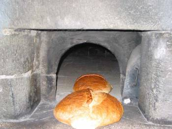

**Maya** tutarsa yaşadık Bir göz, bir **göze** değerse Herşey **başkalaşır**

Yaşam **düzene** girer **Haller** güç kazanır **Yükler** azalır Hayat **bahara** döner **Maya** tutarsa

**Sözler** anlaşılır İsimler **anlam** kazanır **Eşya** nura döner **Maya** tutarsa

**Maya** diyor ki : “Benim gibi **olacaksın”** **Kabul**, sen da bana **uyarsan** Uymazsan, nasıl **tutacaksın** **İkimiz** bir olmadan Bir başka **varlık** doğmaz.

**Maya** tutarsa **hem** sen Hem **ben** ve o, yaşadık O zaman **samanlık** **Seyran** olur değil mi ! **Maya** tutarsa

Ulu **Rabbim** bizleri  **Asi** kullardan eyleme **Mayalar** tutsun Mayalar **tutacaktır.**

“**Reddi hakim**” mümkünse de “**Reddi Tanr**ı” nasıl olacak ? O zaman **korkma !** **Mayalar** tutacaktır.

Ey **insanoğlu** Sen inan ve **güven** Ona eskiler “**Tevhid** ve **teslimiyet**” Demişler bu **ne** demek ? **Mayalar** tutacaktır Anlamında.. **Hayırlı** olsun !
