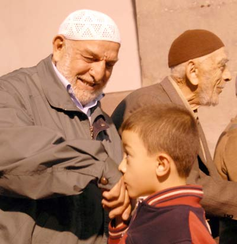

****

**Müslümanlar** bir ay **oruç** tuttular. Gün boyu **yemek** yemediler. **Su** içmediler. İbadete uymayan **fiilerden** kaçındılar. **Gözlerini** yere dikerek dünyanın **uğursuz** işlerini görmemeye **gayret** ettiler. Kötü bilinen dahil, kimseye **kötü** bakmamayı bu ayda daha yoğun **becermeye** çalıştılar.

Bu yüzden belki **Aff**ı **İlahiye** uğradılar Bunun için **bayram..**

Müslümanlar **bir ay** boyunca hiçbir **canlının** yaşam hakkına **tecavüz** etmediler. Hiçbir **mahlukatı** yok yere **öldürmediler**. Kalpleri derin bir **yaradılış neş’esi** ile doldu. Bu yüzden **her canlı** onların yanında **hayat** buldu, işinden gücünden **emin** oldu. Bu yüzden **Müslümanlar**..

Belki **Affı İlahiye** uğradılar. Bunun için **bayram**

Birbirleri ile **iyi** geçindiler. “**Hak verilmez alınır**” kuralını bir tarafa bırakarak “haklının **hakkını** vermeye” çalıştılar. Kimsenin **kuyusunu** kazmadılar. Kazanlara **sitemler** yağdırdılar. **Müslüman** topluluklarının her zamandan daha **emin** olarak işlerini güçlerini **düzenlemeleri** için **cenab-ı Rabbül Alemin**’e niyazda bulundular. Bu istekleri ile kendi **kişisel** dertlerinin üzerine çıktılar ve “**Affı mağfireti”** yeryüzünde yaşayan her **insanoğlu** için istediler.

Bu yüzden belki, **Affı İlahiye** uğradılar. Bunun için **bayram..** **İslam ülkeleri** hak etmediği biçimde **savaş, açlık** ve **felaketler** zincirinde yaşarken kendi **mutluklarını** düşünmediler. Onlar **"tevhid ve teslimiyet"** çarkları içinde yoğrulmuş  **Müslümanlardır** ki dünyada **son aç** doymadan, **son çıplak** giyinmeden, **son gözyaş**ı akıp kurumadan kendilerini **rahata** ermiş saymazlar. O **müslümanlardan** olmak için gösterilen **gayret** dolayısıyle…

Belki **Aff**ı **İlahiye** uğradılar. Bunun için **bayram..**

Müslümanlar **insan** topluluklarının başına **bela** olan bir takım **yaradılış özürlü mahlukatın** kendi toplumlarının haklarını **çiğnemesine**, şu güzelim **yeryüzünü** kan ve **ateş** deryasına çevirmesine “anlamsız **çatışmaların** dinmesi” uğruna hiç olmazsa bu ay göz **yummalar**ı yüzünden..

Belki **Affı İlahiye** uğradılar. Bunun için **bayram**

**Müslümanlar** arzın diğer yörelerinden kendilerine **yöneltilen** her haksız ve önyargılı **saldırıya** karşı aşırı **metanet** gösterdikleri,  kendilerinin “**kanlı terör odakları**” ile bir tutulmaları karşısında dahi **cesaretlerini** kaybetmeyerek **dinlerine** her zamankinden daha büyük bir **gayretle** ve **ilahi** bir **neş'e** ile sarıldıkları için..

Belki **Affı İlahiye** uğradılar. Bunun için **bayram**

Siz **müslüman** mısınız ? **Kitabı** bozulmamaş **tüm dinlere** ve **dinsizle**r dahil, tüm **insanlığa** saygılı mısınız ?

O halde size de **bayram** ! “ Kutlu olsun” !

Çoluk **çocuğunuz, abla kardeşiniz, hanımnine dedeniz, konu komşunuz, uzak yakın akrabalarınız, asker arkadaşlarınız ve işyeri çalışanlarınızla** birlikte Nice nice sağlıklı **bayramlara..**
