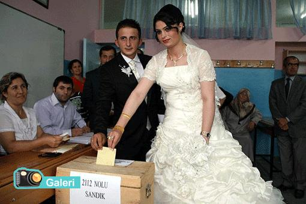

Seninle **dalga** geçiyorlar **Jonathan** Bilmem **farketmedin** mi Jonathan ? Seni sürüyorlar **Batı**’ya doğru

**Denize** döküleceksin **Jonathan** **Yaradan** bilir ya.. İlk **paskalya**’da denizdesin

Dört **asır önce** bir suç işledin **Cezanı** çekeceksin **Jonathan** **Ayvaya** kiraz aşıladın Bahçenin **düzenini** bozdun Cezanı çekeceksin **Jonathan**

Sen ki **kafana** güveniyordun, Ama **kafan** sana güvenmedi, **Jonathan** Sana neler **neler ett**i de, anlamadın Vermedi sana **Tanrı** anlamayı..

**Doğa** sana öyle bir **şamar** atar ki O **şamar** yüzünden **kalbinde** Öyle bir ters **Damar** atar ki, Yok **olmayı** istersin **Jonathan**

Sen en iyisi **şimdiden** çekil git **Kanlar** yerde kurumadan Derdime **dert** katmadan.. Hey !.. duydun mu ? **Jonathan**

**Sümbül Sarmısak**
