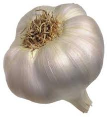

Evlerimizi içi **nurludur** **Sokak** karanlık Evlerimiz içi **Hakk**’la dolu **Sokağın** durumu **vahim** **Yürekler** acısı **Kapılar** karanlıkları örter Dışarda **kıyamet** kopuyor **İçerde** hepimiz eminiz,

Dışarda **alçaklık** var İçerde **rahatlık** **Kapıyı** içerden Dışarıya **kapa** **Evin** İçi bozulmasın

Girmesin **tertemiz** haneme **pislik** Silemem **sokakları** istesem de **dirlik** Bak ne **güzel** evin içi Güllük gülistanlık **şenlik**

Yanıyor yeryüzü **çıtır çıtır** Bir **gün** bize de gelir Bilmez ki **gönül** hatır

Eve gir **kapıyı** kapa Bakma **sokağa** **Kör** olursun

Kendine **gel** **Kendine** sarıl **Yuvana** dön **Gidiyorsun !**

_**Sümbül Sarmısak**_
