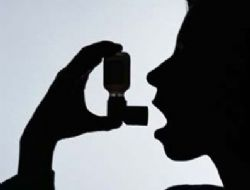

_Türkçe özet: İtalyan doktorları Facebook bağımlısı 18 yaşında bir gencin, ekran önünde geçirdiği uzun saatlerden sonra astım krizlerine yakalandığını saptadılar. (Nefes darlığı hastalığı) Doktorlar kız arkadaşından yeni ayrılan gencin, Facebook’ta eski sevgilisinin resmini gördükten sonra krize girdiğini ileri sürüyorlar._ (Teşekkürler Yahoo)

Des médecins italiens ont découvert qu'un jeune homme voyait son asthme empirer lorsqu'il consultait Facebook ! Pourquoi une consultation régulière de Facebook déclencherait-il des crises d'asthme chez un jeune homme de 18 ans ? C'est ce qu'a tenté de découvrir récemment des médecins italiens en découvrant ce cas rarissime chez un asthmatique. Selon la revue The Lancet, un jeune homme a en effet vu ses problèmes respiratoires empirer parce qu'il surfait trop souvent sur le réseau social ! Pour faire le lien avec le site Internet, il a fallu comprendre dans quel état psychique se trouvait le garçon. Ce dernier venait de subir une rupture amoureuse douloureuse. Il s'est avéré que ses crises d'asthmes empiraient lorsqu'il consultait le profil Facebook de son ex-copine, qui n'était visiblement pas très chagrinée par la fin de son idylle. Pour être certain qu'il s'agissait bien de la source du problème, les médecins ont demandé au jeune homme de ne plus aller sur le réseau social durant quelques temps. Après plusieurs semaines de sevrage, son asthme était redevenu stable.(Courtoisie Yahoo)
