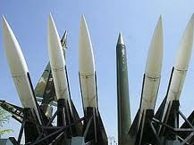

Amerikan sanayinde füze kalkanı  **teknolojisi** için soyunan kuruluşların “**medya**” ilişkileri varmış. Yani bu başarılı **silah tüccarları** aynı zamanda **TV** ve gazete sahibiymiş. Yani sistemi geniş **halk kıtlelerine** şirin göstermek için ellerinde fevkalade etkili **yayın organları** varmış. Bu yayın organları ile daha şimdiden  **amansız** bir propaganda yarışına girişmişler veya **girmek üzere** hazırlanıyorlarmış.

Günlerdir **konuşulan** bu, artık her şey açıkça ve **net** anlaşılıyor. Bir takım **kişilerin** ve böyle şeylerle var olan **grupların** zengin olmaları için, birtakım kişilerin **ölmekleri** gerekiyor. Kitle halinde **ölecekler**. Mecburlar. 1,5 milyon **Iraklı,** bir o kadar **Afganlı** nasıl öldüyse onlar da **ölecekler**. Hedef bu. Üstelik bu **siyaset** ve hazırlık bu kişilerin yaşam **haklarını** savunma adına kuruluyor.

Anlaşılan **yaşayan** insan sayısı **dünyaya** fazla geliyor, bunların önemli bir kısmının “**irtihal-i dar-ı beka**” eylemeleri lazım. Vaktiyle **İran**’da **Tebriz** şehrinin halkı pek **ziyade** çoğalmış. Tebriz valisi **Şah**’a demiş ki: “Bunların yarısını **öldürelim..**..” Şah kabul etmiş. Tam işe başlayacakken bazı **akıllı adamlar** araya girerek **Şah**’ı kararından caydırmışlar.

**Amerika**’da silah fabrikatörlerinin **Medya** kuruluşları varmış. **TV yayın organları**, gazeteleri bol maaşlı **köşe yazarları** varmış. Hiç **hayret** etmedim. Bu dünyada ilk değildir. 100 yıl önce **I. Dünya** savaşında o zamanki Fransız Cumhurbaşkanı **Clemenceau**’ nun kardeşinin **silah fabrikası** ve “**Exelsior**” isimli bir gazetesi vardı. Bu gazete ve benzerleri halkı **savaşa hazırlamakla** görevliydiler. Gazete insan topluluklarını “**savaşın** gerekli olduğuna” inandırmak için **kurulmuştu.** 

Çağımızda şimdi “**gazete”** fikrine  bir de **Televizyon**” eklenmiş ve iyice azan **silah tüccarları** her eve giren bir **alet türü** kazanarak bununla olağanüstü bir **güç sahibi** olmuşlardır.  Son yıllarda buna ilave edilen “**cep telefonları”** da devamlı dinlenerek halkın ne **düşündüğü** kolaylıkla kontrol edilebilecek hale gelmiş ve böylece artık **halkları** istenen **yöne** çevirmek için hiçbir **engel** kalmamıştır.

**NATO** andlaşmasını teşkil eden **23** müdür ? **26** mıdır ? kaç **ülkeyse** o kadar ülkenin halkının  ilk aşamada **300 milyon dolar** harcaması gerektiği söyleniyor. Böylece bu halklara “siz **uslu** durmaz ve bu **paraları** vermezseniz bir sabah şehirlerinizin üzerinde İran **“şahap** “füzelerinin kırmızı **karnı baharını** görebilirsiniz”  demektedirler. Eskiden insanları “**Rus füzeler**i” ile korkuturlardı, şimdi bunlar “**İran füzesi**” oldu. Batı’nın yeni ”korku **generatörü**” Moskova değil “**Tahran”**dır.

Eski zamanlarda her **kerhanenin** bir belalısı olurmuş. Eli kanlı, kafası dumanlı bu belalılar, **patron**’un parası ile sermayeleri korkutur, **kadınların** uslu durmalarını sağlarmış. Şimdi bu düzen **uluslar arası** planda devam ediyor. Batı **durmaksızın** kendine bir “**belalı**” arıyor. **Bin Ladin** mi olur, **Molla Ömer** mi ? bir belalı bulunacak. Batı’nun yeni “**belalısı**” hayırlı olsun. Bakalım sonraki zamanların “**belalısı”** kim olacak  ?

Bu arada İran çırpınıyor “ben **uranyumu** barışçı amaçlar için”işliyorum. “Size **saldırmak** gibi bir niyetim yok” **Batı** ise bunu hiç duymuyor. **İran**’ın hesabını kesti bile... Artık İran’la “**uranyum**” la, “**şahap füzes**i" ile bir işi yok Batı “**kütle imha silahı vardır** “diye **Irak**’a saldırdıktan sonra hiç yüzü kızarmadan” aaa.. **yokmuş**" dedi ya. Yine aynı **şey** olacak.

Bizim **Devlet** adamları da “belgede **İran** lafı etmelerini önledik” diyerek sevinçten **takla** atıyorlar. Bunu pek büyük **başarı** diye sunuyorlar. Kurt **kuzuyu** parçalamaya hazırlanırken kurd’a “yapma..etme **ayıptır**…” diye yalvarıyorlar. “Hiç olmazsa baştan söyleme, **korkmasınlar**” diyorlar.

Ne müthiş bir küresel “**kaht-ı rical** “yaşıyoruz ya **Rabbülalemin..**
