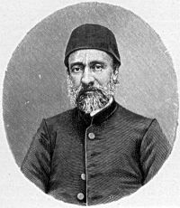

/\* Style Definitions \*/ table.MsoNormalTable {mso-style-name:"Normal Tablo"; mso-tstyle-rowband-size:0; mso-tstyle-colband-size:0; mso-style-noshow:yes; mso-style-parent:""; mso-padding-alt:0cm 5.4pt 0cm 5.4pt; mso-para-margin:0cm; mso-para-margin-bottom:.0001pt; mso-pagination:widow-orphan; font-size:10.0pt; font-family:"Times New Roman"; mso-ansi-language:#0400; mso-fareast-language:#0400; mso-bidi-language:#0400;}

_Mehmet Emin Âlî paşa_ (1815-1871)

**Adam** bizim topraklarımıza **atom bombası** yerleştirmiş, bunu da **nasıl** yaptıysa gizlemiş, şimdi **vikiviki** ortaya çıkartıp **Amerikan hükümeti** de doğrulayınca nasıl olur da **Türk-Amerikan** ilişkileri **bozulmaz ?** anlamıyorum.

**Türk-Amerikan** ilişkilerinin bozulması için **İran savaşı'**nın başlaması mı gerekli ? Amerikalılar yüzünden İran “**Şahap**” füzelerinin **şehirlerimize** düşmesi mi gerekli ?  Siz hangi sularda **yelken** açıyorsunuz  ? **Allah aşkına.**. İş **mahalle kavgasına** döndü, **Tayyip** bey hem **Obama** hem **Ahmedi Nejat** ile dost olmuş acaba hangisine **meram** anlatacak ? Böylesine **şaşkın** bir başbakan daha **Cumhuriyet** tarihinde görülmemiştir. Belki **Osmanlı** tarihinde de ?

“**Kadim Amerikan dostluğundan**” söz açıyorlar. **Kore**’de beraber **savaştık** diyorlar, evet öyle oldu. **Askerimiz** orada **şerefle** savaştı ve **Amerikan askerini** korudu. **Kunuri** savaşında **şehadet** mertebesine ulaşan tüm askerlerimiz bir A**merikan** subayının hatasına kurban gitti. Elbette **şehittirler**, ama **harp tarihi** başka şeyler yazıyor.

**Sömürgecilik** döneminin en hızlı zamanında **Amerikalılar** uzak doğuda **Japon’**larla rekabete giriştiğinde  o **yörede** ve **Pasifik** adalarında yaşan **Müslüman** halk, **Osmanlı** devletine baş vurarak “Bu iki **ulustan** hangisine uyalım ?” demişler. **Babıali**’nin cevabı: “**Amerikalıları** henüz tanımıyoruz, **Japonlar** için kendi **manevi değerlerine** bağlı asil bir **millet** diyorlar..siz onlara **uyun**”

Daha **yüzeli yıl** önce dünya **politikasında** söz sahibi olan **Osmanlı İmparatorluğunun** hatırası önünde şu **yaşadığımız** çağda devletimizin düştüğü **pejmürde** hale bakın. Bir **Osmanlı** paşası olsa da dış **politikamızı** yönetse .. Yoksa **Amerikalı** bizi İran savaşında yem olarak kullanacak.

Yakın devrin ünlü sadrazamlarından **Mehmet Emin Âlî paşa** “bir icratta bulunduğum zaman **Rus diplomatlarının** yüzüne bakarım, eğer gülüyorlarsa **Osmanlı devleti** için kötü bir şey **yapmışım** demektir, eğer **surat** asıyorlarsa **Devletimiz** için iyi bir şey yapmışım demektir diyor. Şimdiki **devlet adamlarımız** ise değil yabancıların tutumundan **ülke** için hayırlı haberler  elde etmek dış t**oplantılarda** yabancı liderlerin yanında **resim** çektirebilmek için itiş kakış **gizli savaş** veriyor.  Bu sonuç iki ayrı **devletin** büyüklük farkıdır.

Mükemmel bir **Fransızcası** olan **Mehmet Emin Âlî paşa** devrin Fransa İmparatoru **III.Napolyon**’un “**Girit** adasını bize verir misiniz ?” sorusuna karşılık “ veririz, aldığımız **fiata**” demişti. **Osmanlı** İmparatorluğuna  **56.000 şehide** mal olanan bu adayı **Paşa**, ancak siz de aynı **vatanperver gayret**i” gösterirseniz **geri** veririz demek istemişti.

Devlet **asalet** demektir, devlet **mehabet** demektir, devlet adına ”**millet”** denen ve sayısı **milyonlara** varan bir grup **şerefli** insanın hakkını **hukukunu** korumak demektir. Bir toplumun geleceğini **garanti** altına almak demektir. **Bilgi** ve hareket demektir. Laf **ebeliği** değildir. Şimdi bu **devletin** liderinin kültürü “**Van minut** ” ten öteye geçememiştir.. **Ülkenin** en çok lidere **ihtiyacı** olduğu zamanda tek kelime **yabancı** dil bilmeyen bir başbakanımız var.

Acaba ? diyorum **Paşa** bu günlerde yaşasaydı  “**füze kalkanı**” ve “**nukleer silah”** **krizini** nasıl çözerdi. Herhalde **Obama** ile yüz yüze geldiğinde “Evet ülkeme **bomba koymana** razı olurum, ama o **bombalar** sonucu çıkacak **savaşta,** kaybedeceğimiz vatandaşlarımızın **kan** bedelini  sen kendi **vatandaşlarının** kanı ile öder  misin ? derdi.

/\* Style Definitions \*/ table.MsoNormalTable {mso-style-name:"Normal Tablo"; mso-tstyle-rowband-size:0; mso-tstyle-colband-size:0; mso-style-noshow:yes; mso-style-parent:""; mso-padding-alt:0cm 5.4pt 0cm 5.4pt; mso-para-margin:0cm; mso-para-margin-bottom:.0001pt; mso-pagination:widow-orphan; font-size:10.0pt; font-family:"Times New Roman"; mso-ansi-language:#0400; mso-fareast-language:#0400; mso-bidi-language:#0400;}

Kurulduğu günden beri **dünyaya** savaş, silah ve bela **saçarak** ayakta kalmış bir **ülkenin** liderine bir **Osmanlı paşası**'nın vereceği ders ne **muhteşem** olurdu.
