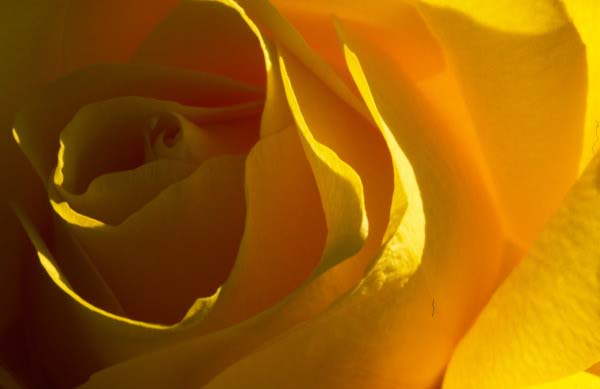

Beni mi **sevdin** Bendeki **seni mi** sevdin **Sendeki** beni mi sevdin ? Sendeki **ben** miyim Bendeki **sen** misin ?

Bilmem ki **söylesene !**

Aşka mı **aşıksın** **Aşkına** mı aşıksın Bendeki **aşka** mı aşıksın ? **Rüzgara** mı aşıksın

Bilmem ki, **söylesene !**

Neyin **peşindesin** Nelerden **söz** ediyorsun **Kimlerle** geziyorsun Sen nesin **biliyor** musun ?

Bilmem ki, **söylesene !**

**Ayna** oldun da gözüme İnanmadın hiçbir **sözüme** **Sonsuza** giden hayallerde Gizlendin karşılıklı her **aynada**

Varlığın **yokluğundan** soruldu **İnsanoğlu** bu işten yoruldu Nesin, **nasılsın**, nicesin ? Kendini kendi çözer **bilmecesin** Sen ey **Dost** ! kendinden de **hallicesin** Söylesene**, söylesene  sen nesin** ?

**Sarı şeyh**
