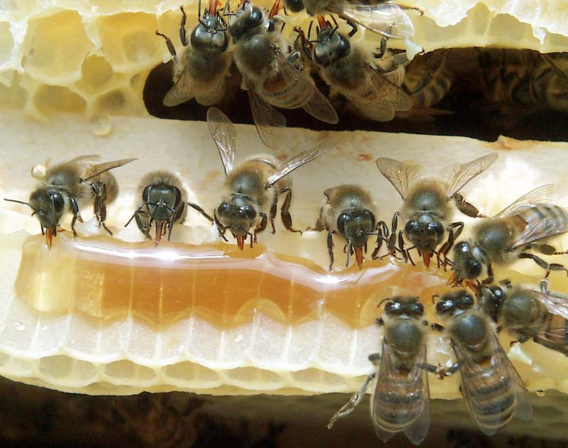

Şu coşkun **akan** sele bir bak Geçmiş **yüzyılların** çoğu **Durmakta** derinde Anlamak varsa **kaderinde** **Göreceksin**, her şey yerli yerinde

Çün bu **alem** var oldu bir anda Önce sebep sonra **mekan** kurulur ya, **Ters**i oldu önce **mekan** kuruldu Şimdi **sebep** aranıyor

Sebeplerden **yola** çıkanın Başı **beladan** kurtulmaz Sebeplerin **sebebine** geri dön Sorma **dört eleman** altı yön

**Nazlı** yarim ne de **hoş** kâmetin var Hem **mârifetin** hem **kerâmetin** var Dünyaya öyle bir **çalım** attın ki Arılar **peteğine** saklandı kurtuldu;

**Sarı Şeyh**
