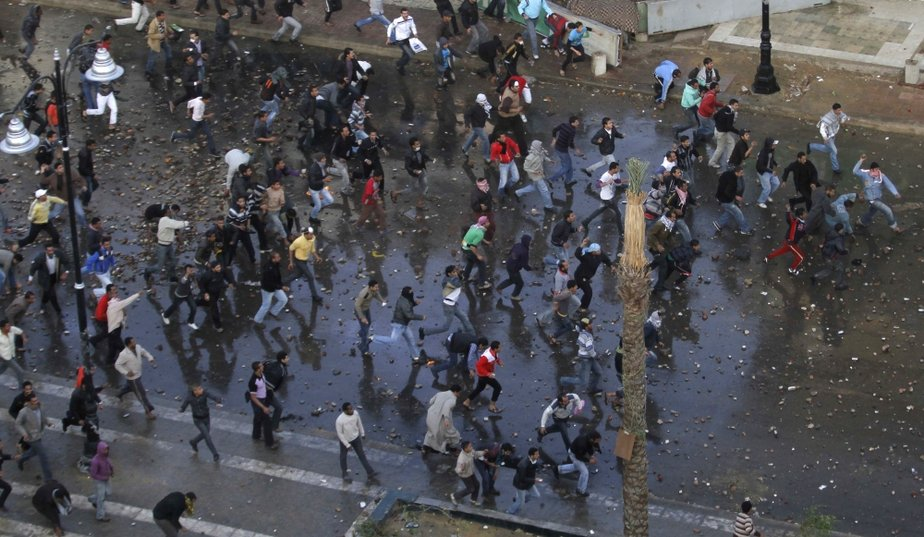

   [ Tunus, 16 ocak 2011        Süveyş 26 ocak 2011 (_Courtoisie Yahoo_)           (_Courtoisie Paris Match_)](../uploads/2011/01/cailloux_.jpg "cailloux_.jpg")

**Vikileaks** belasının  **richter** ölçeğinin en üst düzeyinde  bir **siyasi depreme** yol açacağı belliydi. Dünyanın tüm yerleşik i**hanet şebekelerini**n bir sel felaketi ile sarsılacağı anlaşılmıştı. **Demokras**i diye, globalizasyon diye, **serbest ekonom**i, çağdaş demokrasi yok bilmem ne ? diye **halkları soymanın** sonu geldiği **ufukta** beliriyordu.

**Ekonomik** bunalımların, **işsizlik** sorunun, **enflasyonun** kasden çıkarıldığı **belli** olmuştu. Ve **halk** sonunda patladı. Şimdi **sokağa** iş düştü. Yollara dökülen **8 bin** insan **Tunus’**u karıştırdı. 16.000 kişi **Yemende** sıra bekliyor.

Günde **2 dolarla** hayat geçiren **Yemen**’in yüzde kırk halkı göğsünü **diktanın** silahlarına açtı. Artık **ölüm tehdid**i kimseyi durduramayacak Zaten **ölü yaşamaya** mahkum edilmiş insan **kütlelerini** daha fazla durdurmak **mümkün** olabilir mi ? İnsanları soyup sovana çevirerek **ülkeler**i bir avuç soysuz **dejenere zenginin** eline bırakmak olur mu ?

 

**Mısır**’ın en şerefli adamı Baradai dedi ki “ne yaptıysak **fayda** etmedi, nasihat verdik **olmadı,** siyasi program **teklif** ettik, tutmadı, parti kurduk **yürümedi**, yolsuzluk ve **ihanet** her gün inatla artarak **bacay**ı sardı, sonunda **gençler** işi ele aldılar… **Sokağa** iş düştü ” Dünyanın sevip saydığı **Arap Birliği** Başkanı Baradaı **Kahire**’de **Hüsnü Mubarek**’in sarayına doğru yürüyor... **Binlerce** insan arkasında.. Hey  mubarek **Hüsnü Mubarek,** bunu da mı görecektin ? **Göstermelik** çakma seçimlerle **kendini** seçtire seçtire bu **günlere** geldin.. **Allahın** izniyle şansının çizgisi buraya kadar.

Dünyada **demokrasiye i**zin vermemiş, halklarının başına **yılan gib**i çökmüş  tüm sahte **halk** önderleri kendi **izin**e düşmüş **Sibirya kurtuna** benziyorlar. Ünlü **Sibirya kurdu**, karla kaplı korkunç **ormanlarda** dolaşırken **farkına** varmadan daire çizer, **yola** devam ettikçe dairelerde ayak izleri **çoğaldığında** onların **kendi izi** olduğunu anlamaz, **sürüye** yaklaşıyorum diyerek daha fazla **koşarmış,** daha fazla, daha **fazla** derken yorulur **düşer** ölürmüş. İşte olay bu...

Aslında özellikle **Fas**’tan **Endonezya**’ya kadar kurumlarını yitirmiş veya kuramamış tüm İslam ülkeleri yüz yıllardır bu **yorgun kurtlarla** yönetiliyor. **Fas**’ta kral **Hasan, Cezayir**’de **Buteflika**, Tunus’ta kaçak **bin Ali, Libya**’da **Kaddafî**, **Mısır**’da **Hüsnü** **Mubarek, Irak**’ta devri**k Saddam**, **Afganistan,** **Pakista**n, **Belücistan** öylece gidiyor.

Bu ülkelerin **halklarının** birbirleri ile teması dikkatle önlenmiştir. **Fas Cezayir**le kavgalıdır, **Cezayir, Tunus**’la anlaşamaz, **Tunus Libya’**ya dargındır, **Libya Mısır**’a küskündür, **Mısır Suriye**’ye kızar, **Suriye Lübnan, Ürdün** ila nihaye uzayıp gidiyor

Bu **ülkeler** bir atlamalı birbiri ile **barışıktır**. **Fas Tunus’**la, **Tunus Mısır’**la, **Mısır Pakistan**’la iyi geçinir. Bu **haritayı** kim çizdi ? Tabii ki **dünyanın** bu haritası **emperyalist** Batılı’ların **savaş coğrafyasıdır**. Onlar çizdiler. Her **ülkeye** kendi adamalarını koydular. Birbiri ile **Kavgalı** ülkelerin arasında **vize** yoktur, halklar en yakın **komşular**ı, akrabaları, **dindaşları,** dildaşları  ile **temas** edemezler. **Emperyalistlerin** başlıca **maksatları**  halklar birbiri ile temas etmesin. **Gençler** anlaşmasın, **soygun** gideceği yere kadar gitsin. İşte şimdi **soygunun** sonu geldi. **Enternet b**ir anda tüm hesapları **tersine** çevirdi. Hiç **akıllarına** gelmemişti.

**Halk düşman**ı, yol kesici, **haydut,** uygarlık engeli, **iktidar** hırsızlarının şimdi tek çareleri **uluslararası** iletişim araçlarının **kökünü** kazımaktır. Yoksa kendi **kökleri** kazınacak.
