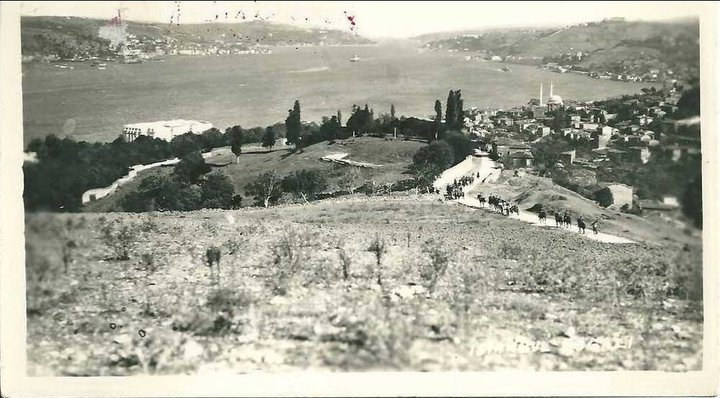

 [ Üsküdar 1953](../uploads/2011/01/nakkasbaba-1.jpg "nakkasbaba.jpg") Üsküdar Kuzguncuk'un arkasında Nakkaşbaba tepesi. Soldaki toprak yolun başından bisiklete binerdim. Bisiklet yokuştan aşağı uçarcasına iner Beylerbeyi'ne kadar beni taşırdı, dönüşte de ınleye sıklıya ben onu taşırdım. Nakkaştepe son otuz yıl içinde kabuk bağladı. Betonla örtüldü, sonra o betonlar yosunlandı. Ne bisiklet kaldı ne toprak yol. Tepeye kama gibi köprünün ayağı çakıldı. Üzerinde Cadde Bostanlı zengin çocukları PORŞE  oynuyor. Bisikleti yukardan salsam acaba yine beylerbeyine iner mi ?
