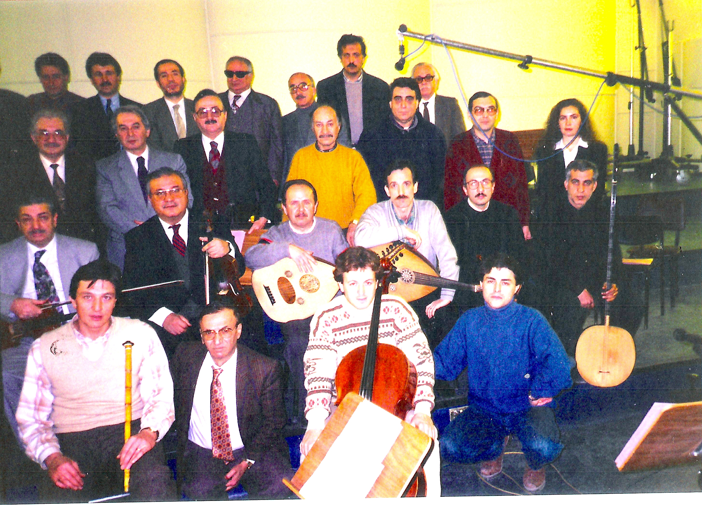
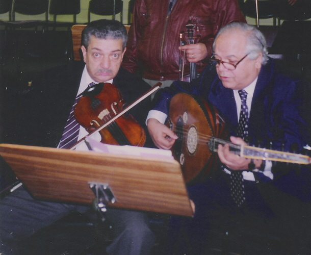
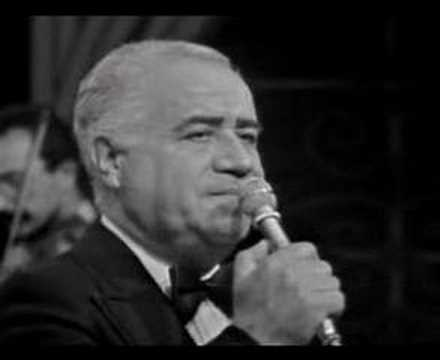
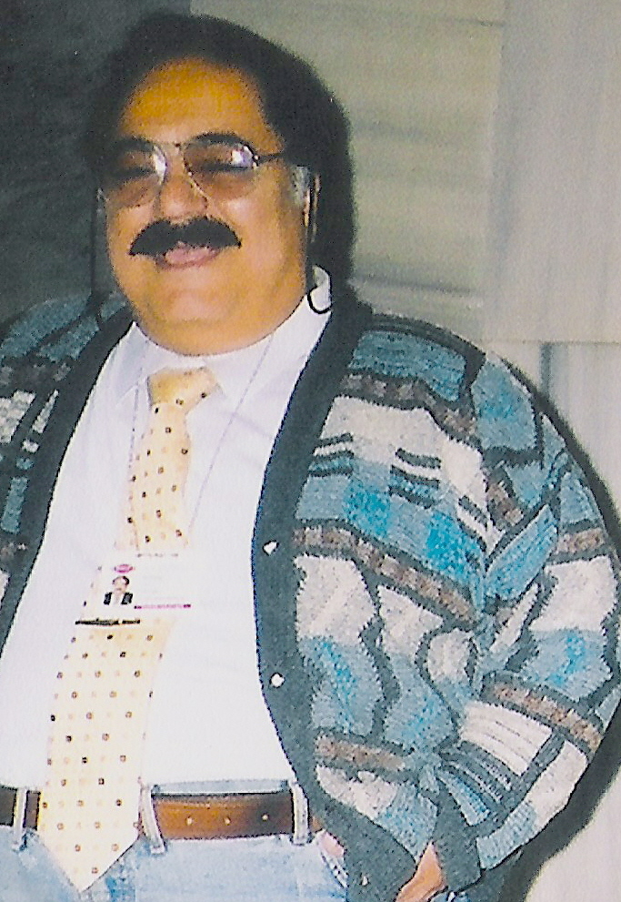
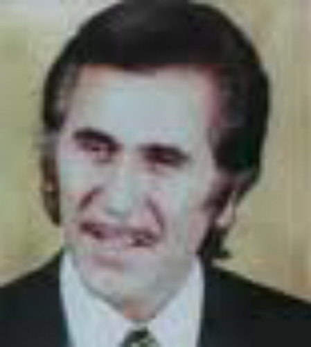
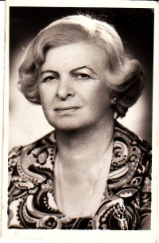

/\* Style Definitions \*/ table.MsoNormalTable {mso-style-name:"Normal Tablo"; mso-tstyle-rowband-size:0; mso-tstyle-colband-size:0; mso-style-noshow:yes; mso-style-parent:""; mso-padding-alt:0cm 5.4pt 0cm 5.4pt; mso-para-margin:0cm; mso-para-margin-bottom:.0001pt; mso-pagination:widow-orphan; font-size:10.0pt; font-family:"Times New Roman"; mso-ansi-language:#0400; mso-fareast-language:#0400; mso-bidi-language:#0400;}

_Not: Bir profesyonel gazeteci olarak her pazar bir günlük gazete'ye gönderdiğim  yazılar, resimler ve başlıklar, yayıncının görüşlerine ve yayın ilkelerine göre kısmen sansüre uğramaktadır. Dokunulmamış yazıları yayınlıyorum;_

Flaş:Bir devlet kuruluşu olan TRT’de müziğin fazla yeri yoktur. Radyolar kurulduğu günden beri siyasal iktidarın çizgisinden ayrılmamış, sadık bir devlet sözcüsü olmuştur. Bu gelenek TRT’nin içinde de devam ederek günümüze ulaşmıştır. TRT Anayasaya rağmen bağımsız değildir.

Bir müzik kuruluşu olduğu halde siyasi yönü ağır basan TRT’ de genel müdürler dahil üst düzey yöneticileri arasında genellikle müzisyen sayısı azdır. Genel müdür Siyasal iktidar tarafından atanır. Genel müdürün  atadığı çalışma arkadaşları ise TRT kadrolarında yer alan kurum içindeki bürokratlardan seçilir. Bu noktada da kurumun varlık kazandığı yıllardan bu yana süregelen bir çelişki yaşanmaktadır.

San’atçıya yakın olan, stüdyolara girip çıkan alt düzey yöneticileri arasında müzisyenler vardır, fakat bunlar çoğu zaman müzik dünyasında tutunamamış, müzik bilgisi eksik kişilerdir. Bunların arasında beste yapanlar da çıkar... Bestelerini zorla çaldıranlar da vardır... Müdürlerden gelen besteleri çalıp söylemek başlı başına bir derttir. Acaba bu beste iyi mi ? çalınsa uygun mu ? iyi olduğu için mi ? yoksa müdürün bestesi olduğu için mi çalınıyor... ?

Bir gün üst katlarda oturan bir müzik müdürü fasıl için prova yapılacak stüdyoya geldi... San’atçılar henüz yerlerini almamışlardı... Müdür, Büyük  stüdyo’nun orta yerinde birkaç san’atçıyla sohbet ediyordu, üzerinde ördek başı renginde yeşil bir ceket vardı. Dayanamadım. O günlerde moda olan ünlü bir türküyü  mırıldanarak müdüre yaklaştım:

                     Müdür beyin yeşil kürkü,

                     Yeni çıktı bu türkü,

                     Müdür bey emir verdi

                     Söylenecek bu türkü.

Laf tam yerini bulmuştu, herkes gülüştü. Sonra çalışma başladı. Radyo’da müdürün  yeşil ceketi piyasadaki “müdür beyin yeşil kürkü” türküsü kadar meşhur olmuştu... Onu bir süre sırtından çıkarmadı. Radyo’da alt katta oturan bir başka müdür de yazları kırmızı çizgili bir gömlek giyerdi, o gömleği de onun sırtında her yaz on onbeş yıl kadar görmüştüm.

 

Radyo’larda “islahat projeleri” meşhurdur. Benim bulunduğum yıllarda İstanbul Radyo’suna her gelen müdür hep bir “islahat projesi” ile gelmiştir. Bir gün –Yeni bir müdür geldi, sizinle konuşacak... herkes kantine çıksın, dediler...Oh oh sevindik, limonata içer kuru pasta yeriz dedik... Çünkü her müdür gelişte o  limonatalar içilir, o pastalar yenir, yeni gelen müdürlerin “islahat projeleri” dinlenirdi.. Kantine çıktığımda o dört beş yılda bir masaların üzerine çıkan limonata sürahilerini ve geniş süslü tabaklarda kuru pastaları gördüm... Cam kenarında manzaralı bir yere oturdum. Gitmesen olmaz, laf ederler... Ayrıca eğlenceli oluyor.

Hep birlikte müdürü beklemeye başladık. Az sonra yardımcılarıyla geldi. Uzun boylu yakışıklı bir adamdı. Gri bir elbise giymişti. Orta yaşlıydı. Saçları kırlaşmıştı. Gazeteciymiş, sonrada öğrendik. Gençliğinde gazeteci olup da, başarısızlık yüzünden gazeteci kalamayan pek çok insan gibi bir zamanlar gazeteci olduğunu kendi söylemiyor ama başkaları anlasın istiyordu.  Konuşmaya başladı :”Arkadaşlar bildiğiniz gibi bu kuruluşun pek çok sorunu var... Bunları hep birlikte çözmek zorundayız. Önerileriniz nelerdir?” Herkes birbirine bakıyordu. Elbette önerilecek pek çok şey vardı, ama bu “çok şey” ler her zaman olduğu gibi kişisel problemlerden öteye geçemiyordu... Kafalarda kimbilir neler dolaşıyordu...?

Vedat’a eğildim:“Konuşsana” dedim...Vedat ayağa kalktı konuşmaya başladı:–Sayın müdürüm hoş geldiniz...benim Bakırköy’de bir tavernam var, bir akşam bekleriz...dedi. Sonra Mediha Hanım kalktı, o da benzer şeyler söyledi... Sonra herkes ayaklandı. Kimi oğlumun okul taksidi dedi, kimi ev kirası dedi, kimi programlar, kimi notalar, kimi stüdyolar, kimi tavandaki lambalar dedi. Gazeteci kökenli Müdür herkesi dinledi. Son noktayı koymaya hazırlandı: “TRT halkın kuruluşudur, halka yaklaşmak zorundadır.” Dedi.

iş anlaşılmıştı, yeni müdür başımıza yeni yeni işler açacak, bize yeni kostümler biçecekti. Müzisyen değil ya, bizim oralarda boş oturduğumuza inanıyordu. Bir buçuk saat sürdüğü halde TRT’nin işleyişine dair tek bir konunun ele alınmadığı o toplantıdan sonra limonatalar içildi, kuru pastalar yendi,  dağıldık...,  Arslan Hepgür, Selahaddin Erköse

TRT’nin TV yayınları başladıktan sonra Boğaz’da Kuruçeşmede yaptırdığı bir Stüdyo vardı. Bizi ara sıra oraya çağırırlardı. Bir gün o stüdyoda çalışmadan çıkan arkadaşları, üzerinde TRT yazılı arabalara koymuşlar, bir yerde düğüne götürmüşler, bir ev mi ? yoksa düğün salonu mu aklımda değil ? “Çalın” demişler arkadaşlar şaşırmışlar, öyle bir uygulama görülmüş değil. Ne eski yıllarda Radyo’da ne de TV zamanında akla gelmemiş... Kimsenin başvurduğu böylesine bir “bedava müzik” programı olmamış. Herkes kurumda sözleşmesine uygun saatleri doldurmuş ve evine gitmiş. Kim bu işi başlatan ?

Kim olduğu belli. Yeni gelen müdür.. Müzisyen arkadaşlar “yol olur başımıza kalır” diye, fazla üstelemeden işi bitirmişler, ama olayın kurum içine yarattığı baş ağrısı günlerce sürmüştü... Bazıları “böyle bir şey olamaz” diye üst makamlara dahi ulaşmayı denemişlerdi.

İş bir süre devam etti. Hatta o müdür,TRT misafirhanesinde, misafirlerine fasıl çaldırmaya dahi kalkışmıştı. Sonunda bid’at ortadan kaldırıldı, müdür yabana gitti, uygulama unutuldu... İyi de oldu. TRT san’atçılarının artık özel hizmetlerde kullanılamayacağı anlaşılmıştı. Devir ne Demokrat Parti devri, ne de yer Ankara’ydı. Böyle şeyler vaktiyle Ankara’da olurmuş derlerdi... Gerçekten o çağlarda Ankara Radyosu san’atçılarının Köşke çağrıldığını, devlet erkanına sürpriz konserler verdiklerini o devrin dedikodu basınında okumuştum.

TRT bir ara çeşitli Anadolu şehirlerinde halk konserleri yapma merakına kapılmıştı. Bilmem şimdi devam ediyorlar mı ?  Beni Adana’da TV’den verilecek bir konsere yazmışlar “Çıkmam” diye tutturdum... Ben radyo san’atçısıyım, böyle geldim böyle gideceğim, ne konsere çıkarım, ne de TV’de görünürüm... Müdür şaşırdı. TV’nin  kurulduğu yıllardan beri Radyo’da çalışan herkes TV ekranına çıkabilmek için cansiperane bir çaba harcıyordu, ben ise çıkmamaya çalışıyordum...Zira o yıllarda ekranda çalgıcı kılığında görünmeyi gazeteci formasyonuma yakıştıramıyordum. “O kadar insan bakıyor, TV’ye çıkana nazar değer” diye düşünüyordum. Müdür bir gün :

               \-Konser var Adana’ya gideceksin, dedi

               \-Gitmem, dedim

              –Mecbursun gideceksin... dedi.

             –Sözleşmede yok, askeri darbe günlerinde imzalattırdığınız tek taraflı bir sözleşmeyle bizi yılladır çalıştırıyorsunuz. Halbuki sözleşme adı üstünde, iki taraflı olur.  Yeter artık, şimdi gider  şu karşıda, Kasımpaşa yokuşundaki idare mahkemesinde dâvâ açarım, dedim. Gerçekten Radyo’nun karşısındaki sokakta bir idare mahkemesi vardı. Pencereden görünüyordu ama kimse bilmezdi.  Sonunda blöf tuttu. Müdür beni Adana’ya göndermekten vaz geçti... Yalnız o laflardan sonra Müdür Rıdvan Tandoğan’dan özür dilemiştim. Kabul etti, barıştık. Aslında ben TRT’yi seviyordum.Yine de seviyorum.          

Eski yıllarda sanatçının emeklisi olmaz çalışabildiğiniz kadar çalışın derlerdi. Sonra ne olduysa oldu, sanatçıları İktisadi Kamu Kuruluşu çalışanları ile bir tutup yaş haddine bağladılar. Altmış beş yaşına gelen her sanatçıyı okunmuş gazete gibi kapı önüne bıraktılar. En verimli çağında işini elinden aldılar. TRT sanatçıları Padişahlar zamanında olsaydı herhalde eli ayağı tutmaz oluncaya kadar Saltanat meclislerinde Sultanın yanında yerini korurdu. Eğer Hammamizade İsmail Dede Efendi şimdi yaşasaydı, ne Saba ayinini ne de Kâr-ı Nev’i besteleyemezdi. Personel kanunundan emekli olurdu.

         Şecaeddin Tanyerli    Turhan Engin

Bu kurumun eski sanatçıları yerlerinden kopamıyorlar. Arjantinde doğup Türkiye’de muhteşem yerli renklere bürünen Türk Tango’sunuın en değerli efsane ismi Şecaeddin Tanyerli emekli olduktan sonra epeyi bir zaman radyoya gelmiş ve kantinde belli bir masaya oturmuştu. Recep Birgit de radyodan ayrılmaz, tek kuruş almadan korolara girerdi. Bir zamanlar halkın sesi olan Semahat Özdenses fasıllara gelir, gözyaşıyla ağlardı. Folklorumuzun başta gelen isimlerinden Turhan Engin Radyo’dan atılınca gitti Beyoğlunda arka sokak tavernalarında çalıştı. Fasıl musikisinin unutulmaz ismi Kasım İnaltekin kahrından dertler uğradı. Ve hepsi erken ölümle şu vefasız dünyadan ayrıldılar

         Recep Birgit     Kasım İnaltekin   Semahat Özdenses

 TRT yıllarca çalıştırdığı bu değerli insanları kapı dışarı ettikten sonra toplu programlara dahi davet etmedi… Ne olurdu halka açık konserlerde onları çağırıp dinleyici yerlerinde en ön sıralarda oturtsaydı.  Kuruluş nizamnamesinde sanatı ve sanatçıyı korumaya söz veren bu kurum, bu alanda başarı gösterememiştir. Haklı olarak gözlerini gençlere diktiler ama ihtiyarları da unutmaları gerekmiyordu.
