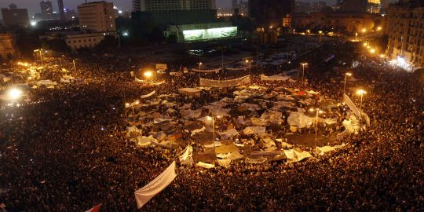

 [ La contestation contre le président égyptien](../uploads/2011/02/1477130_3_50b4_manifestations-sur-la-place-tahrir-mardi-8.jpg "1477130_3_50b4_manifestations-sur-la-place-tahrir-mardi-8.jpg") [Hosni Moubarak](http://www.lemonde.fr/sujet/a6bc/hosni-moubarak.html) est encore montée d'un cran, mardi 8 février, avec de nouvelles manifestations, qui ont réuni des centaines de milliers de personnes au Caire et en province. Il s'agit des manifestations les plus importantes depuis le début du mouvement, le 25 janvier. (Courtoisie Le Monde)
