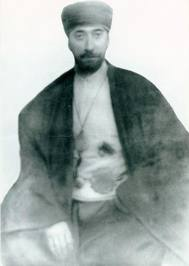
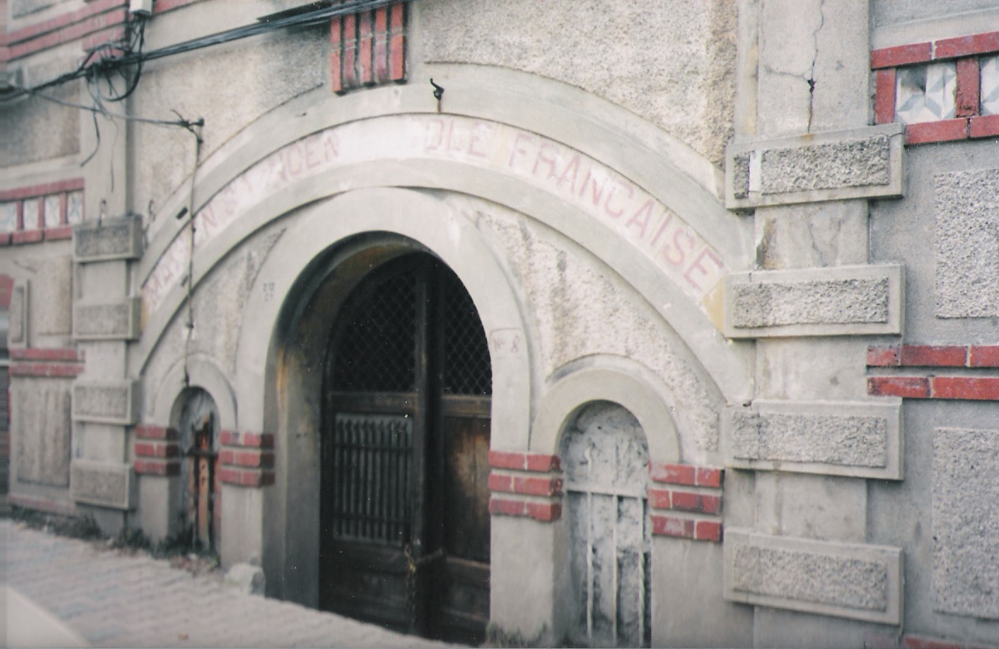
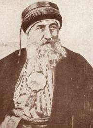
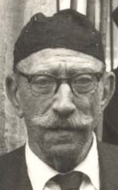

/\* Style Definitions \*/ table.MsoNormalTable {mso-style-name:"Normal Tablo"; mso-tstyle-rowband-size:0; mso-tstyle-colband-size:0; mso-style-noshow:yes; mso-style-parent:""; mso-padding-alt:0cm 5.4pt 0cm 5.4pt; mso-para-margin:0cm; mso-para-margin-bottom:.0001pt; mso-pagination:widow-orphan; font-size:10.0pt; font-family:"Times New Roman"; mso-ansi-language:#0400; mso-fareast-language:#0400; mso-bidi-language:#0400;}

Kadıköy’de Fenerbahçe stadyumunun arkasında dört katlı bir apartmanın son katında o gün şenlik vardı. Burada uzun zamandan beri Cumartesi toplantıları yapılır, devrin tanınmış kişileri bu toplantılara katılır, gelir sıra sıra dizilir, makam sahibinin çevresinde toplanırlardı. Ev, son zamanların tanınmış Celveti şeyhi Yusuf Fahir Baba’nın mekanıydı. Yeni bir yapıydı  ama eski ahşap bir tekkenin yanına yapılmıştı. Tekkenin mezarlığının bir kısmını kaldırmışlar yerine ruhsuz bir taş bina kondurmuşlardı.

Yusuf Fahir baba ömrünün büyük bir kısmını burada geçirmişti. Apartman sakini olmadan önce burada, bahçeler içinde tek katlı ahşap bir tekkede yaşardı. Burası İstanbul’da Kadıköy’de eski Kuşdili çayırında Celveti-Bektaşî tekkesiydi. Şehrin tanınmış bir köşesiydi. Pek çok gönlü neş’eli kimsenin uğrak yeri, nefeslendiği bir alandı. Bir selamlık, bir mutfak, birkaç oda ve bir de “tevhidhane”den ibaretti. Gösterişli, şatafatlı bir yer değildi, Eski tramvay caddesini dönünce yolun hemen yanı başında yaya kaldırımın az ötesindeydi.

Yusuf Fahir Baba “deryadil” bir adamdı. Hali tavrı alışılmış bir “şeyh baba” tavrının ötesindeydi. Gözü hem bu dünyaya, hem ötesine dönüktü. Kültürlüydü. Doğru ve yerinde bir orta tahsili, köklü bir yaşam tarzı ve ileri görüşleri vardı. Üsküdar’da Bağlarbaşı’nda bu gün terk edilmiş bir harabe olan “Maison St. Vincent Ecole Française” isimli eski Fransız okulunda okumuştu. Kendisi pek değinmezdi ama başkaları “siyasi” yönünün bulunduğunu da söylerlerdi. Osmanlı zamanı “ittihatçılara” meyledermiş. Partiye girmiş mi ? siyasi bir oluşum içinde bulunmuş mu bilmeyiz ? derlerdi. Belki işgalde “Karakol” teşkilatında yer almıştı..

Siyaseti pek sevmediği ve siyasilerle barışık olmadığı anlaşılıyordu. Bir cumartesi toplantısında, çevresindeki dostlardan biri  heyecanla merdivenlerden çıkarak Yusuf Baba”ya “Müjde Baba milletvekili oldum..” diye seslendi. Baba o sırada derince bir konuya, dalmış bir şeyler anlatıyordu. Sözü yarıda kesilince canı sıkıldı, gözlüğünün üzerinden bakarak, sevinçten göklere çıkan o zata “ Daha beter ol.. inşallah” dedi. Adam, ışığı kesilmiş kandil gibi söndü, cevap verecek oldu beceremedi, kelimeler boğazında düğümlendi, ayakta öylece dondu kaldı. – Buyur efendi dediler, neden sonra oturttular. Baba yeni milletvekiline son bir göz daha attıktan sonra lafa kaldığı yerden devam etti.

Babanın huzurunda sohbet bir “edep ve terbiye” sohbetiydi. Kimse lafın orta yerine aynalı sazan gibi atlamazdı. Söyleyeceği bir şey varsa söyler, yoksa susardı. Neyin ? nasıl ? neden ve ne zaman söyleneceğine ise çoğu zaman Baba’nın kendisi karar verirdi. Konular belirsiz olmakla birlikte bir “Dergah efendisinin “huzuruna yakışan türdendi. Ağırlık konudan çok konuya yaklaşımdaydı. Bu insanlar başka insanlardı. Büyük bir kültür geçmişinin içinden süzülerek geldikleri her hallerinden belliydi. O yüzden ele aldıkları konular ve onların ele alınış biçimi, öyle herkesin her zaman uluorta  edeceği laflardan ibaret değildi.  

Az olmakla beraber ara sıra siyasete giriliyordu. Kadıköy’deki Cumartesi toplantılarının hızla devam ettiği yıllarda Türkiye Alevileri “Birlik Partisi adı ile bir parti kurmaya kara vermişler, teşkilatı tamamlamaya koyulmuşlardı.  Baba hedeflerindeydi. Özellikle üzerinde duruyorlardı, zira Antalya tahtacılarından elli bine yakın oy toplar, derlerdi. Gerçekten her nasılsa Celveti-Bektaşî şeyhi Yusuf Fahir baba’nın siyasi kimliği de Aleviler arasında o sırada konuşulmuştu. Ancak baba kesin bir dille reddetti. “Siyaset benim işim değil” dedi. Bir gün “Siyasi olarak tek tanıdığım Mustafa Kemal’dir” demişti. Konunun Mustafa Kemal’e dayandığı sırada Paşa’nın “ehveni şer şerlerin en kötüsüdür” sözü  kendisine hatırlatıldığında şu cevabı vermişti: “o da bir şey mi ? ben kendi kulaklarımla duydum -bükemediğin kolu kır.- demişti.” Mustafa Kemal’e ve inkilaplarına bağlıydı. Olanları doğal karşılıyor, her şeyi yakından izlediği tarihin akışı çerçevesinde düşünüyordu.

Yusuf Fahir Baba Üsküdar’da, İnadiye’de “Bandırmalılar” tekkesinin sülalesindendi. Bu Tekke vakıf kayıtlarına ve Hadika’ya göre 1752’de vefat eden Bandıralı şeyh Seyyid Yusuf Nizameddin tarafından kurulmuştur. Bu yüzden dergaha “Bandırmalılar” tekkesi veya “Bandırmalızade tekkesi “adı verilmişti. Dergahın kurucusundan sonra gelen ikinci şeyhi 1783’te vefat eden, oğlu Seyyid Mustafa Haşim, devrinde tanınmış bir kişi olduğundan Dergah “Haşim Baba Dergahı” olarak da anılmaktaydı.

Yusuf Fahir Baba’nın manevi neş’esi Hâşim Baba’ya dayanıyordu. Hâşim baba, Dergahın kurucusu  ceddi Bandırmalızade Yusuf Nizameddin Baba gibi bir Celvetî şeyhiydi. Bu tarikat Üsküdar’da Aziz Mahmut Hüdai,  Bursa’da Üftade hazretleri ve  Kötürüm Hızır Dede ile 13. yy’da Ankara’da Hacı Bayram Veli adına kurulmuş Bayramiyye’ye bağlanmaktadır. Bursa’da zuhura gelmiş İstanbul’da gelişmiştir. Ancak tarikatın özellikle Hâşim Baba tarafından değiştirildiği anlaşılıyor. Hâşim Baba daha sonra Mısır’a giderek Nil nehri kıyısında Kasr ül ayn’deki Bektaşi Dergahı postnişini Hasan Baba’dan  icazet almıştı. Bu Dergah 1964’te Mısır devlet başkanı Nasır tarafından yıktırılıncaya kadar faaliyet sürdürmüştür.

Hâşim Baba’nın Bektaşi icazeti dolayısıyle Bandırmalılar Tekkesi o tarihten sonra “Celveti-Bektaşi” tekkesi olarak anılmıştır. Yusuf Fahir Baba’nın Bektaşiliği de bu kanaldan gelmekteydi. Bu durum İstanbul’da Celvetî çevresinde tepkilere yol açmıştı. Tasavvuf yolunda büyük bir yeri olan, yazdığı “istihraç: ile de tanınan Hâşim Baba, 1783 yılında vefat edince cenazesi, namaz için Pir makamına getirildiğinde Hz. Hüdai postnişini Mudanyalı Ruşen Dede tarafından  içeri alınmamış, cenaze namazı caddeye kurulan musalla taşında veya Pir makamının hemen karşısında bulunan Cennet efendi türbesinde kılınmıştı.

Ruşen Dede’nin zamanı Hz. Hüdai Pir makamı olduğu halde biraz tenhalaşmış, ihvan hep çarşı içindeki dergaha gelecek yerde İnadiye yokuşunu tırmanarak Bandırmalızade tekkesine taşınır olmuştu. Ruşen Dede bu duruma üzülürmüş. Bir gün Dergahın Meydancı dede’si ile Kazancı Dede’sini çağırarak:

 – Gidin bakın bakalım herkes orada toplanıyor bunun sebebi nedir ?  demiş. Dedeler yola çıkmışlar, aradan epeyi bir zaman geçmiş, kimseler görünmemiş. Bir süre sonra ufak bir çocuk kapıyı çalmış, Ruşen Dede açmış, çocuk elindeki bir sürü anahtarı Dede’nin eline tutuşturarak, kendisine yapılan tenbihatı tekrarlamış: kaçak dedeler, çocuğun ağzından  Ruşen Dede’ye  “ Biz de burada kaldık, kapıları kilitle sen de gel.. “demişler.

Tasavvuf tarihi Ruşen Dede’nin bundan sonraki tavrını belirlemiyor. Ancak Haşim Baba’nın “Bektaşi karışımı Celveti”  neş’esinin Celvetilik yolunda fazla bir yansımaya neden olmadığı da anlaşılıyor. Tarikat kredosu içinde Haşim Baba tavrı’nın “Celvetiyye-Haşimiyye” kolu alarak devam ettiğine göre iki yol birbirinden kabul edilebilir cizgilerle ayrılmış demektir. Her ikisi de yaşamış ve her iki koldan da Allahüalem değerli şeyhler gelmiştir.

Yusuf Fahir Baba ömrünün sonlarına doğru rahmetli Niyazi Ahmet Banoğlu’nun çıkarmaya başladığı bir tarih dergisine “Bektaşıliğin Sırları” isimli bir yazı dizisine başlamıştı. Baba bu yazılarında Bektaşilik yolunda başından ne geçtiyse yazmaya kararlıydı. Dergi birkaç sayı çıktı, kapandı. Babanın sırları da örtüldü. Toprak altı oldu. Ne yazacaktı ? neler anlatacaktı ? hangi sırları verecekti.. Baba’nın “sırları “açıklayacağı “duyulduğu zaman ortalığı toz duman kapladı, Çevrede herkes “acaba ucu bana dokunacak mı “ diye tasalanmaya başladı. Kuşkuya kapılanlardan biri de Üsküdar’da Özbekler Dergahı postnişini, Yusuf Fahir Baba’nın kadim dostu Necmeddin Özbekkangaydı. Gençken birlikte çok dolaşmışlar. Necmi ağabey bana dedi ki :

–Haydi kalk gidelim, Yusuf sır söyleyecekmiş, soralım bakalım ne sırlarımız varmış ?  Gittik. Bir yaz günüydü. Sokağın gürültüsünü geride bırakıp ağaçların, çiçeklerin arasından dergaha vardık, Baba bahçe kapısının önünde oturmuş demleniyordu. Bizi görünce sevindi, biraz da burkuldu, Necmi ağabey’in “kadehdaşı” ve yoldaşı olmadığını biliyordu. Yanında birkaç kişi daha vardı. Bizi –Buyur ettiler.. Oturduk. Sohbet açıldı, az sonra konu can alıcı noktaya geldi. Necmi Ağabey lafa girdi:

–Neymiş o.. ne açıklayacaksın, ne sırrı söyleyeceksin.. ? Hava birden değişti, sessizlik oldu, herkes kulak kesildi, Yusuf Baba, kalın şişe dibi gözlüklerinin altından Özbek şeyhine son bir bakış attıktan sonra sakin bir sesle:

–Ne var,  korkuyor musun ?  dedi. Şeyh cevap verdi:

–Korkacak bir şeyim yok..ne yaptıysak  beraber yaptık. Açıkla da görelim. Yusuf Baba:

–Herkes kusur işler, Bektaşiliğin özelliği mi var ? dedi. Konu kapandı. Zaten Banoğlu’nun çıkardığı tüm mevkuteler gibi “ Tarih dergisi” nin de ömrü uzun olmamıştı. O yazıların ne kadarı yayınlandı ? devamı duruyor mu ? Bilinmiyor.

Yusuf Fahir Baba’nın manevi mimarı zannımca Merdivenköy Şahkulu Dergahı’ nın  postnişini Mehmet Ali Hilmi Dede Baba’dır. Bin yılda Anadolu Türk ruhunu şekillendiren büyük Bektaşi geleneğinin en son ortaya koyduğu ulu isim Hilmi Dede Baba, şu şiiri ile kendisini etraflıca anlatır:

[zümre-i nâcî](http://www.eksisozluk.com/show.asp?t=z%c3%bcmre-i+n%c3%a2c%c3%ae)leriz bende olup Hayder’e Şîr-i Hudâ [müctebâ](http://www.eksisozluk.com/show.asp?t=m%c3%bccteb%c3%a2) [safşiken](http://www.eksisozluk.com/show.asp?t=saf%c5%9fiken) ü [safder](http://www.eksisozluk.com/show.asp?t=safder)e

Heybet-i ‘lâ fetâ’dan arz u semâ titredi Şiddet ile urunca pençe der-i Hayber’e

[Dest](http://www.eksisozluk.com/show.asp?t=dest)\-i [velâyet](http://www.eksisozluk.com/show.asp?t=vel%c3%a2yet) ile salladı [zülfikâr](http://www.eksisozluk.com/show.asp?t=z%c3%bclfik%c3%a2r)’ın Kesti yedi kat yeri [darb](http://www.eksisozluk.com/show.asp?t=darb) edicek [anter](http://www.eksisozluk.com/show.asp?t=anter)’e

[Şâh-ı velâyet](http://www.eksisozluk.com/show.asp?t=%c5%9f%c3%a2h-%c4%b1+vel%c3%a2yet) Ali cümlemizin [server](http://www.eksisozluk.com/show.asp?t=server)i [Kanber](http://www.eksisozluk.com/show.asp?t=kanber)iyiz tâ ebed kanber olan Kanber’e

[Kalb-i selîm](http://www.eksisozluk.com/show.asp?t=kalb-i+sel%c3%aem)inde çü [hub](http://www.eksisozluk.com/show.asp?t=hub)b-ı Ali olanlar Verdi Hüseyn aşkına, bakmadı cân u [ser](http://www.eksisozluk.com/show.asp?t=ser)e

[Râh](http://www.eksisozluk.com/show.asp?t=r%c3%a2h)\-ı muhabbetinde [mest](http://www.eksisozluk.com/show.asp?t=mest)\-i mey-i aşk olur [Cennet-i adn](http://www.eksisozluk.com/show.asp?t=cennet-i+adn) içinde tâlib olan [kevser](http://www.eksisozluk.com/show.asp?t=kevser)’e

[Mevt](http://www.eksisozluk.com/show.asp?t=mevt) ü hayât elinde ol veliyyü’l-mutlak’ın [Mürde](http://www.eksisozluk.com/show.asp?t=m%c3%bcrde)ler [ihyâ](http://www.eksisozluk.com/show.asp?t=ihy%c3%a2) olur ‘kum” diyecek [makber](http://www.eksisozluk.com/show.asp?t=makber)e

Cennet ü [dûzâh](http://www.eksisozluk.com/show.asp?t=d%c3%bbz%c3%a2h) anın emrine [fermânber](http://www.eksisozluk.com/show.asp?t=ferm%c3%a2nber)i Eyleye taksîm-i dem hâkim olup mahşere

Tâ ki çıkar nisbet-i [silsile](http://www.eksisozluk.com/show.asp?t=silsile)\-i ahdimiz Âl-i alî’den [hemîn](http://www.eksisozluk.com/show.asp?t=hem%c3%aen) hazret-i Peygamber’e

Mürşidimiz Muhammed, rehberimizdir Ali Aşık olan can verir mürşid ile rehbere

İki cihânda ebed kaygu çeker mi dahi Sen ki şefî’ olasın HİLMİ gibi [kemter](http://www.eksisozluk.com/show.asp?t=kemter)e

Hilmi Dede Baba’nın neş’esinde ve Tarikat yolunda derece almış Yusuf Fahir Baba da bu tarikat geleneğinde anıtlaşmış olan “Ali sevgisine” derinden bağlıydı. Peygamberin aziz ve sevgili damadı ve torunlarının olağanüstü yaşam öyküsü sanki ruhunda kendi öyküsü gibi her an yaşar, zaman zaman alevlenir göz yaşı olur, bazen kağıda dökülür, şiir formatına girerdi. Şu şiir onundur :

**Şahım** **Ali** **Abaya**, Erenlere Aşk olsun, Meydan-ı Murtazaya, Girenlere aşk olsun.

Meydan bir özge yerdir, Bilmek,anı hünerdir, Erkanı erenlerdir, Girenlere aşk olsun.

Koç kuzulu bir koyun, Olup derdinden soyun, Anda Mürşid’e boyun , Verenlere aşk olsun

Mürşid Haydar Alidir, Hakk anda müncelidir, Eli Hakk’ın elidir, Bilenlere aşk olsun.

Bu yol inceden,ince, Kılıçtanda keskince, Mürşid nasihatince, Gidenlere aşk olsun.

Tevellayı gönülden, Getirdim FAHİR elden, Mürşidi can-ı dilden, Sevenlere aşk olsun.

Yusuf Baba bir ömür yaşadığı Hacı Bektaş-ı Veli meydanı için “bilmek anı hünerdir” demişti. Bu hünere sahip olduğuna inanıyordum. Son nefesini verdiği hafta yine Özbek şeyhi ile ziyaretine gitmiştik. İki kişinin koltuğunda son anlarındaydı Şeyhin yüzüne baktı.. “Biz sahtekarmışız..” Dedi. Neyi kasdetti ? anlayamamıştık. Bu iki kelime onun için seksendört yıllık bir ömrün kısadan kısa özetiydi. Bir itiraf mıydı ? fani hayatı küçümseme miydi ? Gereksiz işlerle uğraşıp O ulu gerçeği gözardı etmek miydi… ? Pek çok şey olabilirdi.

1967 Şebi arusu’nda Konya’daydık. Bir sabah otele bir telgraf getirdiler: Kağıtta “Yusuf Baba Kaçtı..” yazıyordu. Telgraf İstanbul’dan Manastırlı Bektaşi Dervişi  Kazım Ağa tarafından çekilmişti. Yusuf Baba’nın vefatını haber veriyordu. Derviş Kazım telgrafa “Yusuf Baba Göçtü” diye yazmış. Telgrafçı bir dergah değimi olan “göçtü” kelimesini anlamamış “kaçtı” ya çevirmişti. Şeyh Dedi ki : “Yusuf duramadı kaçtı..”  O tarihten sonra dervişler kendi aralarında konuşur ve bir ölümü haber verirken hep “kaçtı..” derlerdi.

 Biyografi

                   Yusuf Fahir (Ataer) Baba

 Yusuf Fahir Ataer (1861-1967) Üsküdar’da Menzilhane yokuşunda Bandırmalızade şeyh Seyit Mustafa Haşim Baba (1718-1782) soyundan Münip efendi’nin oğludur. Celveti-Bektaşi şeyhidir. Kadıköy’de Feneryolu’nda  Kuşdili çayırında Abdülbakı efendi Sa’di dergahında şeyhlik etmiştir. Babası da aynı dergahta Celveti’liğin Haşim Baba kolunu temsil ediyordu. Bu kol Haşim Baba’nın Mısır “Kasrı ayn”  Bektaşi dergahı postnişini Hasan Baba’dan Bektaşi icazeti alması ile doğmuştur. Bu icazet sonucunda Bayramiyeye dayananan ve İstanbul’da Hz. Aziz Mahmut Hüdai (1598-1628) ile temsil edilen Celveti tarikatı ile Hacı Bektaş Veli adına gelişen Bektaşilik arasında bir bağ kurulmuş oluyordu.

Aslında şer’i hükümlere sıkıca bağlı Celvetilik ile Horasan çizgisinde gelişmiş, heterodoks Bektaşiliğin kaynaşması zordu. Bu yüzden Haşim Baba’nın Bektaşilik bağlantısı Celveti çevrelerinde tepkilere yol açmıştı. Ancak bu yol füruğ (babadan oğla geçme) adab ve erkanı ile  devam etmiş ve Üsküdar’da Celveti’lere ait bazı tekkeler Haşimi’lerin eline geçerek buralarda Haşim Baba erkanı sürdürülmüştür. Yusuf Fahir Ataer, Haşim Baba kolunun son temsilcisiydi. Ehli beyt sevgisi taşıyan coşkun bir sufi’ydi. Fransızca bilirdi. Doğu ve Batı kültürlerine hâkimdi. Tasavvuf edebiyatında yeri olan pek çok şiir, nakale ve tanıtıcı yazılar yazmıştı.

Her yıl on muharremde Kocamustafa Paşa, Sümbül Efendi camiinde yapılan “Hz Hüseyn’i anma” Ku’an, Salavat,Mersiye dua ve Gülbank toplantılarında yaptığı dualar, İstanbul’da tarikat çevrelerinde meşhurdu. Yusuf Fahir Baba, uzun yıllar devam eden bu ünlü dualarında önce İslamın bağrını delen “Kerbela” vak’asına dair veciz bir giriş yapar, olayı herkesin anlayacağı bir dille ortaya döker ve son bölümde pek duygulu niyaz ve serzenişler ve göz yaşları içinde duasını bitirdi.

Bu dua genel anlamda Cenabı Hakk’a yakarış olmakla birlikte anı zamanda  bir peygamber torunu’nun  katli ile sonuçlanan elim “Kerbela” vak’ası dolayısıyle adeta İslam Dini’nin Hz. Hüseyin’e “özrüydü”. Her yıl on muharremde yapılan Kocamustafa Paşa toplantıları, Saltanat ve hilafet merkezi İstanbul şehrinde, son zamana kadar İslamı yaşam biçimi ile yaşayan pek çok insan için mistik-trajik bir konçerto gibiydi. İmparatorluk döneminden kalma bu gelenek, Cumhuriyetin ilanından sona da devam etmiştir. Yusuf Fahir Baba’nın vefat ettiği 1967 yılından sonra aynı yerde büyük dua  hacı Muzaffer Ozak tarafından yapılırdı.
