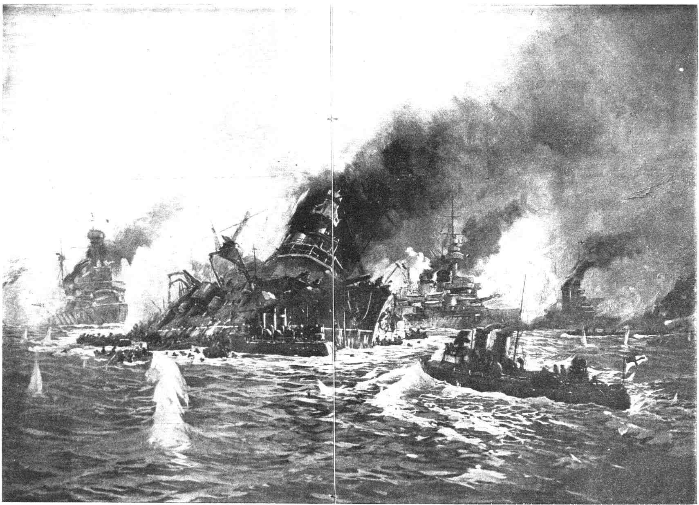
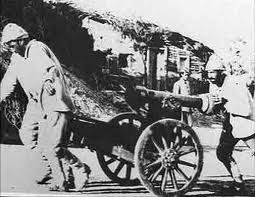
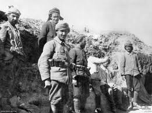
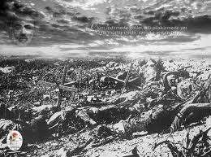
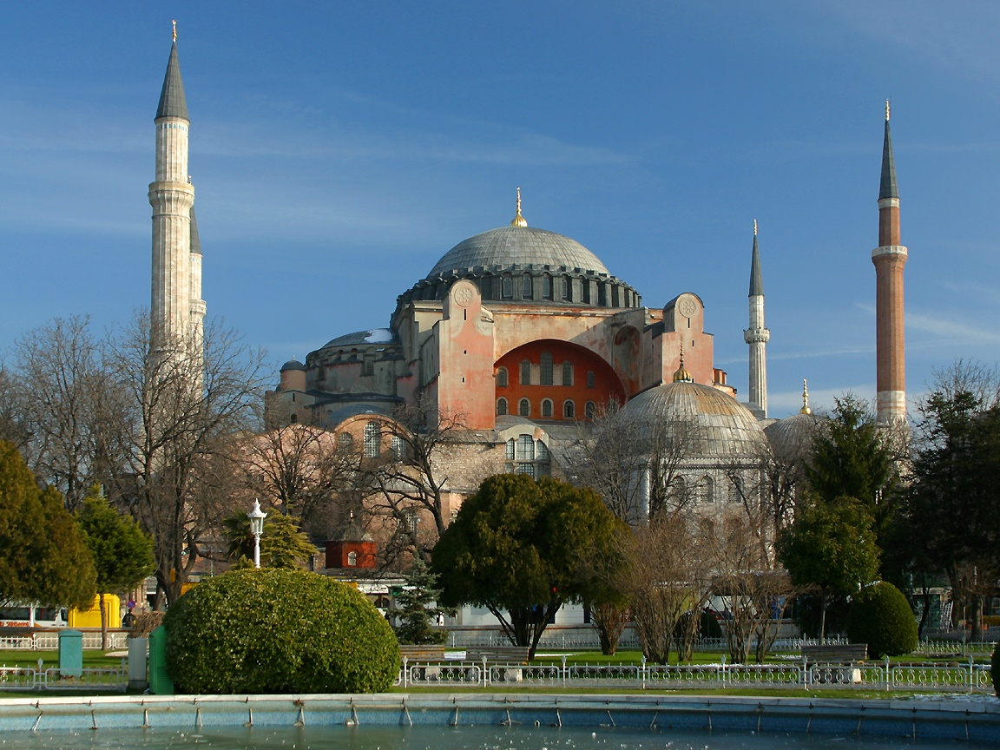
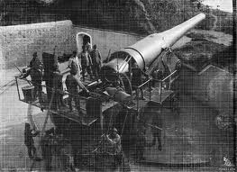

/\* Style Definitions \*/ table.MsoNormalTable {mso-style-name:"Normal Tablo"; mso-tstyle-rowband-size:0; mso-tstyle-colband-size:0; mso-style-noshow:yes; mso-style-parent:""; mso-padding-alt:0cm 5.4pt 0cm 5.4pt; mso-para-margin:0cm; mso-para-margin-bottom:.0001pt; mso-pagination:widow-orphan; font-size:10.0pt; font-family:"Times New Roman"; mso-ansi-language:#0400; mso-fareast-language:#0400; mso-bidi-language:#0400;}

 (Arşiv'den)                       

Bu savaşın üzerinden 90 küsır yıl geçti. Bu gün dahi savaş alanlarına gidip “dedelerinin nasıl  savaştığını” merak edenlere devamlı anlatılan bir hikaye vardır. “Havada çarpışarak eriyen makinelı tüfek mermileri…” Savaş alanına yayılmış, bunlardan yüzlercesi, hâlâ topraktan çıkmakta, ziyaretçilerin yüreğini kabartmaktadır. Ancak karşılıklı kullanılan milyonla merminin nasıl olup da havada buluşacak kadar sık ateşlendiği kimsenin dikkatini çekmez.

Çanakkale savaşı makinelı tüfek çağının en önde gelen savaşıdır. Bu harika savaş makinesinin hangi zekâların ürünü olduğu pek sorgulanmaz. Çanakkale savaşında kullanılan ve o çağın en ileri teknolojisi ile üretilen silahlar,  bu savaşın bir “silah fuarı” şekline döndüğünü gösteriyor. Sergi standına çevrilen siperlerde silahlar, müşteriye uygulamalı tanıtılıyor, ne işe yaradığı anlatılıyor ve nasıl insan öldürdüğü, dakikada kaç can aldığı, tetiği çekene nasıl bir güç sağladığı izah ediliyor. İnsan kanı pazarı.. Ölüm üzerine ticaret. Bütün bunların yanında savaş, kahramanlık, şehadet, esaret sanki kan sofrasının şirin garnitürü…

Çanakkale savaşının gözlerden uzak düşmüş bir başka özelliği de birbirinden binlerce kilometre ötelerde yaşayan halkların buluşarak savaşa tutuşmalarıdır. Dünyanın bir ucundaki İngiltere diğer ucundaki sömürgelerinden asker toplayarak getirmiş, yolun yarısında bir başka ulusun üzerine göndermiştir. Bunu hangi güçle başarmıştır ? Nasıl bir temel devlet idealidir ki, Londra sömürgeleştirilmiş, soyulmuş, son noktasına kadar siyasal erkten uzaklaştırılmış insan topluluklarını böylesine vahşî bir sevkiyata ve soykırıma ikna edebilmiştir.

1900’lerin başında bir Avusturalyalı’nın, veya Borneo’lunun yahut bir Anzak’ın Çanakkale boğazında ne işi vardı ? Bu soru Çanakkale savaşlarının 90. yıldönümünde Avustralya ve Yeni Zelanda başbakanları tarafından törenlere katılan İngiltere prensi Charles’e sorulmuştu.

1915 Çanakkale savaşlarında tarafların kayıpları yaklaşık olarak  şöyledir: Türkler : 251.309 İngilizler : 205.000 Fransızlar : 47.000.  Savaş, denizde ve karada 8.5 ay sürmüştü. Şair Mehmet Akif Ersoy’un “tüm insanoğlu” anlamında “akvam-ı beşer” dediği insan toplulukları bu 8,5 ay zarfında birbirlerini boğazlamışlar, yarım milyon insan, kendilerini yöneten birkaç politik planlamacının eseri olan bir savaşta, canlarını kaybetmişlerdi.

Elbette ölenler şehit, kalanlar gaziydi ama bu savaşa neden olanların ve çıkarları bunu önlemeye uygun düşmeyenlerin  hiç de böyle bir şeref kazanmaya hakları olmadığını düşünüyorum. Tarih sadece “dürüstlere” şeref madalyası verir.

Çanakkale savaşı her  iki taraf için de bir “imha” savaşıydı. O zamana kadar savaşlarda birbirlerinin siyasal gücünü dize getirerek yasal isteklerini, karşı taraftan silah zoruyla elde etmeye çalışan uluslar, eski çağların düello yapan şovalyeleri gibi kahramanca savaşırlardı. Çanakkale savaşı ve sonrası ise ulusların birbirlerini “imha” etme savaşlarıdır. Türkler bu savaşı kazanmışlar, ne yazık ki, hemen arkasından gelen politik savaşı kaybetmişlerdi. Zira Çanakkale Boğazı’ndan geçemeyen Müttefik Donanması iki yıl sonra elli beş parça gemiyle İstanbul limanına demir atmıştı.

Müttefik donanması ile birlikte 13 kasım 1918 günü İstanbul’a 3500 asker çıkarıldı. Bunlara daimi kalmaları için yer bulundu. Askerler şehre dağıldılar. İstanbul’un silahlı işgali ve 15 mart 1920  Letafet Apartımanı faciası bundan bir yıl, sekiz ay sonradır. İngilizlerle birlikte İstanbul’a İtalyanlar ve  Fransızlar da gelmişti.

Yüzyılın başında İstanbul’un uğradığı gerçek işgal, bu şehrin tarihinde derin izler bırakmıştır. Bu işgal sadece askerî değil aynı zamanda sosyal bir hareket, şimdilerde moda olan değimle bir medeniyetler çatışmasıydı. Belki “medeniyetler karşılaşması” daha uygun düşecektir.

İşgal sırasında İngiltere’de bir ara “İstanbul’u Yunanlılara verelim, Ayasofya’yı kilise yapsınlar” fikri doğmuştu. Buna karşı çıkanlar oldu. İngiliz Kamu oyu inanılması güç biçimde “İstanbul’un Türklerden geri alınması”nı tartışıyordu. Acaba o sırada bir Osmanlı vatandaşı “Londra’yı İngilizlerden alalım…” demiş olsaydı, nasıl bir tepki görürdü ? merak ediyorum. 1900’lerin başında dünyada yaşlı savaş geleneğinin ulaştığı nokta  gerçekten ilginçtı.

Çanakkale savaşını bir “imha savaşı” şekline sokanlar ve daha sonra 450 yıllık Osmanlı başkentini fiilen işgal edenler, yeryüzünde işte o üstün ırk iddiasında olanlardır. Bunlar kendi uygarlıklarının karşısına dikilen diğer uygarlıkları, insan topluluklarını ve farklı yaşam biçimlerini, arzın sathından silebildikleri ölçüde yasallık ve devamlılık kazanacaklarına inanmışlardı. Bu inançlarını daha sonra denemeye devam edecekler ve bu düşünce ve davranışlarını ekonomik ve endüstriyel çıkarların çok ötesine taşıyarak yeryüzü çapında bir sosyal reform düzeyine ulaştıracaklardı. Başarılı oldular.

