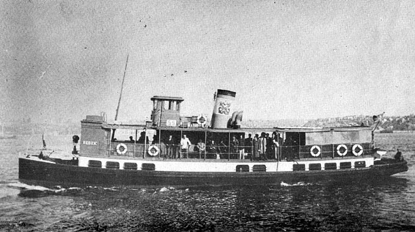

Altmış sene önce bu günlerde Üsküdar'a taşındığımızda Üsküdar-Beşiktaş arasında çalışan "Bebek" ve "Göksu" isimlerini taşıyan iki küçük vapur vardı. Bu vapurlar beni o yıllarda haftada bir Ortaköy'de bulunan Galatasaray Lisesi'nin ilk kısmına götürür getirirdi.  Ağır ağır hareket eden asaletli vapurlardı. İnsanda saygı uyandırırlardı. Sanki "İşte sizi Asya'dan Avrupa'ya taşıyoruz" diyerek  gururlanıyor gibiydiler. Ben bu vapurları pek severdim. Pazartesi sabahı okula gidişin hüznü, Cumartesi günü geri gelişin neş'esi hep bu vapurlara takılı kalmıştı.. Eski şirket-i Hayriyye'nin İngilterede yaptırılan en küçük vapurlarıydı bunlar, sandaldan biraz daha büyüktüler. Bu iki vapurdan az daha büyük "Dilnişin" ve "Üsküdar" vapurları vardı. Aynı boyda bir vapur daha olacak ama adını unuttum. Üsküdar, ünlü İzmit Körfezi faciasında 400 şehitle battı, sonra çıkardılar. Dilnişin'in de "i" sinin noktaları düşmüş "dılnışın" olmuştu. Şu eski gemilerin hiç olmazsa maketlerini yapıp müzeye koysalar, Ne çok insanın gençlik, orta yaşlılık anıları vardır o gemilerde.. Şehir hayatının unutulmaz parçalarıydı onlar.. Sevinçlerimize kederlerimize ortak olmuş. Yakın dostlarımızdı..
