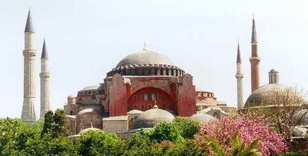

 (Arşiv'den, Üsküdar, 26 aralık 2002)

Değerli müzeci Erdem Yücel Ayasofya’nın müdürüyken bir gün ziyaretine gidecektim. Eminönü’nde taksiye bindim –Ayasofya, dedim. Araba yola çıktı, Cağaloğlu yokuşunun başına vardık. Sokakları dolaşmaya başladık..  O sokak, bu cadde girip çıkıyoruz. Anladım, adam Ayasofya’nın nerede olduğunu bilmiyor – Dur, dedim –Geldik mi Ağabey, dedi –Hayır dedim, Ayasofya nedir biliyor musun ? – Hayır  dedi. Tarif et gidelim.. Aslında bulunduğumuz yerden Ayasofya’nın muhteşem kubbesi ve yakışıklı minareleri aradan görünüyordu – Ben ineceğim  dedim, Ayasofya’yı benden öğrenme, sana Ayasofya’yı bilmeme cezası veriyorum..

İndim gittim. Dün Hürriyetin haberinde Ayasofya’nın enternet anketinde 13. sıraya düştüğünü görünce irkildim. Nikea:Zafer ihtilalinden postunu zor kurtaran Justinyen’in Ayasofyası, Sultan Fatih’in kendi vakfiyesi ile kabullendiği, tarihin en önde gelen insanlık eseri ; Paris’teki demir yığını Eyfel Kulesi, foseptik bilmeyen Fransız krallarının oturaklarını bahçelerine boşalttıkları Versay Sarayı, Deli Petro’nun – kokuyor, diye içinde oturmadığı Romanofların Kanlı Kremlin Sarayı ve yamulmuş Piza kulesinden de geriye düşmüştü... Bu sonucu Enternet “sörfçüleri” saptamış... Böylece Enternet sörfçülerinin ne derecede cahil ve gelmiş geçmiş her olaydan ne kadar uzak, sinsi ve kurnaz bir medya elinde neye benzedikleri gerçeği ortaya çıkıyor...

Bundan Ayasofya değil “enternet” nesli utanmak zorundadır... Ey uzak ve yakın tarihin canlı, dinamik ve her an yaşayan şanlı Ayasofya’sı... İnsanlık tarihinin, bir bölümünün envanteri. Sen bizi affet... Seni bilemeyenleri hoşgör... Mevlâna Hazretleri : “Hazinelerin üzerinde oturmuş dilencileriz...” diyor... Yalan mı söylüyor...? Pazar günü Parisli bir aile misafirimdi. Evi bulamazlar diye kendilerine Üsküdar meydanındaki Çeşmenin önünde randevu verdim. Belirtilen saatte buluştuk. Selam faslından sonra merdivenlerinde durduğumuz I.Ahmed’in Çeşmesini işaret ettim – Avustralya kıtası keşfolmadan önce yapılmıştı... Dedim.

Birlikte yürümeye başladık. Karşımızda Gülnuş Valide Sultan’ın eseri Yeni Cami... – Amerikan İç Savaşı sırasında yapıldı... dedim... Karı-koca şaşkınlıka çevreye bakınırken solumuzda kalan İskele Camiini işaret ettim... – Fransa’da 14. Lui saltanat sürerken Kanuni’nin kızı Mihrimah Sultan’ın parasıyla Mimar Sinan’a yaptırıldı, dedim.... İnsanlar önünden geçtiğimiz her taşın en az dört yüz yıl önce oraya konduğunu öğrendiler... Neye yarar ki, o gün o meydanda, bütün bunları öğrenip yürekleri titreyen iki Fransız dostumuzdan başka kimse bu konularda, değil bilgi sahibi olmak, böyle şeyleri öğrenmek dahi istemiyordu... Herkes başını önüne eğmiş işine gidiyordu... Kimsenin ne Çeşme’yi, ne Sinan’ın camiini ne de rakibini kıskançlıkla Küçüksu deresine atıp boğduktan sonra vicdan azabıyla cami yaptıran IV. Mehmed’in Hasekisi, Gülnuş Emetullah Sultanı bilecek hali yoktu.

İstanbul’un halkı değişmiştir... Son üç on yılda bu şehrin halkı gitmiş, yerine başkaları gelmiştir. Ben bazen iş olsun diye köprünün başına durup, akşam güneşinde sislere bürünerek Keops ehramı gibi büyülü efsaneler dağıtan Süleymaniye’yi gelen geçene gösterip soruyorum... – Birader ben yabancıyım, şu caminin adı nedir ? Dört kişiden biri zar zor biliyor... Eyyüb camii diyenler var... –Kim yaptırmış ?\_ Diyorum. –Süleyman Demirel diyen oldu... Gemiye binerek Kadıköye’e giderken de bazen luzumsuz sorgularıma devam ediyorum... Haydarpaşa Garını Mimar Sinan’a yaptıranlar, Selimiye Kışlasını Kanuni devrine götürenler çıkıyor... Rahmetli Peder’in okuduğu, eski Haydarpaşa Lisesi, şimdiki Marmara Üniversitesi olan Mimar Valaury’nin “Tıbbiye-i Şahane” sinde Hukuk Fakültesi varmış. Vapurda oradan mezun olduğunu söyleyen güzelce bir hanım, çenesi ile binayı göstererek – Şurada bir Bizans eseri var ya... bizim okul işte o dedi.

Hayretten dona kaldım. Şaka olduğunu anlaması için – Oralarda hiç Bizanslı gördün mü ? dedim. Tınmadı... Baktım ciddi söylüyor... – Siz Hukuk fakültesinde mezun olduğunuza emin misiniz...? dedim... Gülüştük... Bana kalırsa İstanbul elden çıkmıştır... Buradaki insanlar kimsenin adını dahi bilmediği bir şehirde yaşıyorlar... Biri istese verirler veya depremde yıkılsa umursamazlar... Yazık koca şehir sahipsiz kaldı... Tabii ki Ayasofya da öyle... Tanımayan, tanıtabilir mi ? Elalem bahçesine oturağını döktüğü sarayını tanıtıyor, sen 15oo yıllık Ayasofya’nın adını kimseye öğretemiyorsun... Ey bu şehrin değişen halkı... Burada taşlar yaşıyor, sen yaşamıyorsun... Orada dur ve başını çevirdiğin her taraftaki binlerce yıllık anıtlardan özür dile... Plate savaşından kalma 2500 yıllıkYılanlı Sütün boynuna dolansa, 1700 yıllık Çemberlitaş başına düşse sana zerre kadar acımam... \[Üsküdar, 26 aralık 2002\]
