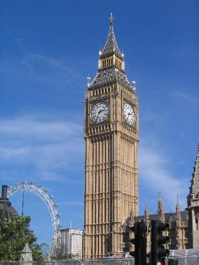
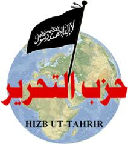
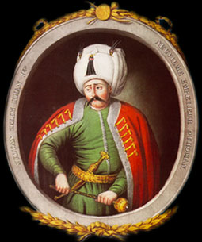
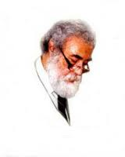

 (Arşiv'den,16 eylül 2002)

İngiltere’nin başkenti Londra’da Pazar günü on bin Müslüman toplandı. Büyük Britanya, Sudan, Pakistan, Endonezya ve Birleşik Amerika’dan gelen Müslüman delegeler, Londra’nın doğusunda yer alan London Arena’da bir araya gelerek 11 Eylül 2001 saldırısından sonra Müslümanların Batı toplumları içindeki yerini tartıştılar.

1953 yılında Lübnan’da kurulmuş olan “Hizb-üt Tahrir: Kurtuluş Partisi” isimli örgütün girişimiyle gerçekleşen toplantıya, bazı ılımlı Arab kuruluşlarının liderleri “Hizb-üt Tahrir” in demokratik olmadığı gerekçesiyle katılmadılar. İngiltere Müslümanlarının lideri İnayet Bungalawala : “ Demokrasi veya çok partililiğe inanmıyorlar...” dedi.

Şeriat yönetimindeki Arab Emirlikleri adına Orta Asya laik hükümetlerini devirme amacı taşıyan “Hizb-üt Tahrir” örgütü yöneticileri, “11 eylülden sonra Batı’da Müslümanların rolü” adını taşıyan toplantının açılışında, saldırılardan ve dünyada terörizme karşı savaş açılmasından sonra yeryüzündeki hayatları zorlaşan Müslümanların önüne: “ya kapitalizm ve onun Dünyayı ele geçirme düşüncesine uymak veya terörist olarak anılmak” şeklinde iki farklı seçenek sunulduğunu öne sürdüler.

İngilteredeki Hizb-üt Tahrir şubesinin başkanı İmran Wahid,Batı hükümetlerinin İslamı ele geçirmeye çalıştıklarını söyledi ve “Bu toplantıda İslam ve Batı arasındaki uygarlık şokunu ele alacağız. Batı entegrasyondan söz ederken, kendi değerleri adına Müslümanlara, öz değerlerini terketmelerini öneriyor...” dedi. Bir zamanlar Sovyetler Birliği yaşarken Asya kıtası’nın tüm kuzeyini kaplayan bu ülkede Müslümanlar da vardı...

90 milyon kadar sayılan ve çoğu Türk ırkından olan bu Müslümanların dini ihtiyaçlarını karşılamak üzere idare birbirine uzak yerlerde dört müftülük kurmuştu...Ayrıca Buhara’da din adamı yetiştiren bir de medresenin faaliyetine izin verilmişti... 1924’lerden sonra dinsiz rejim kurulurken tüm ülkede 27 bin camiyi yıkan Moskova yöneticileri uyrukları arasında önemli bir topluluğu oluşturan Müslümanları kendi hallerine bırakmak istemedi...

Rejim o yılların tüm materyalist dünya görüşü ve katı yönetim fırtınası içinde dört müftülük ve bir medreseyi korumayı çıkarlarına uygun buldu... Bin yıllık muhteşem bir İslam şehri olan Buhara’da Ziya Babahanof isimli bir müftü vardı...Resimlerini görür şaşar kalırdık.. Bolşevik Rusya’nın boyunduruğu altında bir İslam Müftüsü...Hâla merak ederim, acaba resimlerde devamlı gülen, kırk kırkbeş yaşlarında sevimli Müfti Babahanof, acaba İslam ile vahşî Bolşevik dünyasını nasıl barıştırıyordu...? nasıl bir araya getiriyordu ? nasıl telif ediyordu ? Bu uğurda ne çeşit fetvalar veriyordu ?

Bir zamanlar çarlık Rusyasında bir papaz “Rusya için en büyük düşman okumuş bir müslümandır” demişti...Komünistler çok daha ileri gittiklerine göre acaba Babahanof Medresede ne çeşit din adamları yetiştiriyordu ? İslamı konu edinmiş bir aydın için bunlar gerçekten önemli konular... Düşünmeye ve araştırmaya değer...

Osmanlı Türkleri Yavuz Sultan Selim yönetiminde 1552’de Mısırı ve Hicaz’ı aldıkları vakit Kahire’de ilk Cuma hutbesinde hatip, Yavuz adına hutbe okurken, onun için “Kutsal yerlerin sahibi” demişti. Padişah oturduğun yerden müdahale etti : “Hayır...doğru söyle...kutsal yerlerin hizmetkârı...” Osmanlı hükümdarları dört yüz yıl Fahri Alem’in hilafet makamını hakkıyle koruyarak İslama hizmet ettiler. Bu Devlet son iki yüz yılında bu hizmetten mahrum kaldı. Saray ve halk başka işlere daldı...Ülke Bir Tanzımat, iki meşrutiyet bir Cumhuriyetle İslam’dan uzaklaşınca bu günlere geldik...Bir zamanlar İslam adına İstanbul’da alınan her karar, burada olgunlaşır ve denizler ötesinden ses getirirdi...

Sultan İkinci Abdülhamid zamanı Saravak Borneo, Endonezya Müslümanları Hilafet makamına baş vurarak “Burada Amerikalılarla Japonlar kapıştı hangisine uyalım...? ”diye sordular...Makam cevap verdi : Amerikalıları henüz tanımıyoruz...Japonlar dindardır, onlara uyun...” 1800’ lerin sonunda Müslüman İstanbul’un gücü Uzak Doğu’ya kadar uzanıyordu. 1998’de Malezyada prof.Attas’a sordum - Hilafetin kalkmasının size zararı oldu mu ? Cevap verdi -Olmaz mı, Singapurda İngiliz ajanlarını sadece Abdülhamid’in ajanları durduruyordu...

Ah! ne olsaydı da o şekil sürseydi... Şimdi İslam çağa ayak uydurmanın en zorlu günlerini geçiriyor... İslamın meseleleri Londra’da konuşuluyor...Keşke İstanbul’da konuşulsaydı... Keşke bunları İstanbul konuşsaydı. Daha akıllı olmaz mıydı...? Demokrasi ve İslamı en sağlam barıştıracak olanlar bu şehirden çıkmaz mıydı...? Yazık oldu... Dünyaya bir Osmanlı lazımdı... Bu kayıp insanlığa pahallıya mal olacak. Nezih Uzel, (Sapanca 16 eylül 2002)
