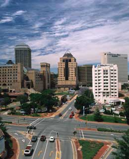
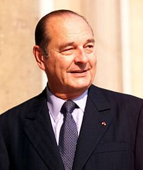
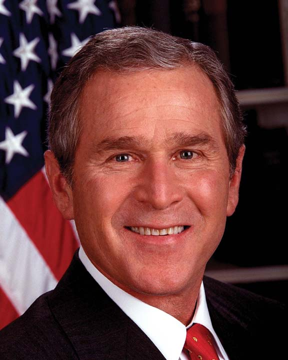

 (Arşiv'den, ağustos 2002) Dünyayı düzeltmek, zenginleri fakirlerle barıştırmak ve gelecek nesillere yaşanabilir bir gezegen bırakmak amacıyla düzenlenen Johannesbourg “Dünya Zirvesinde”  Pazartesi günü Justin Friesen isimli 11 yaşında bir çocuk, 100’den fazla devlet başkanına karşı “ Pek çok yetişkin insan, geleceğimizi ilgilendiren sorunlara eğilmekten çok para ve zenginlik peşine fazlasıyle koşuyor...” dedi.

Pazartesi günü, sembolik olarak kendilerine söz verilen, çocuklar delegasyonunda bulunan, çeşitli ülkelerden gelen ve yaşları altı ile on yedi arasında değişen diğer çocuklar da, Dünya yöneticilerine: “ Başka bir yeryüzü satın alamayacağımızı unutmayın...” dediler.

50 bin resmî, 20 bin özel olmak üzere 70 bin insan ve 7000 ONG’un (Uluslararası Hükümet Dışı Örgüt) katıldığı toplantı, sana’at gösterileri, konserler ve eğitim, tanıtım çalışmalarıyla şimdiye kadar dünyada görülmedik bir etkinlik düzeyine ulaştı... Gerçekten bir “Dünya Zirvesi” olan bu toplantıda en ilginç kişilerde olan Fransız Cumhurbaşkanı Jacques Chirac: “Evimiz yanıyor, biz karşısına geçmiş seyrediyoruz...Geleceğe bir enkaz bırakmamak için dünyada herkesi göreve çağırıyorum... Yaşama karşı insanlık cinayeti veriliyor... Birşeyler yapıp yangını söndürelim...” dedi... Chirac’ın sözlerini  yorumlayan Green Peace: Yeşil Barış örgütünün Politik direktörü Remy Parmentier “Biz bu tavrın yabancısı değiliz...Başkan güzel sözlerini hayata geçirmelidir” dedi. Diğer yorumcular da “Amerika Dünya jandarmasıydı, şimdi bir de itfaiyye eri kazandık...” dediler.

Zirvede konuşan Fransiz Cumhurbaşkani Chirac, çeşitli önerileri arasinda “Bir Dünya Vergisi” nden söz etti...“zenginlerden alinip fakirlere verilecek” böyle bir vergi benzeri, dünyadaki bütün ticari işlemlerden yüzde bir oraninda kesilmesi şeklinde daha önce James Tobin isimli Amerikan ekonomisti tarafindan düşünülmüştü. Bu düşüncenin uygulanamayacagini öne süren Başkan ,kendi görüşünün nasil uygulanacagini ise açik belirtmedi...Chirac’in her sözünü aninda yorumlayarak dünyaya yayan gazeteciler “ Amerikali’larin böyle bir vergiye sicak bakmadiklarini bildigi  için Chirac üstelemedi...”dediler.

Aslinda bu Toplanti hakkinda yazdigimiz ilk yazida belirttigimiz gibi Chirac’in da Zengin-Fakir diye bir problemi yoktu... O sadece Paris Belediye Başkani oldugu günlerden bu yana titizlikle korudugu “Büyük uluslar arasi ticaret şirketlerinin” halka sevimli görünmesi yolundaki gayretlerine dolayli bir katkida bulunmak amaciyla Johannesbourg ufuklarinda yer almişti...Komedisine devam ediyordu.  Ne var ki bu değerli devlet adamı, gelecekte pek çok kişiyi düşündüreceği anlaşılan mucize laflar etme geleneğini de sürdürdü: “ Dünya tehlikede, hepimiz sorumluyuz...” “Bize iki gezegen daha lazım...” “Fakirler günü kurtarmak için geleceği sallıyor bu anlamsızdır...” “ İnsanlık Johannesbourg’da geleceği ile buluştu...”  falan gibi.  Chirac “Dünya Vergisi” konusunda da “Ben bir çivi çaktım, ötesini siz düşünün, olaylar ters gelişse bile fikirler yürür” dedi.

Hz. İsa’ dan sonra, İkinci bin yılın, ikinci yılının, ağustos ayında, Güney Afrika’ nın şirin kenti Johannesbourg şehrinde, Birleşmiş Milletler aracılığı ile yapılan 70 bin kişilik  “Dünya Zirvesi” nde dünyanın en büyük devletinin Başkanı hazır bulunmadı...Bush, bu toplantıya gelmedi.ABD Johannesbourg’da Enerji Bakan Yardımcısı Robert Card tarafından temsil edildi...

Bush gelemezdi, zira havaya en çok gaz salıp  kirleten, mevsimleri bozan, su baskınlarına yol açan, Kyoto andlaşmasına karşı çıkan O’ydu...insanlığın başına her gün yeni bir belâ çıkaran oydu. (Arşiv'den, ağustos 2002)
