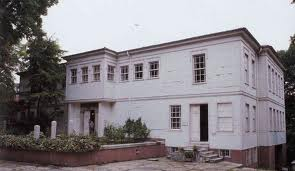
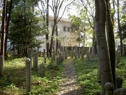

/\* Style Definitions \*/ table.MsoNormalTable {mso-style-name:"Normal Tablo"; mso-tstyle-rowband-size:0; mso-tstyle-colband-size:0; mso-style-noshow:yes; mso-style-parent:""; mso-padding-alt:0cm 5.4pt 0cm 5.4pt; mso-para-margin:0cm; mso-para-margin-bottom:.0001pt; mso-pagination:widow-orphan; font-size:10.0pt; font-family:"Times New Roman"; mso-ansi-language:#0400; mso-fareast-language:#0400; mso-bidi-language:#0400;}

(Bir okuyucu mektubu ve cevabımız)

1996 yılı Divan Edebiyatı Müzesi'nde resmi görevliyken,Tarık Zafer Tunaya Kültür merkezi bitişiği çiçekçi'den biri geldi, dükkanın önündeki kaldırımı muhtemelen kanalizasyon borusu tıkanınca kazmışlar, kazdıkları 30 cm.lik yerden bir şey çıktığını bize söylediler. Gittim baktım ve de ne göreyim,1,5 m. uzunluğunda bir mezartaşı şahidesi.

Kitabesi Celi Sülüs hüsn-i hat yazı çeşidiyle ve ince bir kalem güzeli kalemle ve de hüsn-i hat sanatı bakış açısından enfes ve estetik bir eser. Tutanak tutup mezartaşı şahidesini de müzeye naklettik. Evrak ve adı geçen özgün eser Divan Edebiyatı Müzesi Arşivindedir. (Adnan Alpay)

[Nezih Uzel](http://www.facebook.com/nezih.uzel) Sayın Alpay, Fransız mühendis Henri Gavan 1800' lerde Tunel inşaatına başlarken Galata Mevlevihanesi mezaristanının önemli bir kısmının kaldırılmasını istemiş. Devrin sadrazamı "şeyh efendi ile anlaş.." demiş. Şeyh efendi olan Kudretullah Efendi karşı çıkmış ama söz dinletememiş, taşları toplaıp inşaata başlamışlar. Cumhuriyet devrinde de nikah salonu olacak diye toplamışlar taşları. Bana kalırsa Galata Mevlevihanesi haziresinin % 90'ı toprak ve apartman altındadır.

Mezarlıkta ilk inşaat sırasında bir hırıstiyan taşı çıkmıştı. Üzerinde "Victor Pisani" yazıyordu. Bu taşın İngiliz elçiliğinde çalışan bir zata ait olduğunu tesbit etmiştik. Rahmetli Necati bey bu taşı sakladı.Yabancılar görür de hak ister diye.. Halbuki ünlü cont Ostrorog da hırıstiyan olmasına rağmen buraya gömülmek istemişti. Belki başkaları da vardı.. Bilmiyoruz. Çalışmalarınızda başarılar dilerim
