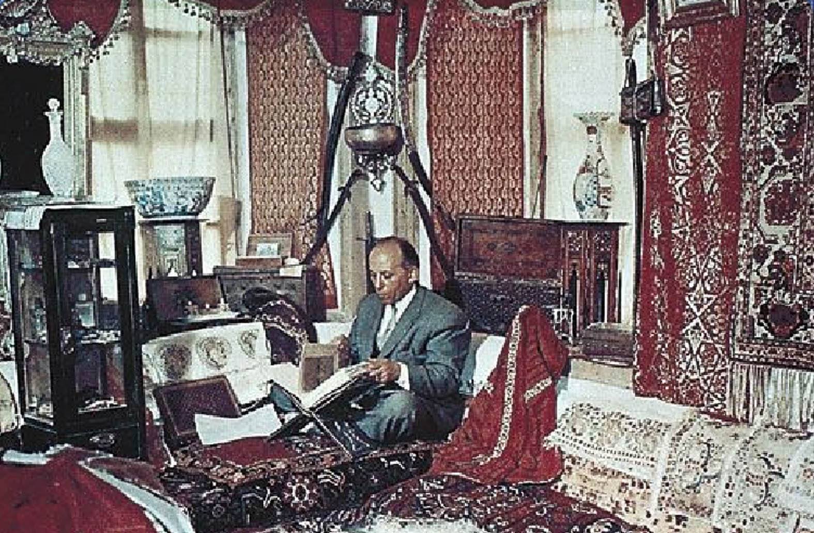
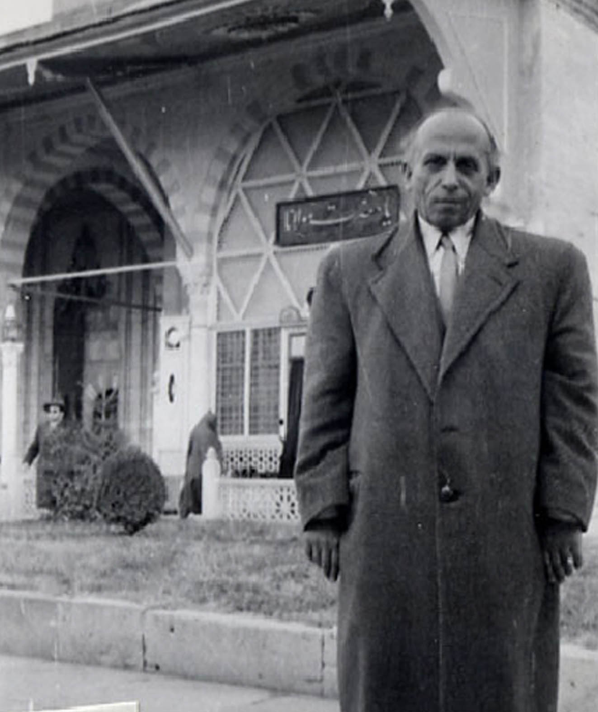
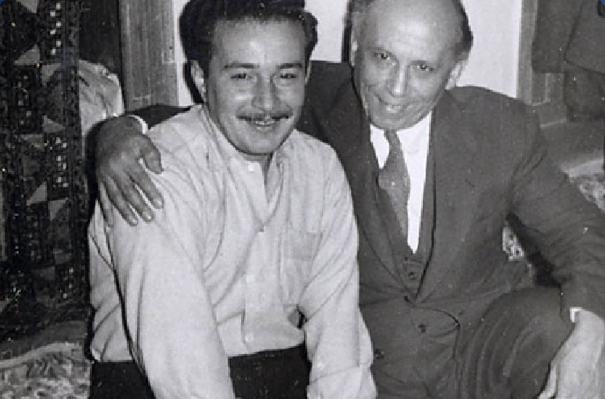
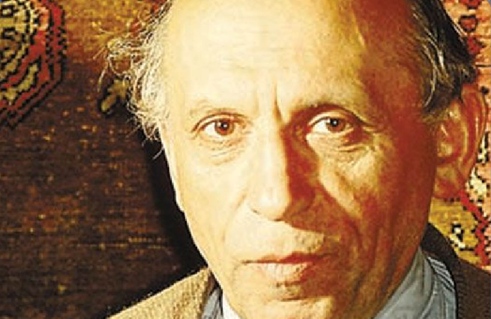
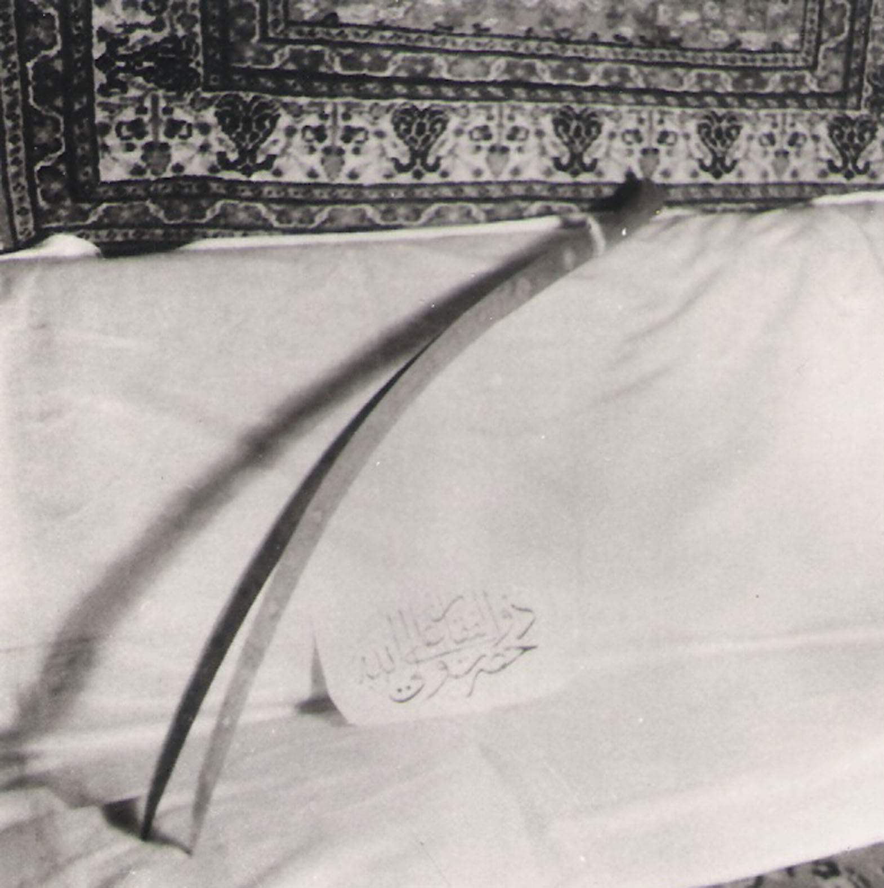
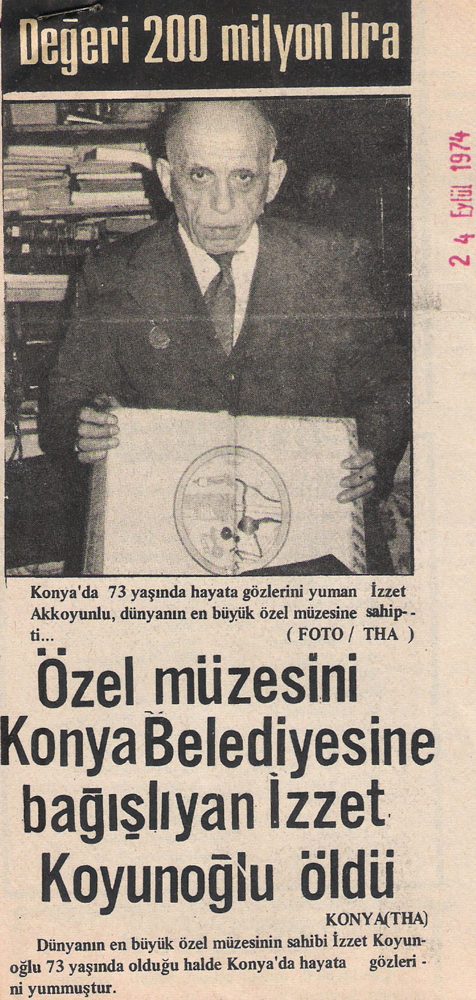
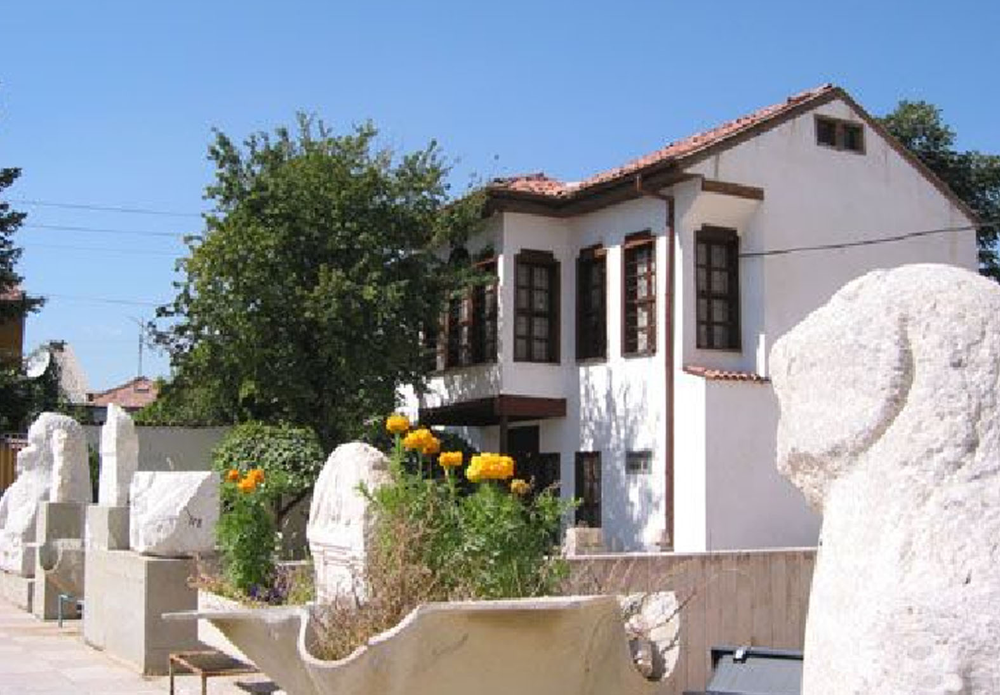

 Konya’da ihtifal Hey’etinin kaldığı Başak otelinin önünde büyük bir otobüs duruyordu. Sokakta gelen giden, otobüsün kapısından bakan, içeri girip sonra dışarı çıkan, itişen, kaynaşan kararsız bir kalabalık göze çarpıyordu. Ortalıkta tuhaf bir telaş vardı. –Ne oluyor? Dedim. –Bir davete gideceğiz, sen de bin, dediler. Konya’ya gelip Mevlâna yolunda yaşayan insanların neş’esine katılmak ve buraya toplanan Türkiye’nin sayılı isimleri ile bir arada olmak günlerdir beni öylesine derinden derine heyecanlandırıyordu ki, artık olayların akışına kendimi kaptırmış gidiyordum. –Kim çağırıyor, nereye gidiyoruz? demeden otobüsün içene daldım..çerde hemen hemen tamamı ile bütün Hey’et vardı. İhtiyarlar saygı eseri ön sıralara oturtulmuştu. Sivaslı’lar, Egeli’ler, Türkiye’nin her yöresinden gelenler hemen onları izliyordu, genç nesil ortalardaydı. Arka sıralar ise çevreden gelenlerle doluydu.  Otobüs yola çıktı, az sonra Mevlânâ türbesinin bulunduğu alana vardık. Çiçekli göbekten sola dönerek Üçler mezarlığının duvarını izlemeye başladık. Bir müddet öylece gittikten sonra Konya’nın “Topraklık” denen semtine vardık. Bir caminin önünde durduk. –İnin, dediler… Hep birlikte indik, önden gidenler, ikişer katlı kerpiç evlerin bulunduğu dar bir sokağa girdiler. Sokağın hemen başında, sağda açık bir kapıdan bir avluya doluştuk. Hava güneşliydi, etraf cam gibi parlıyordu, sanki herşey kristal bir avizeye dönmüştü,  geceden yağan kar, avluda öbek öbek duruyordu. Karşımıza iki katlı muhteşem bir Konya evi çıktı. İki katlı oluşuna karşın bu  evin gizemli bir asaleti vardı. Binaya avludan giriliyordu. Giriş kapısının sağında orta yaşlı, kısa boylu, derin bakışlı, tıknazca, güler yüzlü, fazla özenli olmayan giyimiyle bir zat bizi karşıladı. Bu ev sahibiydi.

Ev sahibi herkese tek tek hoş geldiniz diyordu, ama kimse ile fazla ilgilenmiyordu. Nasıl olduysa Hey’etin tamamı o küçücük eve sığdı, girişin iki tarafındaki odalar, üst kattaki misafir odaları her yer insanla doldu. Burası bir zamanlar Konya’da her yabancının mutlaka gidip gördüğü antika meraklısı İzzet Koyunoğlu’nun eviydi. İzzet bey eskiden Demiryolu müfettişiymiş. Türkiye’deki büyük değişme sırasında dağılan ve çöken eski Osmanlı yaşam tarzından geriye kalan san’at ve kültür eserlerine sahip çıkmıştı.

Atılan, satılan,  sokaklara dökülen eski kültürün saygın yapıtlarını elinden geldiğince bir araya getirmişti.  Başta yazma eserler olmak üzere İslam kültür ve san’atının en nadide ürünlerini, aramakla bulunmaz en değerli parçalarını teker teker evine toplamıştı. Kimini satın almış, kimini hediye vermişler, kimi hibe usulü kazanılmış, kimi yasaklı devirlerde korkuyla ona emanet bırakılmıştı. Nadide yazma kitaplar, yazılar, halılar, kilimler, bakır ve tunç ev ve mutfak eşyası, paslı silahlar, eski tekstil san’atının ender örnekleri, yıllarca çeşitli yörelerden toplanmış İslam öncesinden kalma mermer heykelcikler, taş kabartmalar, steller, toprak kaplar, küpler, cam ve deri eşya, çivi yazılı tabletler… Her yanı, her köşesi, her odası dolu, dopdolu bir ev kurmuştu İzzet bey… Kurduğu müze, gerçek bir koleksiyon, bir hazineydi..

Bizi kapıda karşılayan İzzet Koyunoğlu’nun kendisi de müzelik bir insandı. Konya’da çağlar boyu tanınmış Sahipata sülalesinden geliyordu. Dedelerinde biri veya ailenin kurucusu bu şehirde bir türbede yatıyordu. Bayramda, kandilde ziyarete giderlermiş, İzzet bey daha sonra anlatmıştı: Selçuklularda eskiden cenazeyi mumyalama san’atı varmış, büyük dede de mumyalıymış, ceset bozulmamış, hatta dede’nin kurumuş mumyalı sağ kolu sandukanın  aralık kapağından dışarı sarkarmış, ailenin büyükleri bayramlarda çocukları götürür, büyük dedelerinin ellerini öptürürlermiş, çocuklar korkmadan o kuru eli öper, yüzyıllar önce ölmüş dedeleri Sahipata ile bayramlaşırlarmış…

Sahipata Türbesi şimdi yerinde.. Sahipata’nın mumyalı kolu acaba hâlâ sandukasından sarkıyor mu? Onu bilmiyorum. Ancak bu hikâye oldukça ilginçtir, Mumya işi bilinmez değildi hatta Alaeddin tepesinde yatan hükümdarların bile cesetleri mumyalıdır derlerdi… İzzet Koyunoğlu ile sonraki yıllarda pek yakın olmuştuk. Ne zaman Konya’ya gitsem, hangi saatte olursa olsun İzzet bey’i ziyarete giderdim. Gerçekten kibar ve asil bir insandı...  Konya’da yıllar geçtikçe İzzet bey’in evi şehirdeki eski eserlerle birlikte anılır olmuştu. İstasyona indiğimiz akşamın sabahında, Türbe ziyaretinin hemen arkasından ayaklarımız kendiliğinden Üçler mezarlığına doğrulur, oradan İzzet bey’in evinin bulunduğu Topraklık semtine yönelirdi. O yıllarda Konya’da pek bol bulunan iki atlı payton arabalarına ne zaman binsek, paytoncuya gideceğimiz başka bir yer söylemezsek, araba sessizce İzzet bey’in evinin bulunduğu mahallenin yolunu tutardı.

O evin sabah kahvaltıları meşhurdu. Ünlü Konya çörek otlu tulum peyniri, saç böreği, katmer, çeşit çeşit reçeller, tereyağları ile kahvaltı sofrası pek neş’eliydi. Kırmızı domates reçelini ben ilk defa o sofrada gördüm. Sofra girişin solundaki yer odasına kurulur, misafirler o sofranın çevresine dizilirlerdi. O tam bir “ahi” sofrasıydı. Koca bir kömür sobası bazen saçları kırmızıya dönerek çatır çutur yanarken, avluda Pembe kadın, içinde çalı çırpı tutuşturulmuş bir küp fırında bazlama pişirirdi. Yer odasının penceresinden bakardım. Bazlama’yı Pembe, küp fırının çepeline yapıştırarak pişirirdi. Kızaran ve yapıştığı yerden çözülmek üzere olan bazlamaları ateşin üzerine düşmeden önce yakalamak gerekiyordu. Bunun için bazen Pembe kadın fırına öyle bir sarkardı ki, ateşin üzerine düşecek gibi olurdu. İzzet bey Pembe’ye pembe diyemez, Konya ağzıyla “pempe diye seslenirdi. Bir de oğlu vardı Pembe’nin…çocuk saf yüzlü, sevecen bakışlı, on dört yaşında tombalak, tam bir Konya’lıydı. Her taşralı genç gibi büyük şehirlerin gece hayatını merak eder, bana durmadan İstanbul’la ilgili sorular sorardı. Cevaba pek aldırmaz,  hayallere dalardı.

Yer odasının avluya bakan iki penceresinden birinde minder vardı, Özbek şeyhi Necmeddin efendi hep gider o mindere otururdu. Bir gün dışarıdan bir kadının pencere önüne gelerek okuyup üflediğini fark etmiş, kadın pencereyi türbe penceresi zannetmiş. Şeyh içeriden bağırmış – Hanım, hanım daha ölmedim, git başka evliyaya oku..

İzzet Koyunoğlu’nun evine gittiğimiz ilk gün otobüste bir fısıltı kulaktan kulağa dolaşmıştı. Koyunoğlu ’nun evinde Hazreti Ali’nin ünlü çift başlı kılıcı varmış…  Bu müthiş bir haberdi. Eğer bu haber doğruysa, âlemlerin fahri, İslam Peygamberi’nin sevgili damadı Hz. Ali’nin kılıcı, Türkiye’de, bu şehirde ise, haber tüm İslam dünyasını yerinden oynatabilirdi. Acaba bu kılıç nasıl olmuş da buralara gelmişti? Şimdiye kadar neden duyulmamıştı? Sonunda kılıcı gördük. Üst kasttaki odalardan birinde bir minder üzerinde duruyordu. Herkes kılıca uzaktan bakıyor, kimse yaklaşarak elini sürmeye cesaret edemiyordu. Kılıçtan gözlerini ayıramayan ziyaretçilerin arasında donup kalanlar, sapsarı kesilenler, gözyaşı ile ağlayanlar vardı. Özbek şeyhi pencere kenarında bir yere ilişmiş tespih çekiyor ve bir şeyler mırıldanıyordu. O anda odada öyle bir hava esiyordu ki kimse bu kılıcın gerçekten Hz. Ali’nin kılıcı olup olmadığını merak dahi etmiyordu. Kalabalık büyülenmişti.

Kılıca biraz daha yakından bakmak istedim. İki ağızlı, kararmış bir maden parçasıydı. Fazla büyük ve dehşet saçan bir görüntüsü de yoktu. İstanbul’da, Bursa’da veya başka bir yerde, eskici dükkânlarında yüzlercesi bulunan kılıçlardan biri gibiydi, sadece iki parça kesici çeliğin yan yana getirilmesinden oluşan uzunca saplı sıradan bir kılıçtı. Bana kalırsa İslam’ın büyük ismi; peygamber damadı Hz. Ali’nin kılıcı böyle olamazdı. Eski zamanlardan kalma eserler genellikle açık bir dille konuşur ve başlarından geçen uzun yılların hikâyesini hal dili ile anlatırlar, bu kararmış demir’in ise söyleyeceği fazla bir şey yoktu. Sadece, Hz. Ali kılıcı o kadar hızlı sallarmış ki çift görünürmüş, bu da öyle çift yapılmıştı. Anlaşılan bedeni çift olduğundan dolayı biri, kılıcı o eski Hz. Ali efsanesi ile birleştirmişti. Veya hatırasını anmak için özel yapılmış bir kılıçtı. Üzerinde durulmadı.

İzzet bey yıllar sonra bu dünyadan göçtü. Evli değildi; vârisi yoktu. Bütün eşyasını müze olmak üzere Konya Belediyesine bağışladı. Belediye de Topraklık’taki eski evi yıktırarak yerine “ucube” bir yapı yükseltti. Antikaları oraya koydu, ancak bu ev öylesine şahsiyetsiz ve mimarlık yoksulu bir evdi ki, İzzet Bey’in şanına ve dillere destan koleksiyona yakışmadı. Fakat yine de koleksiyon bütün haşmeti ile duruyor. Ziyarete açık. Ancak o ünlü sofradan ise eser yok..  Belki bir gün bu eserler uygun bir Konya evine taşınır.

