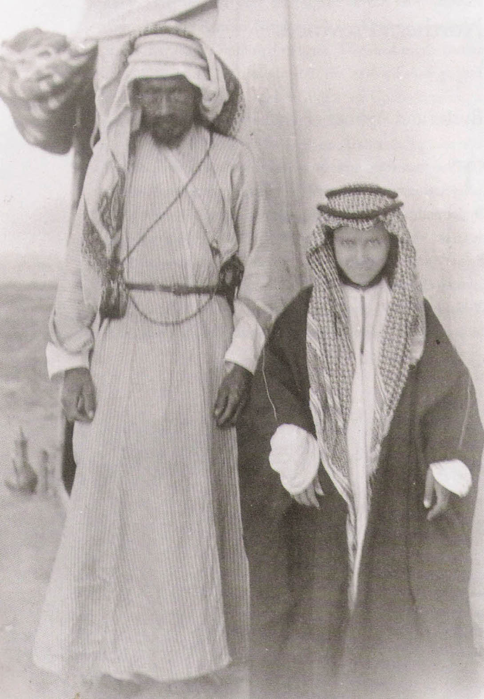

/\* Style Definitions \*/ table.MsoNormalTable {mso-style-name:"Normal Tablo"; mso-tstyle-rowband-size:0; mso-tstyle-colband-size:0; mso-style-noshow:yes; mso-style-parent:""; mso-padding-alt:0cm 5.4pt 0cm 5.4pt; mso-para-margin:0cm; mso-para-margin-bottom:.0001pt; mso-pagination:widow-orphan; font-size:10.0pt; font-family:"Times New Roman"; mso-ansi-language:#0400; mso-fareast-language:#0400; mso-bidi-language:#0400;}

Yaşadığımız günlerden 250 yıl önce Arap yarımadasının Necid bölgesinde Kerbela vak’asından sonra İslam tarihinin en kanlı olayı yaşandı. Asırlardan beri bölgede yaşayan beni Teym kabilesinden Abdülvehhab, büyük İslam şehirlerine karşı bedevi başkaldırısını başlattı.

1703 yılının baharında Necid ’de Uyeyne kasabasında beni Teym kabilesinden Süleyman bin Vahhab’ın bir çocuğu oldu. Adını Muhammed koydular. Muhammed, ailesinden ilk dini eğitimi alarak büyüdü.  Necid o sırada Osmanlı toprağıydı. Yavuz Sultan Selim’in fetihlerinden beri Cidde’ye tayin edilen bir Osmanlı Paşası’nın eliyle yönetiliyordu.

 Aile Hanbelî mezhebindendi. **Muhammed yetişme sırasında Mekke'ye gitti. Medine'de iki yıl kaldı. Bu sırada İbni Teymiyye'nin (1263-1328) eserlerini okudu ve tesirine girdi.** **Hanbelî** **Mu****ammed bin Abdülvehhab bu yolda bilgilerini ilerletti ve Hanbelî hukuk ve dünya görüşü ile hayat tarzı konusunda derece kazandı.**

 **Abdülvehhab bir Necid'liydi. Arabistan'ın ortasında Medine'nin kuzeyinden Bahreyn'e uzanan bu bölge, tarih boyunca doğudan batıya pek çok kavmin gelip geçtiği yerdi. Yörede eski yeni pek çok gelenek birbirine karışmıştı. Sahte ve yalancı peygamberlerin kaynaştığı, sahte kurtarıcıların rahatça cirit attığı bu yerde insanlar, âbid ile mâbud'u karıştırmış, mâbed mabuda dönmüştü. İnsanoğlu bu ülkede melekle şeytanı ayıramıyor, İmanla küfrü birbirinden fark edemiyordu.**

**Madde ile mânâ çelişkisini bilmez olmuşlardı. İyiliği kötülük, kötülüğü iyilik zannediyorlardı. Ağaçlara, kuyulara, mağaralara, çalılıklara, duvarlar tapıyorlardı. Bölge İslam ülkesi olmasına rağmen İslam uygarlığı bu yörede sislenmiş, dinin adı değişmiş, Kur’an, Hadis, Kıyası Fukaha, İcmai ümmet şeklindeki dört esasa dayalı temel İslamî yönetim ve yaşam biçimi unutulmuş, yaşam eski ilkel kabile geleneklerine ve putperest inanışa geri dönmüştü. İnsanlar mutlaka kurtarılması gereken büyük felaketin içine düşmüşlerdi**

**Abdülvehhab dört yıl Basra'da kaldı. Daha sonra Hureymile'ye geldi. Burada “Kitap-el Tevhit” isimli eserini yazdı. Abdülvehhab bu eserde Kur'an ve Hadis dışındaki her şeyi reddetti. Din'e sonradan sokulan tüm gelenekleri tartışmasız küfür saydı. Öncelikle, ibadet yeri iken yanlışlıkla put'a dönüşen mezarların ve türbelerin yıkılmasını istiyordu. Bunların er veya geç yıkılacağını ilan etti.**

**Dinin emirlerine uymayanı, bid'atlere sapanı, müzik çalgı dinleyeni, ibadette kusur edeni Müslüman saymayacağını ileri sürerek gereğinde bu gibilere karşı silah kullanacağını açıkça belirtti. İmanın amelde gizli olduğunu, iman sahibi olmak için kelime-i şehadet getirmenin yetmeyeceğini ve ameli ile imanını ispatlamayanın, canı ve malının helâl olduğunu açıkladı. Böylece ibadet etmeyen ve ameli zayıf olan kişinin dinden çıkmış sayılamayacağını, sadece kusurlu olduğunu öne süren ehlisünnet anlayışına ters düştü.**

 

**Abdülvehhab Hureymile'de tanındı, az sonra Uyayne'ye döndü burada bölgenin emiri Osman bin Hamr bin Muammer'in himayesine girdi. Bu sırada kadılık yapıyor, fetvalar veriyor, davet işine devam ediyordu. Bir süre sonra Halife Ömer bin Hattab'ın 634'te Yemame harbinde şehit düşen kardeşi Zeyd'in, Der'iyye ile Uyayna arasındaki el-Cabila isimli köyde bulunan türbesini yıkmak için Emiri ikna etti. Zeyd'in türbesi, yanında bulunan diğer şehitlerin mezarları ile birlikte yıkıldı, ağaçlar kesildi. Yakınlarda bulunan bir mağaranın girişi tahrip edildi. İslam dünyasında Vahhabi'lerin ilk yıktıkları türbe ve mezarlık budur.**

 **Emire sözünü geçiren Abdülvehhab 'ın şöhreti artmıştı. Ancak verdiği sert fetvaları ve aldığı katı kararlarıyla korku ve kuşku uyandırmaya başladı. Halk Necid'in güçlü kabilelerinden Benî Halid'in emirine şikâyette bulununca bu kabilenin emiri yardımda bulunduğu Uyayna emiri Osman'dan Abdülvehhab' ı hemen bölgesinden uzaklaştırmasını istedi. Muhammed bin Abdülvehhab Uyayna'dan ayrılarak Der'iyye'ye geldi. Burada Emir Muhammed bin Suud'la tanışarak O'nun himayesine girdi.**

**Bu karşılaşma ve tanışma daha sonra krallığa dönüşerek ikiyüz elli yıl sürecek ve günümüze kadar ulaşacak Vahhabî-Suudî emirliğinin başlangıcıdır. Bu tanışma ile Muhammed bin Abdülvehhab fikirlerine, amacına ve siyasi savaşına askeri destek bulmuş, yüzyıllardır çölde yaşayan bir Necid kabilesinin emiri olan Muhammed bin Suud'ta Abdülvehhab' ın desteğiyle iki buçuk asır sonra dünya siyasetinde denge unsuru olacak bir devlet görüşünün temelini atmıştı…**

 **Abdülvehhab, ibni Suud'la 1744 yılında bir araya gelmişti. Araştırmacılar bu tarihi Suudî ailesinin siyaset sahnesine çıkışı sayarlar. Nitekim aynı yıl ibni Suud, Abdülvehhab'ın kızı ile evlenerek O'na damat olmuştur. Bir başka rivayete göre de Abdülvehhab, ibni Suud'un kızkardeşiyle evlenmiştir. Muhammed bin Abdülvehhab Der'iyye'den Necid bölgesi emirlerine, din bilginlerine ve Medine ileri gelenlerine davet mektupları gönderiyor ve mezhebini savunan kitaplar yazmaya devam ediyordu. Bu arada Osmanlı Sultan III. Selime de bir mektup gönderdi. O çağda iç meselelerle uğraşan Osmanlılar buna pek aldırmadılar. Abdülvehhab Mısır'ı ele geçiren Napolyon Bonapart'a da yazmıştı. Bonapart'ın Akka savaşı sırasında Vahhabî'lerle ilişki kurduğu söylenir.**

 **Dinden uzaklaşan Müslümanlar'la kâfirleri bir tutup bunların can ve mallarını helal sayan yeni mezhep-devlet hızla yayıldı. Onbeş yıl içinde Necid, Asir ve Yemen Vahhabî oldu. Abdülvehhab, İbni Suud'la beraber cihat saydığı savaşlara katılıyordu. Bu sırada Vehhabî-Suudî alanı içine giren her yerde tam bir devlet gücü kullanıldı. Muhammed Bin Abdülvehhab'ın ele geçirilen şehirlere tayin ettiği Vahhabî kadılar, mezhebin hukukunu geliştirdiler. Vahhabî valilerinin görevlendirdiği kolluk kuvvetleri halkın başına tam bir din polisi kesildiler.**

**Tütün içmek, çalgı dinlemek, ipek elbise giymek yasaktı. Din polisi yasaklara uymayanı yakalıyordu. Sabah namazından sonra camilerde yoklama yapılır üç defa özürsüz olarak camiye gelmeyene, içki içene yapıldığı gibi kalabalığın önünde kırk değnek vurulurdu. Muhammed Bin Abdülvehhab kendi şehrinde oturanlara ensar, dışarıdan gelenlere muhacirin derdi. Bu tutumundan dolayı bilgin bir kişi olan kardeşi Süleyman bin Abdülvehhab ona bir reddiyye yazdı.**

 **Muhammed bin Suud 1766'da öldü. Yerine oğlu Abdülaziz bin Suud geçti. Devletin manevi lideri Muhammed Bin Abdülvehhab o sırada hayattaydı. 26 yıl daha yaşadı ve 1792'de öldü. Vahhabi-Suudi devleti 1790'dan sonra güçlendi. Şeklen Osmanlı'ya bağlı olduğu halde başkent İstanbul'a uzaklığı dolayısıyla merkezi otoriteden sıyrılan bu bölgede gelişen yeni siyasi birlik, arka arkaya zaferler kazanıyordu. Abdülaziz cihat adını verdiği savaşlardan elde edilen ganimeti eski Osmanlı pençek usulüyle beşe böler, bir bölümünü kendi alır kalanı adamlarına dağıtırdı. Bu yöntem savaşların çekiciliğini artırıyordu.**

**13 Mayıs 1802'de, Emir Abdülaziz'in oğlu Suud'un kumandasında Vahhabî savaşçıları Kerbelâ' da 10 Muharrem ayini yapan Şiiler'in üzerine saldırdılar... Bir rivayete göre 2000, bir başka anlatıma göre 10 bin Şii bu saldırıda öldü. Hz. Hüseyin'in türbesi yağma oldu. Kerbelâ yandı, yıkıldı, tarihte bir kere daha mateme büründü. Bu savaşta ölen bir Şii'nin yakını daha sonra 4 Ekim 1803 günü mescitte namaz kılan Abdülaziz'i sırtından hançerleyerek intikamını alacaktı. Vahhabîler, ortaya çıktıkları ilk yıllardan itibaren, İslam'ın içinde eski Sasanî imparatorluk gelenekleriyle yaşayan İran’ lıları en büyük düşman bellemişlerdi.**

 **Vahhabîler 18 Şubat 1803'te Taif'e girdiler. Her yeri yakıp yıktılar, halkı öldürdüler. Topladıkları kitapları meydanlara yığarak ateşe verdiler. Peygamber'in amcaoğlu Abbas'ın türbesini yıktılar. İki buçuk ay sonra 30 Nisan 1803'te Mekke'yi aldılar. Suud bin Abdülaziz Kabe'yi tavaf etti. Ulema biat etti. Abdülaziz onlara şöyle konuştu: "Sizin dininiz bu gün kemal derecesine ulaştı. İslam'ın nimetiyle şereflenip Cenab-ı Hakk'ı kendinizden razı kılıp hoşnud ettiniz. Artık âbâ ve ecdadınızın bâtıl inanışlarına meyl ve rağbetten ve onları rahmet ve hayırla yâd ve zikirden korkun ve kaçının. Ecdadınız tamamen şirk üzre vefat ettiler... Hz. Peygamber'in mezarı karşısında, önceleri olduğu gibi durarak, tazim ve salat-ü selam getirmek, mezhebimizce gayri meşrudur... Onun için oradan geçenler okumadan geçip gitmeli ve sadece \[es-Selâmu âlâ Muhammed\] diye selam vermelidir..." İbni Suud bu konuşmadan sonra Hz. Peygamber, Hz. Ömer, Hz. Ebu Bekr, Hz. Ali ve Hz. Fatıma'nın doğdukları evleri yıktırdı.**

 **Suud'un torunu İbni Suud, 1805'te Medine'yi, 1806'da Mekke'yi zapt ettiğinde mezhebin inancı gereği bütün mezarları dümdüz etti. Medine'de Baki Mezarlığı'nın taşlarıyla kaleler inşa etti. O zamana kadar bilinen tüm İslam büyüklerinin mezarları tahrip edildi. Araştırmacılar bu tahrip hareketine balıksırtı adını verdiler. Vahhabîler yanında türbe olan mescitleri dahi yıkıyorlardı. Bu yüzden onlara "mâbed yıkıcıları" adı verenler çıktı. Bu katliamdan sadece Makam-ı İbrahim, Mescid-i Nebevî ve Peygamber Efendimiz' in türbesi Ravza-i Mutahhara kurtuldu. Mezarlık ziyaretine daha sonra izin verildi.**

 **Vahhabî-Suudî isyanı Osmanlı Devleti'ne karşı yapılmıştı. Osmanlı’lar devlet muhaberatında onlara Hz. Ali zamanında olduğu gibi “Yeni Haricîler” adını koydular. Kutsal topraklarda yapılan bu başkaldırı hem devlet otoritesine hem de Müslümanlar 'ın halifesine karşı idi. Buna İstanbul'un sessiz kalması düşünülemezdi. Ancak** **altı asırlık mağrur Osmanlı siyasi yapısı, teolojik devlet sisteminin merkezi olan Haremeyn-i Şerifeyn'e herhangi bir yerli saldırısına ihtimal vermiyordu.**

**Osmanlı dört asır kutsal yerlere hizmet etmiş, kanı ve canıyla bu toprakla bütünleşmişti. Kim onu bu yerlerden sökebilirdi ki.. O** **sırada İstanbul'da II. Mahmut tahta çıkmış, devlet yenilenmeye yüz tutmuştu. Mahmut sert bir hükümdardı. Vahhabî meselesinin hallini 1805'te Mısır Valisi Kavalalı Mehmet Ali Paşa'ya ısmarladı. Paşa, bu nazik görevi oğlu Ahmet Tosun'a verdi. Tosun'un kumandasındaki Mısır Ordusu 1 Mart 1811'de gemilerle Yanbu limanına vardı. Mısırlılar 2 Kasım 1812'de Medine'ye, 23 Şubat 1813'te Mekke'ye girdiler. Kavalalı Paşa Suudîler'den geri aldığı Kâbe'nin anahtarlarını 2 Mayıs 1813'te İstanbul'a gönderdi.**

 **O sırada Vahhabî-Suudî emirliğinin başında bulunan ibni Suud 1814'te öldü. Yerine oğlu Abdullah ibni Suud geçti. Suudîler'in yeni lideri Abdullah sakin bir adamdı. Savaş ve cidâl onu fazla ilgilendirmiyordu. Aciz ve silik bir kişiliğe sahipti. Ancak Mısırlı’ların hışmından kurtulamadı. Savaşta ölen Kavalalı Mehmet Paşa'nın büyük oğlu Tosun'un yerine kumandayı ele alan küçük oğul İbrahim Paşa, Abdullah ibni Suud'u Eylül 1818'de yakalayarak dört gün Mekke'de halka teşhir ettikten sonra İstanbul'a gönderdi. Suud bütün ailesi ve yakınlarıyla birlikte Osmanlı başkentinde görüldü. Devlet-i Aliyye'ye baş kaldırmış bir emir, zaptiyelerin arasında, mevkufen, tüm kalabalığı ile birlikte yollardan geçiyordu. Abdullah İstanbul'da zamanın şeyhülislamı Mekkizade Mustafa Asım Efendi'nin fetvasıyla idam edildi.**

**Abdullah ibni Suud'un ölümüyle 1744'te Arap Yarımadası'nın Necid bölgesinde kurulan Vahhabî-Suudî Devleti'nin ilk bölümü sona ermektedir. Osmanlı Sultanı II. Mahmud'un Mısır Paşası Kavalalı ile bozuşmasından sonra Mısırlılar, Hicaz'dan çekilecekler ve Arabistan yeniden Suudîler'in eline düşecektir. O sırada Mısırlılar'dan ve babasıyle birlikte İstanbul'a posta edilmekten kendini kurtarıp kayıplara karışan Abdullah'ın küçük oğlu Turkî ortaya çıkacak, 1820-34 arasında aileyi toplayacak ve Suudî Devleti'ni ikinci defa yeniden kuracaktır.**

**“Suudi-Vahhabi mezhep devleti” bu gün devam etmektedir. Ancak yeni zamanın Suudileri “namaz kılmayanın katli vaciptir” ilkesini terk etmiş görünüyorlarsa da “müzik dinlemek küfürdür” ve benzeri yasaklara uymaya devam etmektedirler.**
