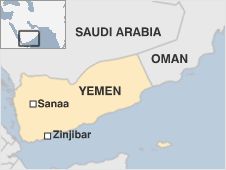
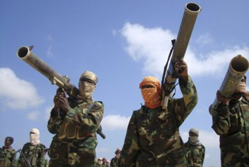

  Reuters: The Yemen-based al Qaeda wing and Islamic militants have taken over the Yemeni coastal town of Zinjibar in south central Yemen, residents of Zinjibar told Reuters on Sunday. "About 300 Islamic militants and al Qaeda men came into Zinjibar on Friday and took over everything," one Zinjibar resident said. Zinjibar is the capital of Abyan province in south central Yemen. Yemen is beset with violence and protests since pro-democracy unrest erupted in January to end President Ali Abdullah Saleh's near 33-year rule. The Yemen-based al Qaeda branch is the world's most active terror cell, according to Washington. The group has strongholds in remote mountain regions in the provinces of Shabwa, Abyan, Jouf and Marib. The al-Qaeda wing in Yemen on Saturday in a statement read before the local residents declared the provincial capital city of southern Abyan province as the capital city of its "Islamic Emirate", said the report. (Courtoisy Reuters)

_Türkçe özet: Reuters ajansının Pazar günü haber verdiğine göre Yemen’in bir kıyı şehri olan Zinzibar’da yaşayanlar, geçen cuma günü şehre gelen 300 kadar el-Kade militanının  Zinzibar’ı  ele geçirdiğini bildirdiler. Yemen’de üslenen el Kaide gruplarının dünyanın en tehlikeli teröristlerinden meydana geldiği belirtiliyor._ 

   
